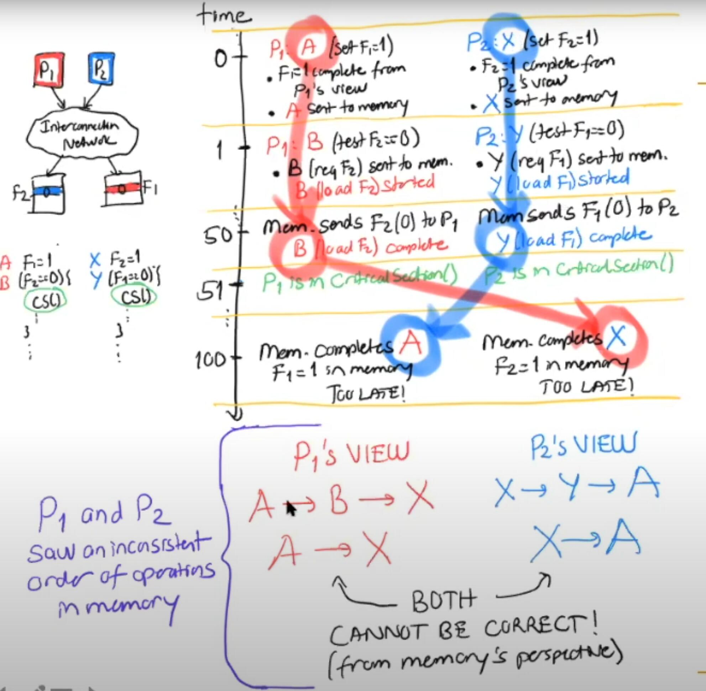
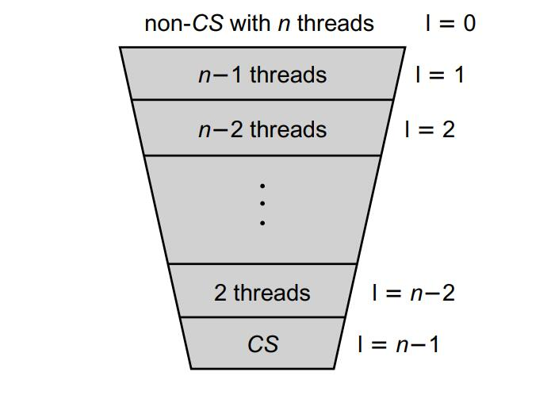
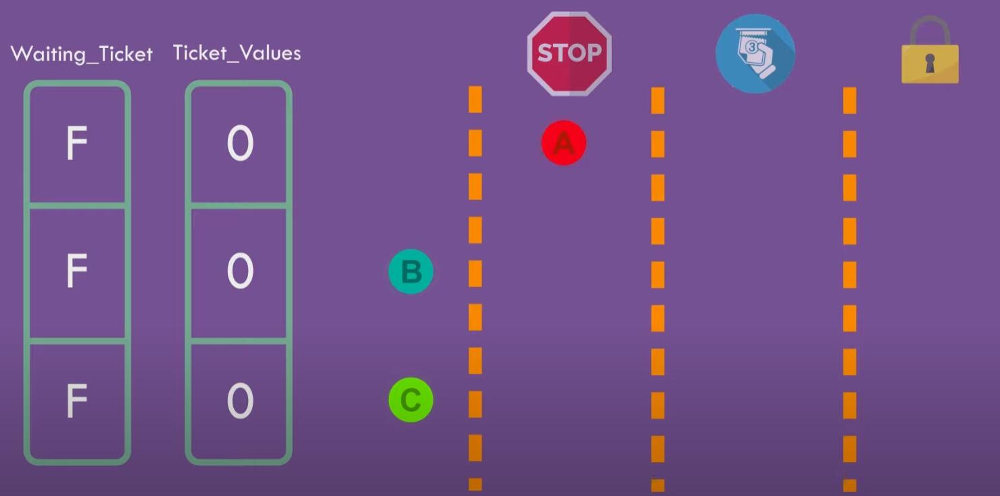
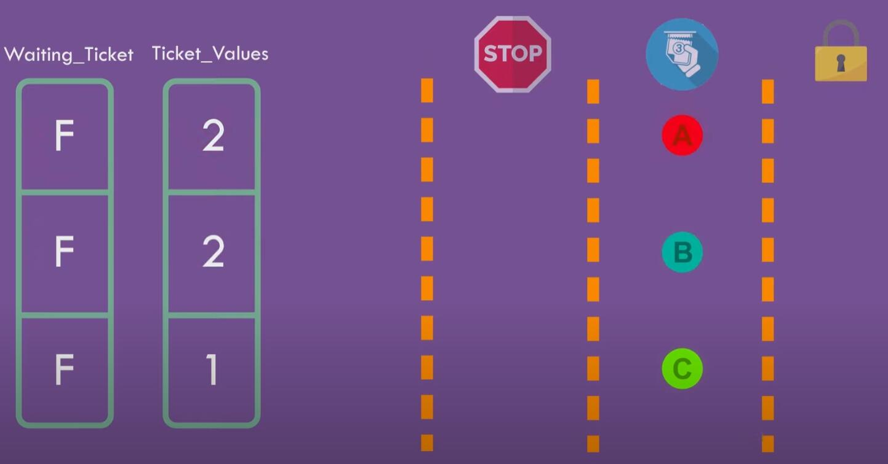
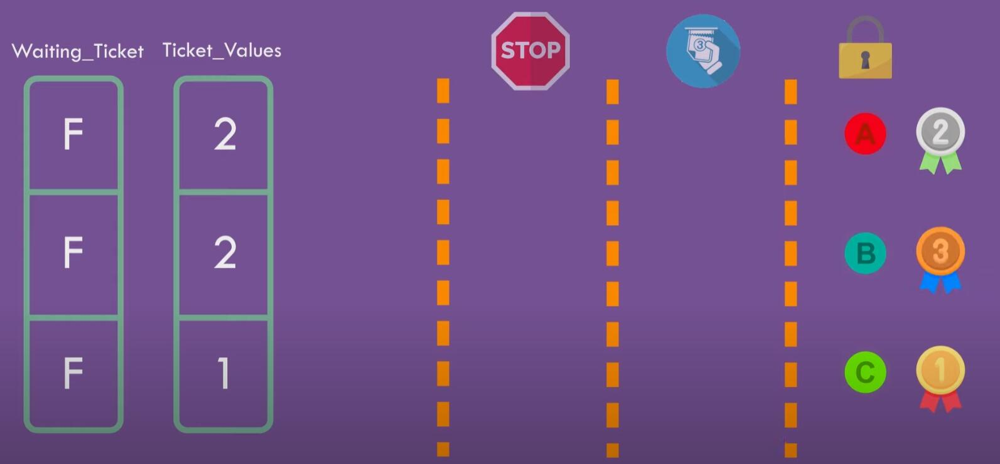

# Mutual Exclusion

## Notation in proof

Events are instantaneous: they occur at a single instant of time. It is convenient to require that events are never simultaneous: distinct events occur at distinct times. (As a practical matter, if we are unsure about the order of two events that happen very close in time, then any order will do.) 

A thread A produces a sequence of events **a<sub>0</sub>, a<sub>1</sub>, ...** threads typically contain loops, so a single program statement can produce many events. We denote the j-th occurrence of an event **a<sub>i</sub>** by **a<sup>j</sup><sub>i</sub>** . 

One event a precedes another event b, written **a → b**, if a occurs at an earlier time. The precedence relation “→” is a total order on events. Let a0 and a1 be events such that a0 → a1. 

An interval (a0, a1) is the duration between a0 and a1. Interval **I<sub>A</sub>** = (a0, a1) precedes **I<sub>B</sub>** = (b0, b1), written **I<sub>A</sub> → I<sub>B</sub>**, if a1 → b0 (that is, if the final event of IA precedes the starting event of IB). More succinctly, the → relation is a partial order on intervals. Intervals that are unrelated by → are said to be concurrent. By analogy with events, we denote the j-th execution of interval **I<sub>A</sub>** by **I<sup>j</sup><sub>A</sub>**.

**CS** stands for <u>critical section</u>

## Software-based implementation

### First try

Mutual exclusion between **2** threads

```Java
1 class LockOne implements Lock {
2 private boolean[] flag = new boolean[2];
3 // thread-local index, 0 or 1
4 	public void lock() {
5 		int i = ThreadID.get();
6 		int j = 1 - i;
7 		flag[i] = true;
8 		while (flag[j]) {} // wait
9 	}
10 	public void unlock() {
11 		int i = ThreadID.get();
12 		flag[i] = false;
13 	}
14 }
```

Problem:

* If the two threads execute line 7 at the same time, then deadlock happens


### Second try

**Humble** solution, let the other go first

```Java
1 class LockTwo implements Lock {
2 private volatile int victim;
3 public void lock() {
4 	int i = ThreadID.get();
5 	victim = i; // let the other go first
6 	while (victim == i) {} // wait
7 }
8 public void unlock() {}
9 }
```

Problem:

* If the other thread finished before the victim thread, the victim thread would wait forever


### Peterson lock

Combine the above 2 methods

```Java
1 class Peterson implements Lock {
2 // thread-local index, 0 or 1
3 private volatile boolean[] flag = new boolean[2];
4 private volatile int victim;
5 public void lock() {
6 	int i = ThreadID.get();
7 	int j = 1 - i;
8 	flag[i] = true; // I’m interested
9 	victim = i; // you go first
10 	while (flag[j] && victim == i) {}; // wait
11 	}
12 public void unlock() {
13 	int i = ThreadID.get();
14 	flag[i] = false; // I’m not interested
15 	}
16 }
```


Basic idea: 

* flags are used to indicate is it even necessary to wait
* victim bit is used to prevent the *first-try* lock's potential deadlock issue


#### Problems with modern CPU

* Compiler might introduce bugs when optimizing the code such as invented/teared load or store
  * Can be prevented using volatile keyword and compiler fence
* Weak memory consistency model may reorder the reads and writes, which causes difference sequences observed by different threads
  * Can be prevented using memory fence


As below, the writes to F1and F2 might be delayed when it is exactly updated in memory, because in each thread's view it won't be accessed by the thread itself(a core normally is designed for single-threaded execution). 

When P1 writes to F1, the write is actually **async**, it didn't wait for the acknowledgement from memory, it just preceded to read F2.

<div>			<!--块级封装-->
    <center>	<!--将图片和文字居中-->
    
    <br>		<!--换行-->
    </center>
</div>


### Filter lock for n threads

```Java
1 class Filter implements Lock {
2 	int[] level;
3 	int[] victim;
4 	public Filter(int n) {
5 		level = new int[n];
6 		victim = new int[n]; // use 1..n-1
7 		for (int i = 0; i < n; i++) {
8 			level[i] = 0;
9 		}
10	 }
    
11 	public void lock() {
12 		int me = ThreadID.get();
13 		for (int i = 1; i < n; i++) { //attempt level 1
14 			level[me] = i;
15 			victim[i] = me;
16 			// spin while conflicts exist
17 			while ((∃k != me) (level[k] >= i && victim[i] == me)) {};
18 		}
19 	}
20 	public void unlock() {
21 		int me = ThreadID.get();
22 		level[me] = 0;
23 	}
24 }
```


The Filter lock, creates n−1 “waiting rooms,” called levels, that a thread must traverse before acquiring the lock. The levels are depicted in below

Levels satisfy two important properties: 

* At least one thread trying to enter level *i* succeeds.
*  If more than one thread is trying to enter level *i*, then at least one is blocked (i.e., continues to wait at that level


There are n−1 levels threads pass through, the last of which is the critical section. There are at most n threads that pass concurrently into level 0, n − 1 into level 1 (a thread in level 1 is already in level 0), n − 2 into level 2 and so on, so that only one enters the critical section at level n − 1


<div>			<!--块级封装-->
    <center>	<!--将图片和文字居中-->
    
    <br>		<!--换行-->
    </center>
</div>


The Peterson lock uses a two-element boolean flag array to indicate whether a thread is trying to enter the critical section. 

The Filter lock generalizes this notion with an n-element integer level[] array, where the value of level[A] indicates the highest level that thread A is trying to enter. Each thread must pass through n − 1 levels of “exclusion” to enter its critical section. Each level *i* has a distinct victim[*i*] field used to “filter out” one thread, excluding it from the next level


### Lamport’s Bakery Algorithm

```Java
1 class Bakery implements Lock {
2 boolean[] flag;
3 Label[] label;
4 public Bakery (int n) {
5 	flag = new boolean[n];
6 	label = new Label[n];
7 	for (int i = 0; i < n; i++) {
8 		flag[i] = false; label[i] = 0;
9 	}
10 }
11 public void lock() {
12 	int i = ThreadID.get();
13 	flag[i] = true;
14 	label[i] = max(label[0], ...,label[n-1]) + 1;
15 	while ((∃k != i)(flag[k] && (label[k],k) << (label[i],i))) {};
16 }
17 	public void unlock() {
18 		flag[ThreadID.get()] = false;
19 	}
20 }
```

<div>			<!--块级封装-->
    <center>	<!--将图片和文字居中-->
    
    <br>		<!--换行-->
    </center>
</div>

<div>			<!--块级封装-->
    <center>	<!--将图片和文字居中-->
    
    <br>		<!--换行-->
    </center>
</div>

<div>			<!--块级封装-->
    <center>	<!--将图片和文字居中-->
    
    <br>		<!--换行-->
    </center>
</div>

