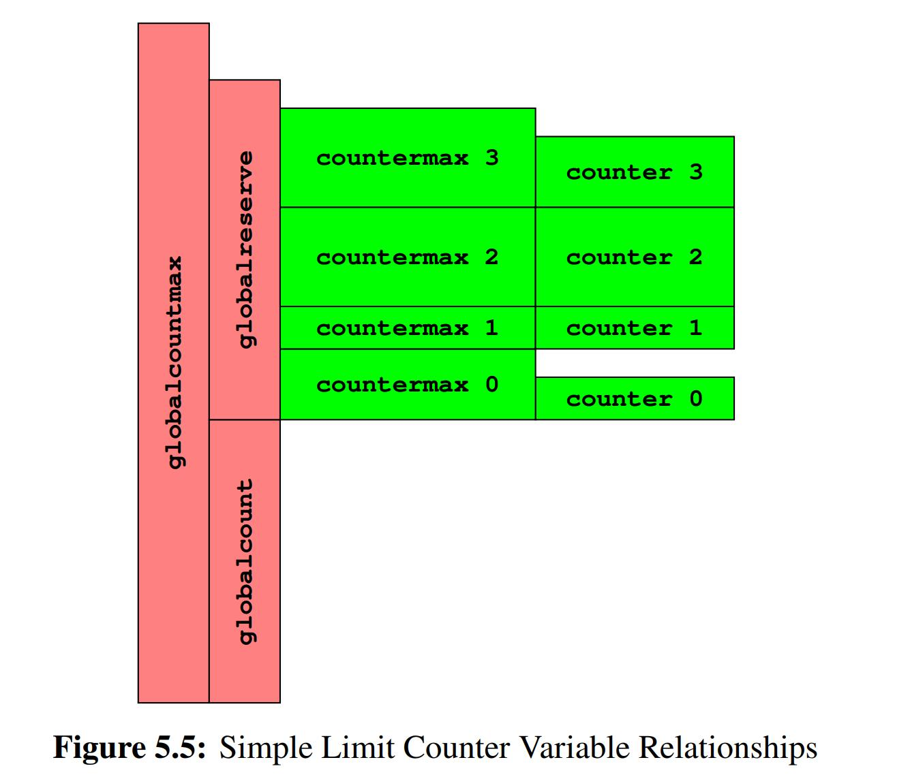
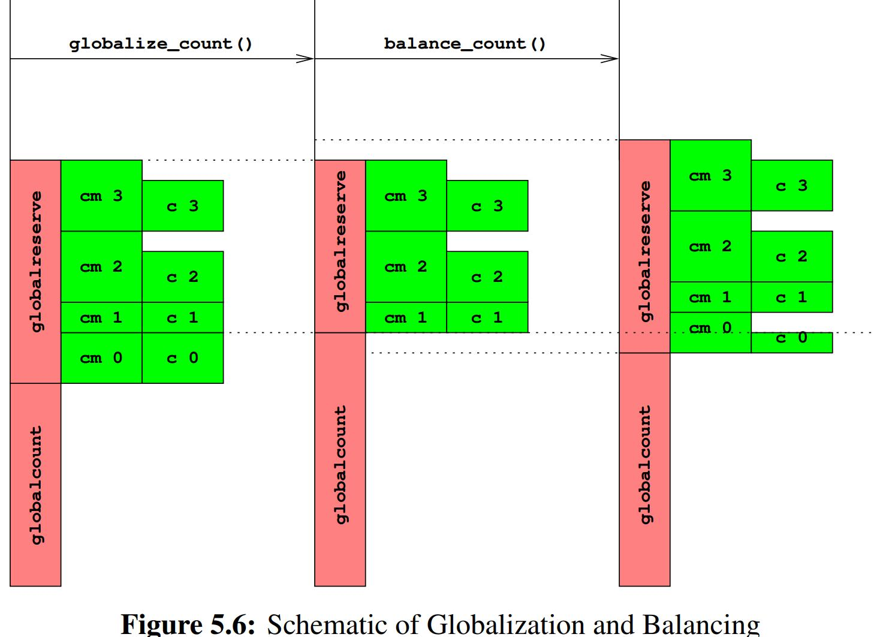

# Counting

## Simple implementation

Just count atomically

```c++
1 atomic_t counter = ATOMIC_INIT(0);
2
3 static __inline__ void inc_count(void)
4 {
5 	atomic_inc(&counter);
6 }
7
8 static __inline__ long read_count(void)
9 {
10 	return atomic_read(&counter);
11 }
```

In order for each CPU to get a chance to increment a given global variable, the cache line containing that variable must circulate among all the CPUs

## Statistical counters

**Statistical counters are counters which is mostly written to and rarely read out.**

Statistical counting is typically handled by providing a counter per thread (or CPU, when running in the kernel), **so that each thread updates its own counter**. The aggregate value of the counters is read out by simply summing up all of the threads’ counters, relying on the commutative and associative properties of addition.

### Per-thread counter Implementation

```C
1 DEFINE_PER_THREAD(unsigned long, counter);
2
3 static __inline__ void inc_count(void)
4 {
5 	unsigned long *p_counter = &__get_thread_var(counter);
6
7 	WRITE_ONCE(*p_counter, *p_counter + 1);
8 }
9
10 static __inline__ unsigned long read_count(void)
11 {
12 	int t;
13 	unsigned long sum = 0;
14
15 	for_each_thread(t)
16 		sum += READ_ONCE(per_thread(counter, t));
17 	return sum;
18 }
```

### Array-based counter implementation

One way to provide per-thread variables is to allocate an array with one element per thread (presumably cache aligned and padded to **avoid false sharing**).

The read operation takes time to sum up the per-thread values, and during that time, the counter could well be changing. This means that the value returned by read_count()  will not necessarily be exact


### Per-Thread-Variable-Based Implementation

```C
1 unsigned long _Thread_local counter = 0;
2 unsigned long *counterp[NR_THREADS] = { NULL };
3 unsigned long finalcount = 0;
4 DEFINE_SPINLOCK(final_mutex);
5
6 static inline void inc_count(void)
7 {
8 WRITE_ONCE(counter, counter + 1);
9 }
10
11 static inline unsigned long read_count(void)
12 {
13 	int t;
14 	unsigned long sum;
15
16 	spin_lock(&final_mutex);
17 	sum = finalcount;
18 	for_each_thread(t)
19 		if (counterp[t] != NULL)
20 	sum += READ_ONCE(*counterp[t]);
21 	spin_unlock(&final_mutex);
22 	return sum;
23 }
24
25 void count_register_thread(unsigned long *p)
26 {
27 int idx = smp_thread_id();
28
29 	spin_lock(&final_mutex);
30 	counterp[idx] = &counter;
31 	spin_unlock(&final_mutex);
32 }
33
34 void count_unregister_thread(int nthreadsexpected)
35 {
36 	int idx = smp_thread_id();
37
38 	spin_lock(&final_mutex);
39 	finalcount += counter;
40 	counterp[idx] = NULL;
41 	spin_unlock(&final_mutex);
42 }
```

The check for NULL on line 19 of add extra branch mispredictions. Have a variable set permanently to zero, and point unused counter-pointers to that variable rather than setting them to NULL would be a reasonable improvement here.

#### why lock?

when a thread exits, its per-thread variables disappear. Therefore, if we attempt to access a given thread’s per-thread variables after that thread exits, we will get a segmentation fault. The lock coordinates summation and thread exit, preventing this scenario.


### Eventually consistent implementation

One way to retain update-side scalability while greatly improving readside performance is to weaken consistency requirements.

We exploit eventual consistency by maintaining a global counter. However, updaters only manipulate their per-thread counters. <u>A separate thread is provided to transfer counts from the per-thread counters to the global counter</u>. Readers simply access the value of the global counter.

```C
1 DEFINE_PER_THREAD(unsigned long, counter);
2 unsigned long global_count;
3 int stopflag;
4
5 static __inline__ void inc_count(void)
6 {
7 	unsigned long *p_counter = &__get_thread_var(counter);
8
9 	WRITE_ONCE(*p_counter, *p_counter + 1);
10 }
11
12 static __inline__ unsigned long read_count(void)
13 {
14 	return READ_ONCE(global_count);
15 }
16
17 void *eventual(void *arg)
18 {
19 	int t;
20 	unsigned long sum;
21
22 while (READ_ONCE(stopflag) < 3) {
23 	sum = 0;
24 	for_each_thread(t)
25 		sum += READ_ONCE(per_thread(counter, t));
26 	WRITE_ONCE(global_count, sum);
27 	poll(NULL, 0, 1);
28 	if (READ_ONCE(stopflag))
29 		smp_store_release(&stopflag, stopflag + 1);
30 	}
31 	return NULL;
32 }
33
34 void count_init(void)
35 {
36 	int en;
37 	pthread_t tid;
38
39 	en = pthread_create(&tid, NULL, eventual, NULL);
40 	if (en != 0) {
41 		fprintf(stderr, "pthread_create: %s\n", strerror(en));
42 		exit(EXIT_FAILURE);
43 	}
44 }
45
46 void count_cleanup(void)
47 {
48 	WRITE_ONCE(stopflag, 1);
49 	while (smp_load_acquire(&stopflag) < 3)
50 		poll(NULL, 0, 1);
51 }
```


## Approximate Limit Counters

**Counting involves limit-checking**

### Design

For limit counters, we can use a variation on this theme where we partially partition the counter. For example, consider four threads with each having not only a per-thread counter, but also a per-thread maximum value (call it countermax). 

But then what happens if a given thread needs to increment its counter, but counter is equal to its countermax? The trick here is to move half of that thread’s counter value to a globalcount, then increment counter. For example, if a given thread’s counter and countermax variables were both equal to 10, we do the following:

1. Acquire a global lock.
2. Add five to globalcount. 
3. To balance out the addition, subtract five from this thread’s counter. 
4. Release the global lock. 
5. Increment this thread’s counter, resulting in a value of six.

Although this procedure still requires a global lock, that lock need only be acquired once for every five increment operations, <u>greatly reducing that lock’s level of contention</u>.

When far from the limit, the countermax per-thread variables are set to large values to optimize for performance and scalability, while when close to the limit, these same variables are set to small values to minimize the error in the checks against the globalcountmax limit.

### Simple limit counter implementation

```C
// Variables
1 unsigned long __thread counter = 0; // local counter
2 unsigned long __thread countermax = 0; // local counter bound
3 unsigned long globalcountmax = 10000;  // global aggregate count limit
4 unsigned long globalcount = 0;   
5 unsigned long globalreserve = 0;//at least the sum of all of the per-thread countermax
6 unsigned long *counterp[NR_THREADS] = { NULL };
7 DEFINE_SPINLOCK(gblcnt_mutex);
```

1. The sum of globalcount and globalreserve must be less than or equal to globalcountmax.
2. The sum of all threads’ countermax values must be less than or equal to globalreserve.
3. Each thread’s counter must be less than or equal to that thread’s countermax.

<div>			<!--块级封装-->
    <center>	<!--将图片和文字居中-->
    
    <br>		<!--换行-->
    </center>
</div>


```C
// Utils
1 static __inline__ void globalize_count(void)
2 {
3 	globalcount += counter;
4 	counter = 0;
5 	globalreserve -= countermax;
6 	countermax = 0;
7 }
8
9 static __inline__ void balance_count(void)
10 {
11 	countermax = globalcountmax -
12 		globalcount - globalreserve;
13 	countermax /= num_online_threads();
14 	globalreserve += countermax;
15 	counter = countermax / 2;
16 	if (counter > globalcount)
17 		counter = globalcount;
18 	globalcount -= counter;
19 }
20
21 void count_register_thread(void)
22 {
23 int idx = smp_thread_id();
24
25 spin_lock(&gblcnt_mutex);
26 counterp[idx] = &counter;
27 spin_unlock(&gblcnt_mutex);
28 }
29
30 void count_unregister_thread(int nthreadsexpected)
31 {
32 int idx = smp_thread_id();
33
34 spin_lock(&gblcnt_mutex);
35 globalize_count();
36 counterp[idx] = NULL;
37 spin_unlock(&gblcnt_mutex);
38 }
```

<div>			<!--块级封装-->
    <center>	<!--将图片和文字居中-->
    
    <br>		<!--换行-->
    </center>
</div>


```C
/**
globalize_count(), which clears the thread-local variables, adjusting the global variables as needed, thus simplifying global processing.

balance_count() updates both the global and the per-thread variables. This call to
balance_count() will usually set this thread’s countermax to re-enable the fastpath
*/


1 static __inline__ int add_count(unsigned long delta)
2 {
3 	if (countermax - counter >= delta) {
4 		WRITE_ONCE(counter, counter + delta);
5 		return 1;
6 	}
7 	spin_lock(&gblcnt_mutex);
8 	globalize_count();
9 	if (globalcountmax -
10 		globalcount - globalreserve < delta) {
11 		spin_unlock(&gblcnt_mutex);
12 		return 0;
13 }
14 	globalcount += delta;
15 	balance_count();
16 	spin_unlock(&gblcnt_mutex);
17 	return 1;
18 }
19
20 static __inline__ int sub_count(unsigned long delta)
21 {
22 	if (counter >= delta) {
23 		WRITE_ONCE(counter, counter - delta);
24 		return 1;
25 	}
26 	spin_lock(&gblcnt_mutex);
27 	globalize_count();
28 	if (globalcount < delta) {
29 		spin_unlock(&gblcnt_mutex);
30 		return 0;
31 	}
32 	globalcount -= delta;
33 	balance_count();
34 	spin_unlock(&gblcnt_mutex);
35 	return 1;
36 }
37
38 static __inline__ unsigned long read_count(void)
39 {
40 	int t;
41 	unsigned long sum;
42
43 	spin_lock(&gblcnt_mutex);
44 	sum = globalcount;
45 	for_each_thread(t) {
46 	if (counterp[t] != NULL)
47 		sum += READ_ONCE(*counterp[t]);
48 	}
49 	spin_unlock(&gblcnt_mutex);
50 	return sum;
51 }
```

