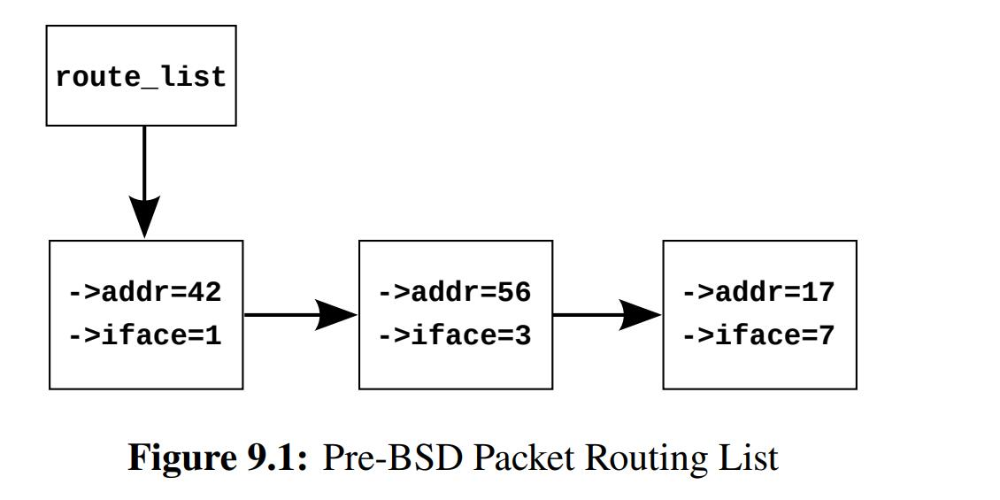

# Deferred processing

We further simplify the algorithm by reducing the search key from a quadruple consisting of source and destination IP addresses and ports all the way down to a **simple integer**

<div>			<!--块级封装-->
    <center>	<!--将图片和文字居中-->
    
    <br>		<!--换行-->
    </center>
</div>

```C
// Sequential version
1 struct route_entry {
2 	struct cds_list_head re_next;
3 	unsigned long addr;
4 	unsigned long iface;
5 };
6 CDS_LIST_HEAD(route_list);
7
8 unsigned long route_lookup(unsigned long addr)
9 {
10 	struct route_entry *rep;
11 	unsigned long ret;
12
13 	cds_list_for_each_entry(rep, &route_list, re_next) {
14 	if (rep->addr == addr) {
15 		ret = rep->iface;
16 		return ret;
17 		}
18 	}
19 	return ULONG_MAX;
20 }
21
22 int route_add(unsigned long addr, unsigned long interface)
23 {
24 	struct route_entry *rep;
25
26 	rep = malloc(sizeof(*rep));
27 	if (!rep)
28 		return -ENOMEM;
29 	rep->addr = addr;
30 	rep->iface = interface;
31 	cds_list_add(&rep->re_next, &route_list);
32 	return 0;
33 }
34
35 int route_del(unsigned long addr)
36 {
37 	struct route_entry *rep;
38
39 	cds_list_for_each_entry(rep, &route_list, re_next) {
40 	if (rep->addr == addr) {
41 		cds_list_del(&rep->re_next);
42 		free(rep);
43 		return 0;
44 		}
45 	}
46 	return -ENOENT;
47 }
```

## Reference counting

BUGGY implementation of reference counting based Pre-BSD routing algorithmn

```C
1 struct route_entry {
2 	atomic_t re_refcnt;
3 	struct route_entry *re_next;
4 	unsigned long addr;
5 	unsigned long iface;
6 	int re_freed;
7 };
8 struct route_entry route_list;
9 DEFINE_SPINLOCK(routelock);
10
11 static void re_free(struct route_entry *rep)
12 {
13 	WRITE_ONCE(rep->re_freed, 1);
14 	free(rep);
15 }
16
17 unsigned long route_lookup(unsigned long addr)
18 {
19 	int old;
20 	int new;
21 	struct route_entry *rep;
22 	struct route_entry **repp;
23 	unsigned long ret;
24
25 	retry:
26 		repp = &route_list.re_next;
27 		rep = NULL;
28 		do {
29 			if (rep && atomic_dec_and_test(&rep->re_refcnt))
30 				re_free(rep);
31 			rep = READ_ONCE(*repp);
32 			if (rep == NULL)
33 				return ULONG_MAX;
34 			do {
35 				if (READ_ONCE(rep->re_freed))
36 					abort();
37 				old = atomic_read(&rep->re_refcnt);
38 				if (old <= 0)
39 					goto retry;
40 				new = old + 1;
41 			} while (atomic_cmpxchg(&rep->re_refcnt,
42 									old, new) != old);
43 			repp = &rep->re_next;
44 		} while (rep->addr != addr);
45 		ret = rep->iface;
46 		if (atomic_dec_and_test(&rep->re_refcnt))
47 			re_free(rep);
48 		return ret;
}
```

```c
1 int route_add(unsigned long addr, unsigned long interface)
2 {
3 	struct route_entry *rep;
4
5 	rep = malloc(sizeof(*rep));
6 	if (!rep)
7 		return -ENOMEM;
8 	atomic_set(&rep->re_refcnt, 1);
9 	rep->addr = addr;
10 	rep->iface = interface;
11 	spin_lock(&rosssutelock);
12 	rep->re_next = route_list.re_next;
13 	rep->re_freed = 0;
14 	route_list.re_next = rep;
15 	spin_unlock(&routelock);
16 	return 0;
17 }
18
19 int route_del(unsigned long addr)
20 {
21 	struct route_entry *rep;
22 	struct route_entry **repp;
23
24 	spin_lock(&routelock);
25 	repp = &route_list.re_next;
26 	for (;;) {
27 		rep = *repp;
28 		if (rep == NULL)
29 			break;
30 		if (rep->addr == addr) {
31 			*repp = rep->re_next;
32 			spin_unlock(&routelock);
33 			if (atomic_dec_and_test(&rep->re_refcnt))
34 				re_free(rep);
35 			return 0;
36 		}
37 		repp = &rep->re_next;
38 	}
39 	spin_unlock(&routelock);
40 	return -ENOENT;
41 }
```

