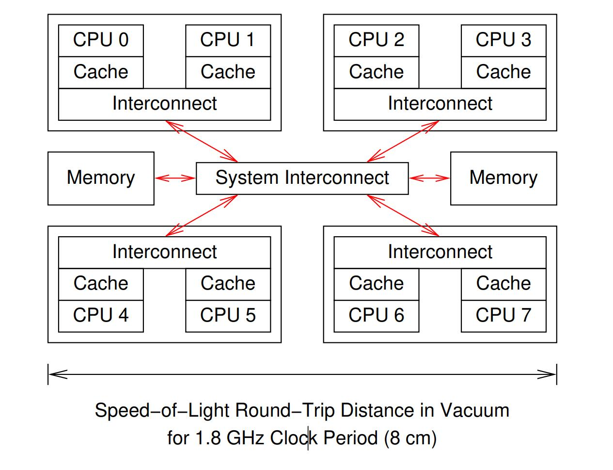

# Hardware and its Habits

## Pipeline

Achieving full performance with a CPU having a long pipeline requires highly predictable control flow through the program. 

A wrong guess can be expensive because the CPU must discard any speculatively executed instructions following the corresponding branch, resulting in a pipeline flush.

## Atomic operations

One common trick by hardware being to identify all the cachelines containing the data to be atomically operated on, ensure that these cachelines are owned by the CPU executing the atomic operation, and only then proceed with the atomic operation while ensuring that these cachelines remained owned by this CPU. Because all the data is private to this CPU, other CPUs are unable to interfere with the atomic operation despite the piece-at-a-time nature of the CPU’s pipeline. 

### Thermal Throttling

If you reduced the number of clock cycles by making more effective use of the CPU’s functional units, you will have increased the power consumed by that CPU. This will in turn increase the amount of heat dissipated by that CPU. If this heat dissipation exceeds the cooling system’s capacity, the system will thermally throttle that CPU

you can parallelize your code, spreading the work (and thus the heat) over multiple CPU cores.

## Multi-core

			<!--块级封装-->
    
	<!--将图片和文字居中-->
    
     		<!--换行-->
    

If multiple threads trying to write the same address, the cacheline will bouncing around difference cache of different core, bombarding the interconnect.

False sharing, which happens when different variables in the same cacheline are being updated by different CPUs, resulting in a high cache-miss rate. Software can use the alignment directives available in many compilers to avoid false sharing, and adding such directives is a common step in tuning parallel software.

## Hardware Optimization

* Large cacheline: might cause false sharing
* Cache prefetching
* Store buffer: might cause memory misordering

* Read-mostly replication in multiple-CPU

