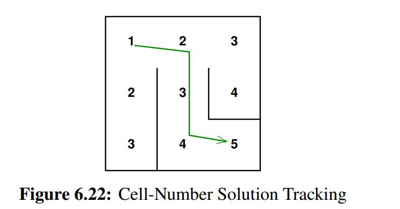

# Maze solver

## Review of BFS and DFS search

DFS

* Via stack or recursion (LIFO)
* Uses: complete search and exhausting possible paths
* Go deep

BFS

* Via iterative or a queue (FIFO)
* uses: check IF a path exists
* Go wild, level by level


## Sequential solver

The maze is represented by a 2D array of cells and a linear-array-based work queue named ->visited

<div>			<!--块级封装-->
    <center>	<!--将图片和文字居中-->
    
    <br>		<!--换行-->
    </center>
</div>

```C
1 int maze_solve(maze *mp, cell sc, cell ec)
2 {
3 	cell c = sc;
4 	cell n;
5 	int vi = 0;
6
7 	maze_try_visit_cell(mp, c, c, &n, 1);
8 	for (;;) {
9 		while (!maze_find_any_next_cell(mp, c, &n)) {
10 			if (++vi >= mp->vi)
11 				return 0;
12 			c = mp->visited[vi].c;
13 		}
14 		do {
15 			if (n == ec) {
16 				return 1;
17 			}
18		 c = n;
19 		} while (maze_find_any_next_cell(mp, c, &n));
20 		c = mp->visited[vi].c;
21 		}
22 }
```

```C
1 int maze_try_visit_cell(struct maze *mp, cell c, cell t,
2 cell *n, int d)
3 {
4 	if (!maze_cells_connected(mp, c, t) ||
5 		(*celladdr(mp, t) & VISITED))
6 			return 0;
7 	*n = t; //next cell
8 	mp->visited[mp->vi] = t;
9 	mp->vi++;
10 	*celladdr(mp, t) |= VISITED | d;
11 	return 1;
12 }
13
14 int maze_find_any_next_cell(struct maze *mp, cell c,
15 cell *n)
16 {
17 	int d = (*celladdr(mp, c) & DISTANCE) + 1;
18
19 	if (maze_try_visit_cell(mp, c, prevcol(c), n, d))
20 		return 1;
21 	if (maze_try_visit_cell(mp, c, nextcol(c), n, d))
22 		return 1;
23 	if (maze_try_visit_cell(mp, c, prevrow(c), n, d))
24 		return 1;
25 	if (maze_try_visit_cell(mp, c, nextrow(c), n, d))
26 		return 1;
27 	return 0;
28 }
```

