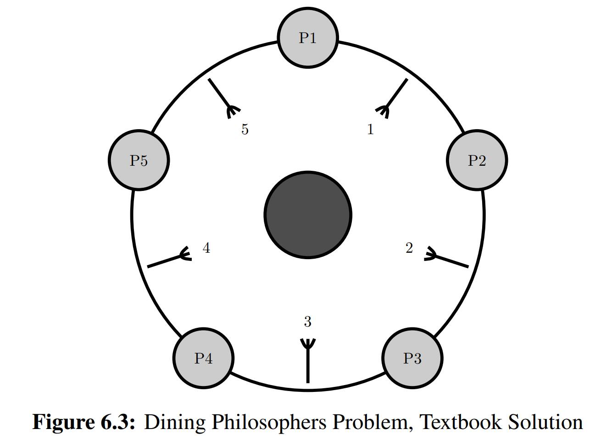
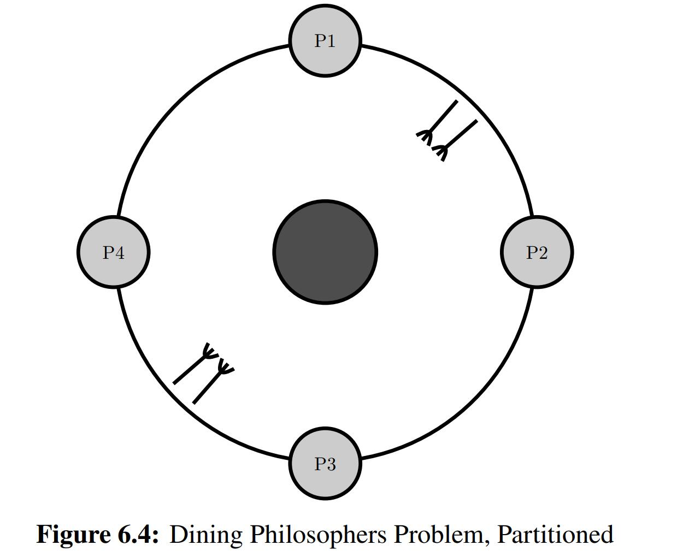
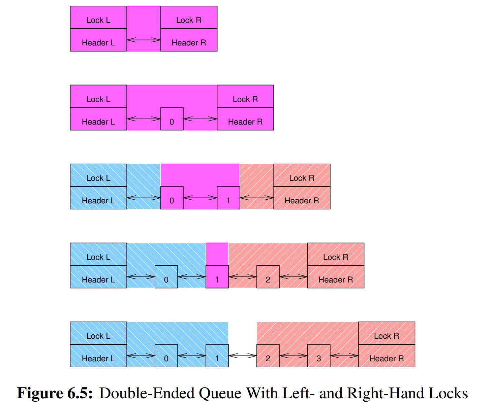
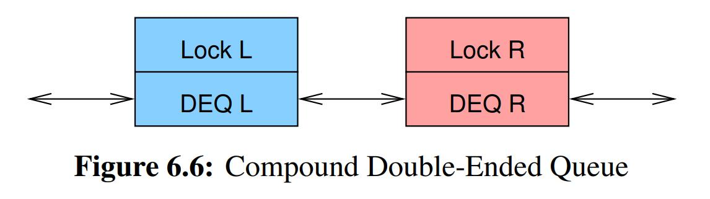
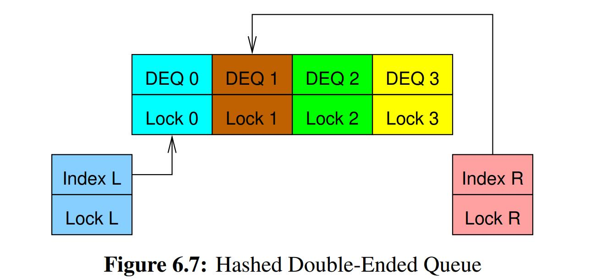
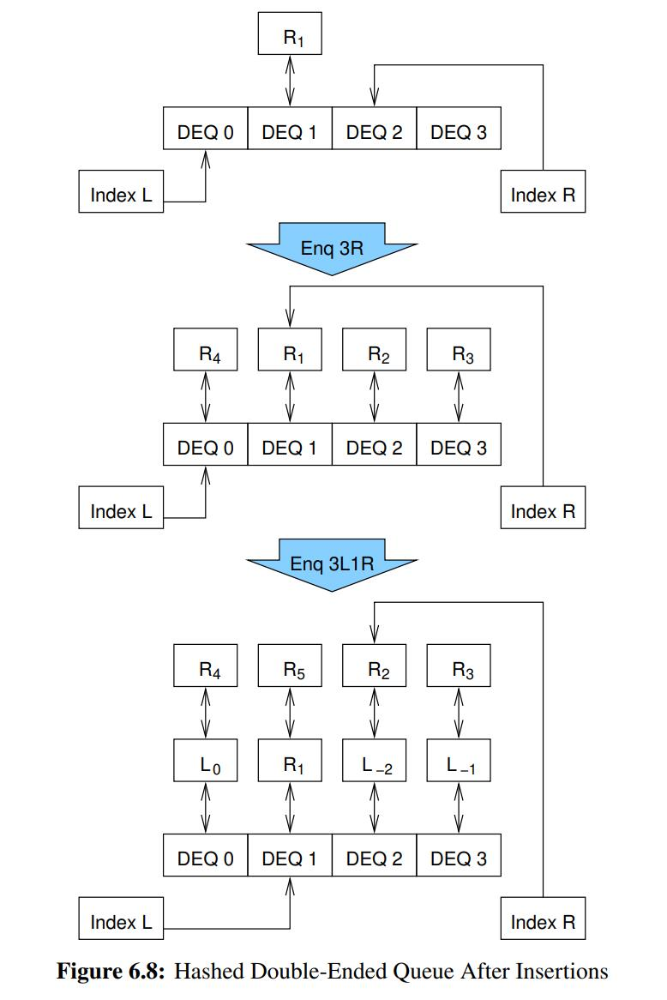
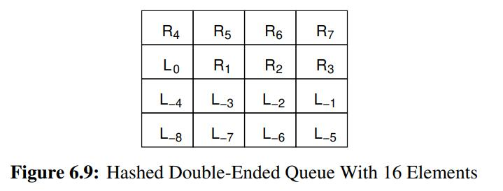

# Paritioning and Synchonization

Design: Partition first, Batch second, Weaken third, and code fourth.


## Dining philosophers problem

<div>			<!--块级封装-->
    <center>	<!--将图片和文字居中-->
    
    <br>		<!--换行-->
    </center>
</div>

Dijkstra’s solution used a global semaphore, which works fine assuming negligible communications delays, an assumption that became invalid in the late 1980s or early 1990s.

More recent solutions number the forks as shown in above figure. Each philosopher picks up the lowest-numbered fork next to his or her plate, then picks up the other fork. (In short, this algorithm can result in only one philosopher eating at a given time, even when all five philosophers are hungry, despite the fact that there are more than enough forks for two philosophers to eat concurrently)

<div>			<!--块级封装-->
    <center>	<!--将图片和文字居中-->
    
    <br>		<!--换行-->
    </center>
</div>

One approach is shown in above figure, which includes four philosophers rather than five to better illustrate the partition technique. Here the upper and rightmost philosophers share **a pair of** forks, while the lower and leftmost philosophers share another pair of forks. If all philosophers are simultaneously hungry, at least two will always be able to eat concurrently. In addition, as shown in the figure, the forks can now be **bundled** so that the pair are picked up and put down simultaneously, simplifying the acquisition and release algorithms


# Double-ended queue

### Left-hand and right-hand locks

One seemingly straightforward approach would be to use a doubly linked list with a left-hand lock for left-hand-end enqueue and dequeue operations along with a right-hand lock for right-hand-end operations

<div>			<!--块级封装-->
    <center>	<!--将图片和文字居中-->
    
    <br>		<!--换行-->
    </center>
</div>

The problem with this approach is that the two locks’ domains must overlap when there are fewer than four elements on the list

Given that concurrent activity at the other end of the list can shift the queue from one special case to another at any time. It is far better to consider other designs

### Compound double-ended queue

<div>			<!--块级封装-->
    <center>	<!--将图片和文字居中-->
    
    <br>		<!--换行-->
    </center>
</div>

One way of forcing non-overlapping lock domains is shown in Figure. Two separate double-ended queues are run in tandem, each protected by its own lock. This means that elements must occasionally be shuttled from one of the double-ended queues to the other, in which case both locks must be held.

 A simple lock hierarchy may be used to avoid deadlock, for example, always acquiring the left-hand lock **before** acquiring the right-hand lock.

**Avoid deadlock**: when trying to acquire 2 locks, in this case, left-hand lock and right-hand lock, you need to follow certain fixed order of acquiring locks.

```C
1 struct cds_list_head *pdeq_pop_l(struct pdeq *d)
2 {
3 	struct cds_list_head *e;
4
5 	spin_lock(&d->llock);
6 	e = deq_pop_l(&d->ldeq);
7 	if (e == NULL) {
8 		spin_lock(&d->rlock);
9 		e = deq_pop_l(&d->rdeq);
10 		cds_list_splice(&d->rdeq.chain, &d->ldeq.chain);
11 		CDS_INIT_LIST_HEAD(&d->rdeq.chain);
12 		spin_unlock(&d->rlock);
13 }
14 	spin_unlock(&d->llock);
15 	return e;
16 }
17
18 struct cds_list_head *pdeq_pop_r(struct pdeq *d)
19 {
20 	struct cds_list_head *e;
21
22 	spin_lock(&d->rlock);
23 	e = deq_pop_r(&d->rdeq);
24 	if (e == NULL) {
25 		spin_unlock(&d->rlock); // avoid deadlock: first llock then rlock
26 		spin_lock(&d->llock);
27 		spin_lock(&d->rlock);
28 		e = deq_pop_r(&d->rdeq);
29 		if (e == NULL) {
30 			e = deq_pop_r(&d->ldeq);
31 			cds_list_splice(&d->ldeq.chain, &d->rdeq.chain);
32 			CDS_INIT_LIST_HEAD(&d->ldeq.chain);
33 		}
34 		spin_unlock(&d->llock);
35 	}
36 	spin_unlock(&d->rlock);
37 	return e;
38 }
39
40 void pdeq_push_l(struct cds_list_head *e, struct pdeq *d)
41 {
42 	spin_lock(&d->llock);
43 	deq_push_l(e, &d->ldeq);
44 	spin_unlock(&d->llock);
45 }
46
47 void pdeq_push_r(struct cds_list_head *e, struct pdeq *d)
48 {
49 	spin_lock(&d->rlock);
50 	deq_push_r(e, &d->rdeq);
51 	spin_unlock(&d->rlock);
52 }
```


### Hashed Double-Ended Queue

*One of the simplest and most effective ways to deterministically partition a data structure is to hash it.*

<div>			<!--块级封装-->
    <center>	<!--将图片和文字居中-->
    
    <br>		<!--换行-->
    </center>
</div>

<div>			<!--块级封装-->
    <center>	<!--将图片和文字居中-->
    
    <br>		<!--换行-->
    </center>
</div>

<div>			<!--块级封装-->
    <center>	<!--将图片和文字居中-->
    
    <br>		<!--换行-->
    </center>
</div>

A key point is that it is not necessary to actually represent a given element’s number, as this number will be implied by its position in the queue


## Synchronization granularity

### Data locking

Many data structures may be partitioned, with each partition of the data structure having its own lock. Then the critical sections for each part of the data structure can execute in parallel

Data locking reduces contention by distributing the instances of the overly-large critical section across multiple data structures, for example, maintaining per-hash-bucket critical sections in a hash table

### Data ownership

Data ownership partitions a given data structure over the threads or CPUs, so that each thread/CPU accesses its subset of the data structure without any synchronization overhead whatsoever. However, if one thread wishes to access some other thread’s data, the first thread is unable to do so directly. Instead, the first thread must communicate with the second thread, so that the second thread performs the operation on behalf of the first, or, alternatively, migrates the data to the first thread.

### Fastpath

In many cases, most of the overhead is incurred by a small fraction of the code. So why not focus effort on that small fraction?

This is the idea behind the parallel-fastpath design pattern, to aggressively parallelize the common-case code path without incurring the complexity that would be required to aggressively parallelize the entire algorithm

#### Reader/writer locking

If only a small fraction of the critical sections modify data, then allowing multiple readers to proceed in parallel can greatly increase scalability

#### Hierarchical locking

The idea behind hierarchical locking is to have a coarse-grained lock that is held only long enough to work out which fine-grained lock to acquire. Global coarse-grained lock is to safely acquire the fine-grained lock.

*This can be used for **Hashed Double-ended  Queue*** above, the coarse-grained lock for left and right index is to safely aquire the lock for the bucket queue, once aquired lock for bucket the index lock can be released.

