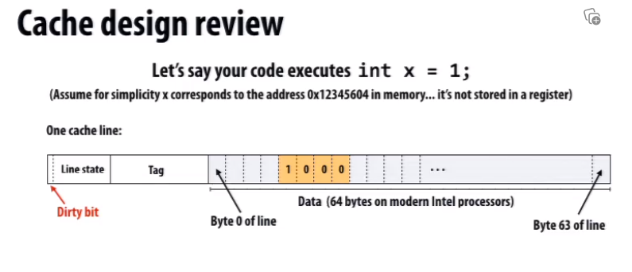
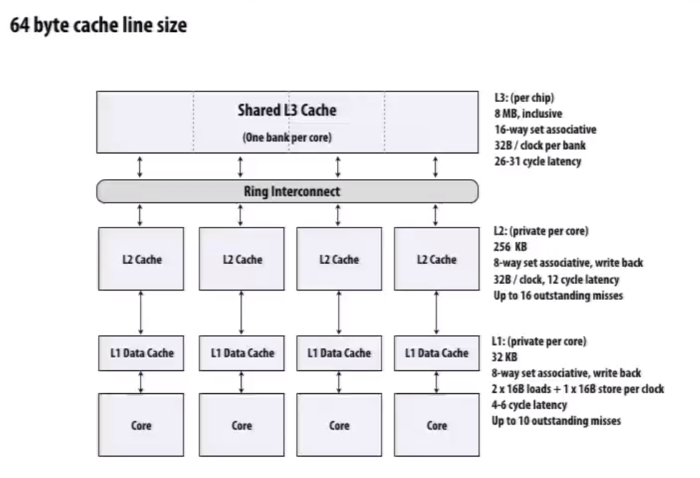
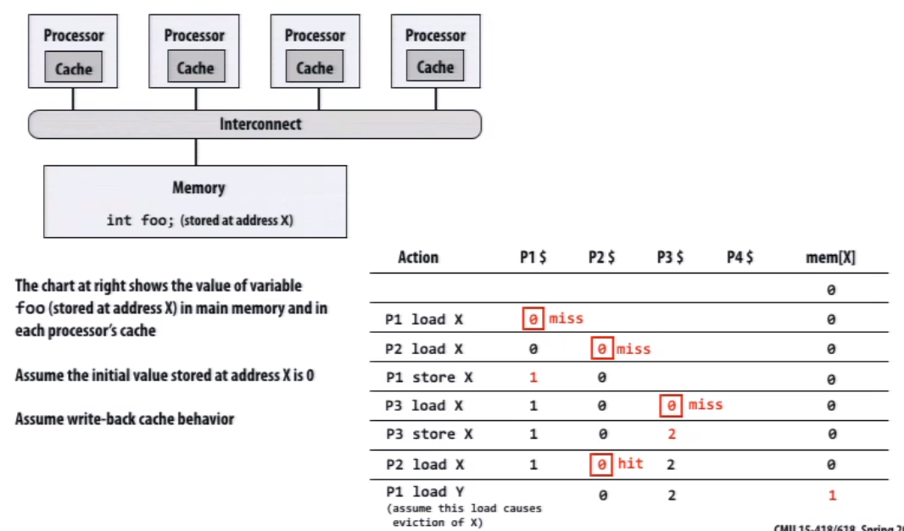
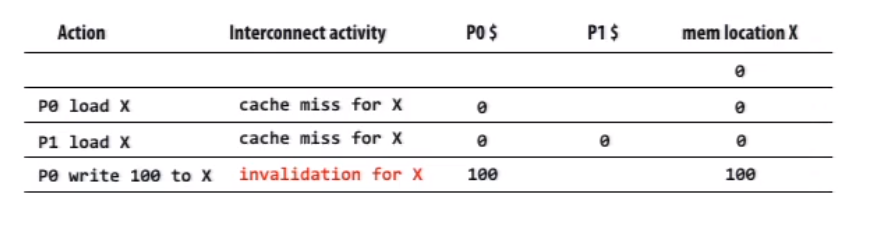
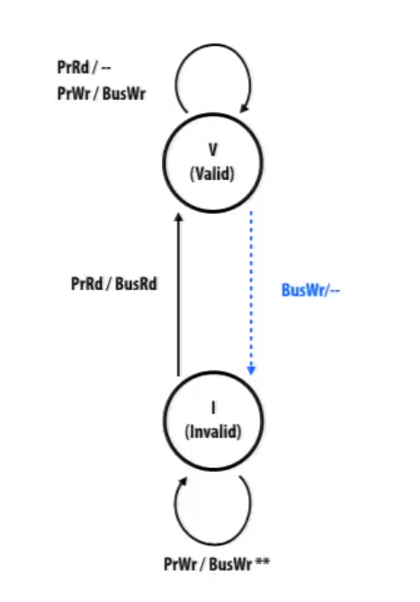
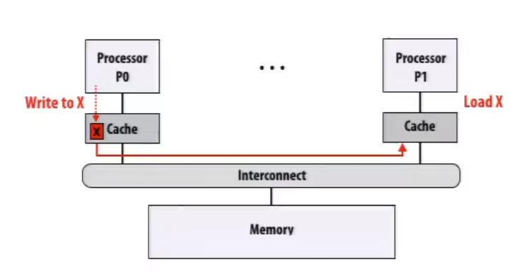
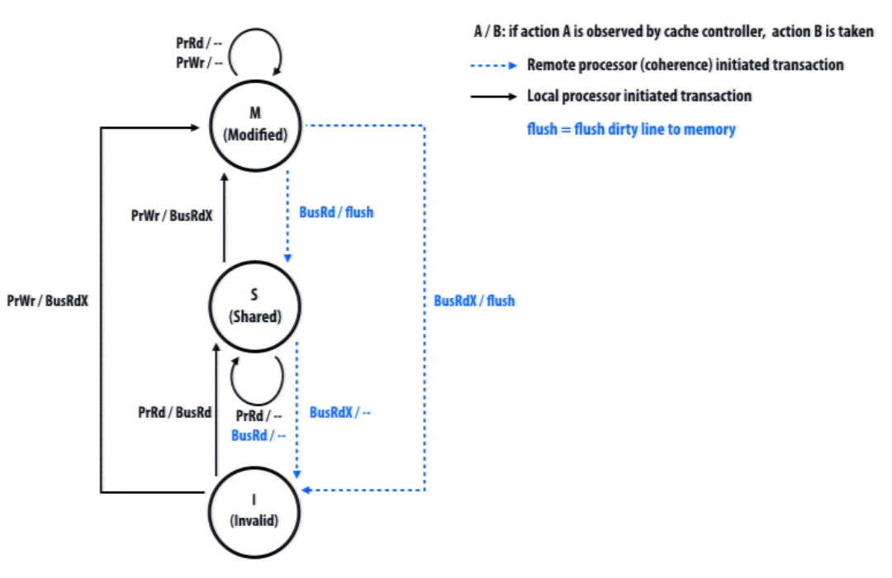
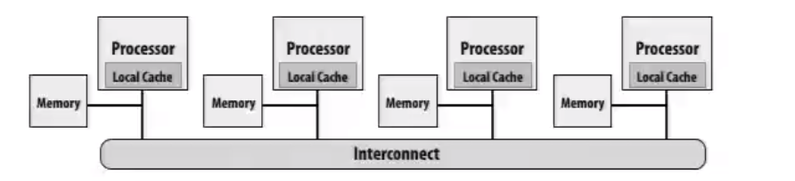
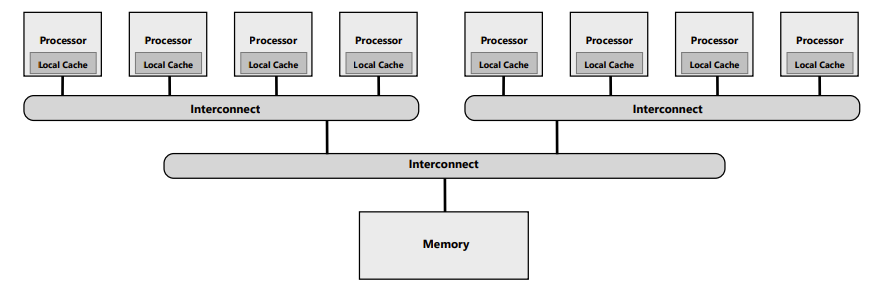

# Cache Coherence

           <!--块级封装-->    
    <!--将图片和文字居中-->       

* Tag here is the memory address of this cache line
* Dirty bit applys when using write-back strategy

### Intel Haswell CPU (2013)

           <!--块级封装-->    
    <!--将图片和文字居中-->       

## Problem

* Modern processors replicate contents of memory in local caches
* Processors can observe different values for same memory location because of not writing back yet
* The problem is not about mutual exclusive at all

           <!--块级封装-->    
    <!--将图片和文字居中-->       

 

## DMA

Consider I/O device performing DMA data transfer

* Processor writes to buffer in main memory, then tells network card to async send buffer. Network card may transfer stale data if processor's writes are not flushed to memory
* CPU may read stale data if adresses updated by network card happen to be in cache

Common solution

* Mark memory pages not-cachable
* Explicitly flush cache line

## Definition of Coherence

* A read by processor P to address X that follows a write by P to address X should return the value of the write by P
* A read by processor P1 to address X that follows a write by processor P2 to X returns the written value
* Writes to the same address are serialized: two writes to address X by any two processors are observed in the same order by all processors.

# Snooping cache-coherence

* Main idea: all coherence-related activity is broadcast to all processors in the system(more specifically: to the processor's cache controller)
* Cache controllers moniter("they snoop") memory operations, and react accordingly to maintain memory coherence'

## Simple Implementation

premises:

* Write-through caches
* Granularity of coherence is cache line

           <!--块级封装-->    
    <!--将图片和文字居中-->       

* Upon write, cache controller broadcasts invalidation message
* As a result, the next read from other processors will trigger cache miss

## Formal Impletation

* The logic we are about to describe is performed by each processor's cache controller in response to
  * Loads and stores by the local processor
  * Messages from other caches
* If all cache controllers operate according to this protocol then coherence will be maintained

​																									**State diagram**

* PrRd/PrWr stands for local read/write
* BusRd/BusWr stands for remote caches read/write

           <!--块级封装-->    
    <!--将图片和文字居中-->       

When the cache line is invalid we apply **non-allocate write**, so when PrWr/BusWr and cache is invalid then the cache line **remains invalid**. (Just for simplicity)

### Cache coherence with write-back

* Dirty state of cache line now indicates exclusive ownership
  * Exclusive: cache is only cache with a valid copy of line
  * Owner: cache is responsible for supplying the line to other processors when they attempt to load it from memory

           <!--块级封装-->    
    <!--将图片和文字居中-->       

**Invalidation-based write-back protocol**

* A line in the "exclusive" state can be modified without notifying the other caches
* Processor can only write to lines in the exlusive state
  * So they need a way to tell other caches that they want to exclusive access to the line
  * They will do this by sending all the caches messages
* When cache controller snoops a request for exclusive access to line it contains
  * It must invalidate the line in its own cache

**MSI write-back invalidation protocol**

* Tasks of protocol
  * Ensuring processor obtains exclusive access for a write
  * Locating most recent copy of cache line's data on cache misses
* Three cache line states
  * Invalid(I): same as meaning of invalid in uniprocessor cache
  * Shared(S): line valid in one or more caches, able to be read but not written
  * Modified(M): line valid in exactly one cache(aka. dirty or exclusive state)
* Two processor operations(triggered by local CPU)
  * PrRd
  * PrWr
* Three coherence-related bus transaction(from remote caches)
  * BusRd: obtain copy of line with no intent to modify
  * BusRdX: obtain copy of line with intent to modify
  * flush: write dirty line out to memory

           <!--块级封装-->    
    <!--将图片和文字居中-->       

* When a processor owns a M line and it snoops a BusRd, it flush the line and go to S state
* When a processor owns a M line and it snoops a BusRdX, it flush the line and go to I state 

# Directory-based Coherence

## Problem

**Scaling cache coherence to large machines**

**NUMA:** non-uniform memory access

           <!--块级封装-->    
    <!--将图片和文字居中-->       

* Efficiency of NUMA system does little good if the coherence protocol can't also scale
* Processor accesses nearby memory, but to ensure coherence still must broadcast to all other processors it is doing so

## One possible solution

**Hierarchical Snooping**

Use snooping coherence at each level

           <!--块级封装-->    
    <!--将图片和文字居中-->       

## Directory

Avoid broadcast by storing information about the status of the line in one place: a "directory"

* The directory entry for a cache line contains information about the state of the cache line in all caches
* Caches look up information from the directory as necessary
* Cache coherence is maintained by point-to-point messages between the caches on a "need to know" basis (not by broadcast mechanisms)

**Terminology**

* "Home node" of a line:  node with memory holding the corresponding data for the line
* "Requesting node": node containing processor requesting line
