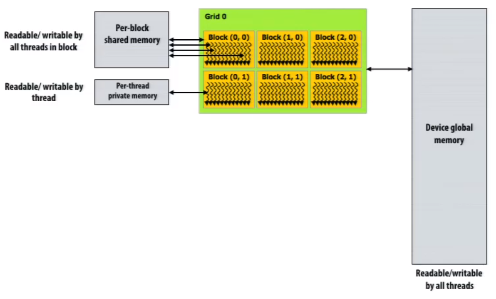
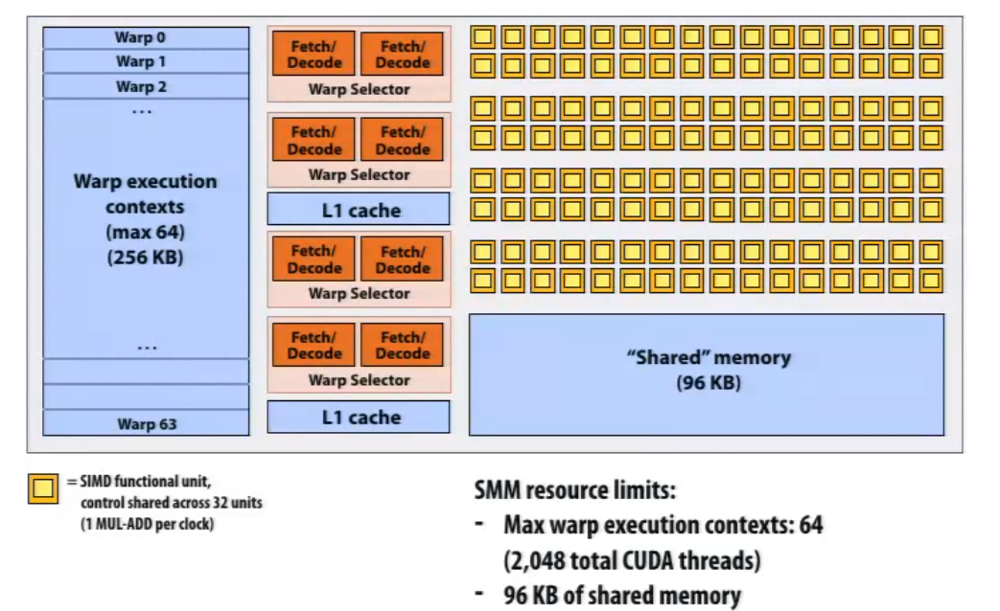
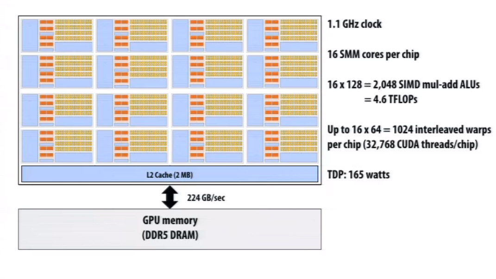
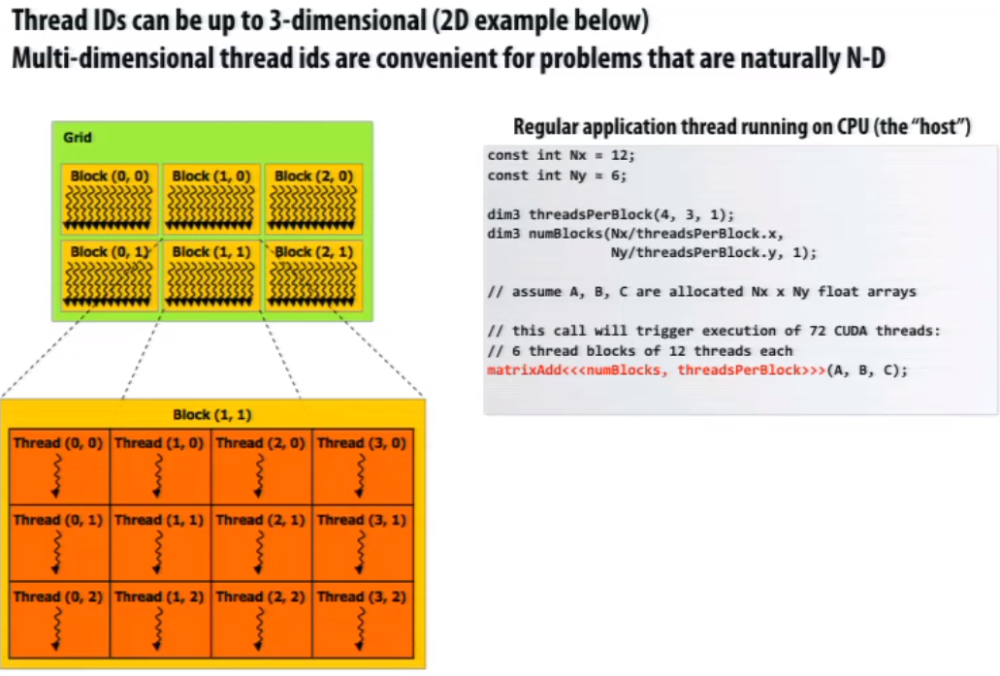
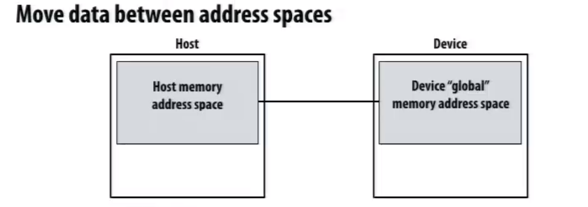

# GPU and CUDA

## GPU

Geforce 8xxx series GPUs applied NVIDIA Telsa architecture. It's the first alternative, non-graphics-specific("compute mode") interface to GPU hardware

If a user wants to run a non-graphics program on GPU

* Application can allocate buffers in GPU memory
* Application provides GPU a single kernel program binary
* Application tells GPU to run the kernel in a SPMD fashion("run N instances")

Three distinct types of memory visible to kernels

           <!--块级封装-->    
    <!--将图片和文字居中-->       

NVIDIA GTX 980

This is one NVIDIA Maxwell GM204 architecture SMM unit ("one core")

* 96kb on-chip shared memory
* 4 set of 32 wide SMID
* 4 set of fetch and decode unit each with 2 way ILP
* 256kb warp execution context

           <!--块级封装-->    
    <!--将图片和文字居中-->       

           <!--块级封装-->    
    <!--将图片和文字居中-->       

## CUDA

* Introduced in 2007 with NVIDIA Tesla architecture
* C-like language to express programs that run on GPUs using the compute-mode hardware interface
* Relatively low-level: CUDA's abstractions closely match the performance characteristics of modern GPUs
* OpenCL is an open standards version of CUDA
  * CUDA only runs on NVIDIA GPUs
  * OpenCL runs on CPUs and GPUs from many vendors

CUDA programs consist of a **hierachy** of concurrent threads

**A block no need to be the same size of a warp**

           <!--块级封装-->    
    <!--将图片和文字居中-->       

**Memcpy primitive**

           <!--块级封装-->    
    <!--将图片和文字居中-->       

