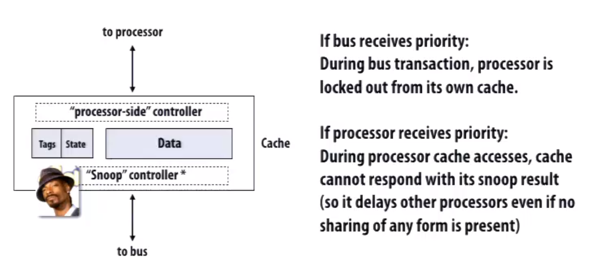
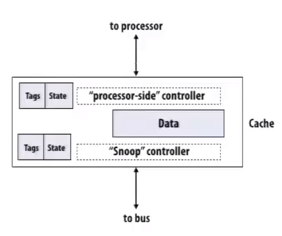
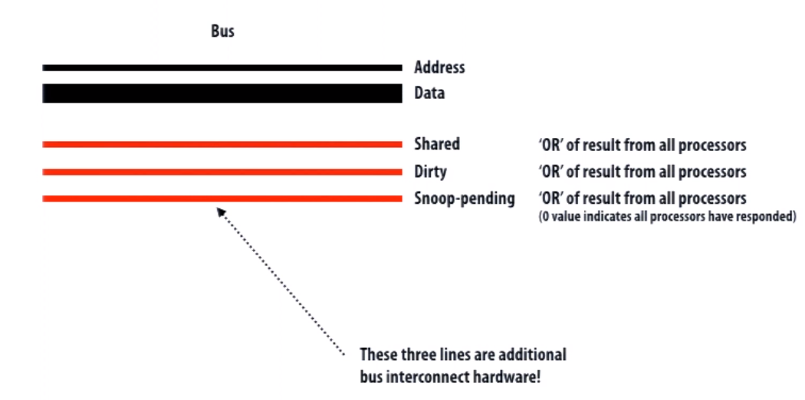
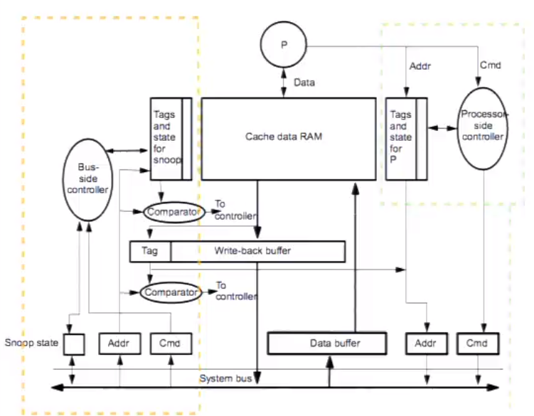
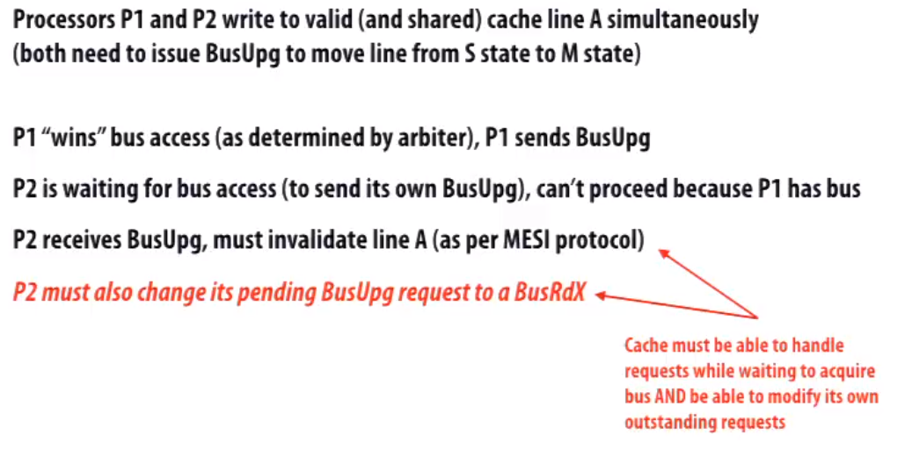
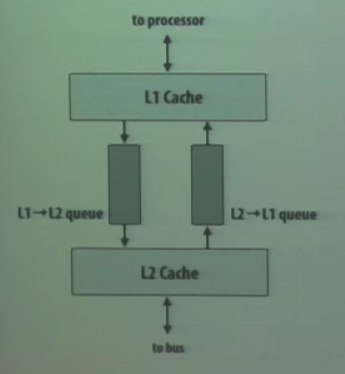
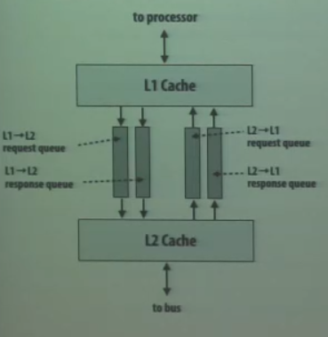
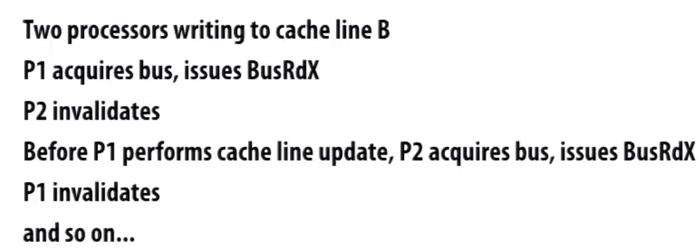
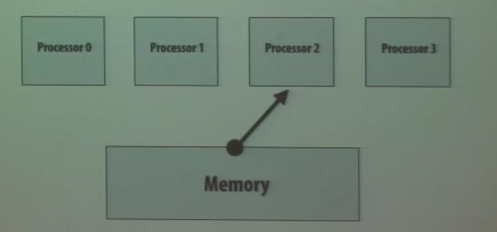

# Implement Snooping Cache Coherent

Challenge: both requests from processor and bus require tag lookup

**This is an example of contention**

           <!--块级封装-->    
    <!--将图片和文字居中-->       

### Possible solution

Since write is less frequent than read, we can duplicate the tags and state, when reading there will not be contention.

           <!--块级封装-->    
    <!--将图片和文字居中-->       

## Report snoop results

Each processor would have three additional wires.

When a processor has that cache line then it activate *Shared*

When a processor has that cache line and it's been modified then it activate *Dirty*

When a processor has not done snooping yet *Snoop-pending* keeps on

           <!--块级封装-->    
    <!--将图片和文字居中-->       

## Problem with write-back cache

When using write-back cache, one popular optimization when evicting dirty line and then load new line to replace its place can be put the dirty line into a buffer and read the requesting line right away. **Make the write async.**

This requires extra complixity when implementing snooping, we have to snoop the lines in write-back buffer too.

           <!--块级封装-->    
    <!--将图片和文字居中-->       

## Race Condition

### Deadlock

           <!--块级封装-->    
    <!--将图片和文字居中-->       

Cache must be able to respond to snoop requests from other processors while it's waiting to acquire bus. It has to answer or acknowledge snoop requests, to help others finish using bus in order to acquire the bus itself. Or this would cause deadlock.

### Circular dependency

           <!--块级封装-->    
    <!--将图片和文字居中-->       

* Outgoing read request (initiated by processor)
* Incoming read request (due to another cache)
* Both requests generate reponses that require space in the other queue

##### Possible Solution:

* Make the size of the queue big enough to fit the max number of requests needed
* Separate requests/reponse queue
  * System classify all transactions as requests and responses
  * Resources can be completed without generating further transactions
  * While stalled attempting to send a request, cache must be able to service reponses
  * Responses will make progress(the generate no new work so there's no circular dependence), enventuallty feeding up resources for requests

           <!--块级封装-->    
    <!--将图片和文字居中-->       

### Livelock

           <!--块级封装-->    
    <!--将图片和文字居中-->       

To avoid livelock, a write that obtains exclusive owenership must be allowed to complete before exclusive owenership is relinquished.

## Memory Consistency

           <!--块级封装-->    
    <!--将图片和文字居中-->       

