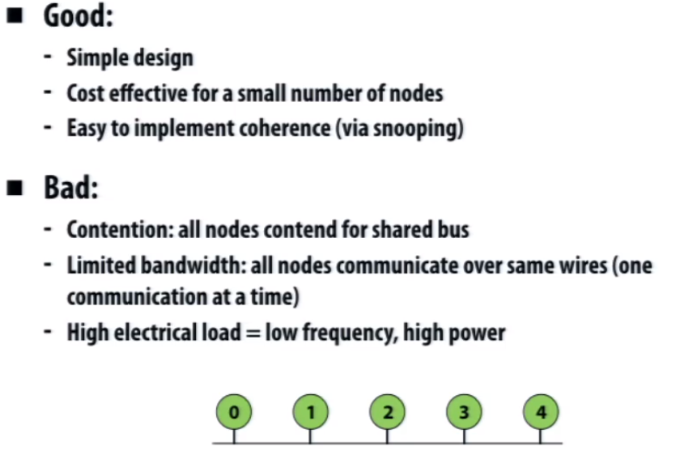
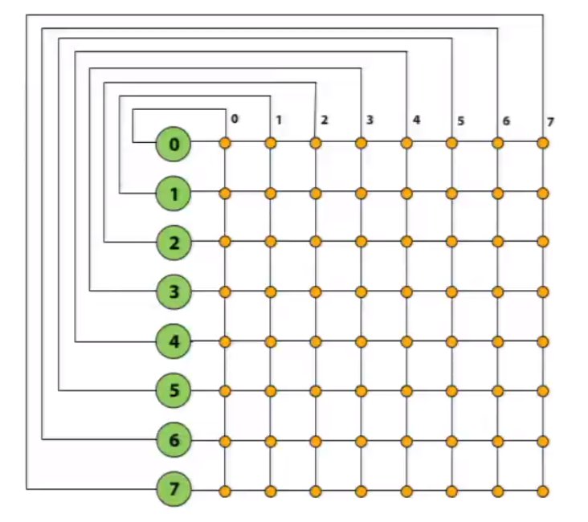
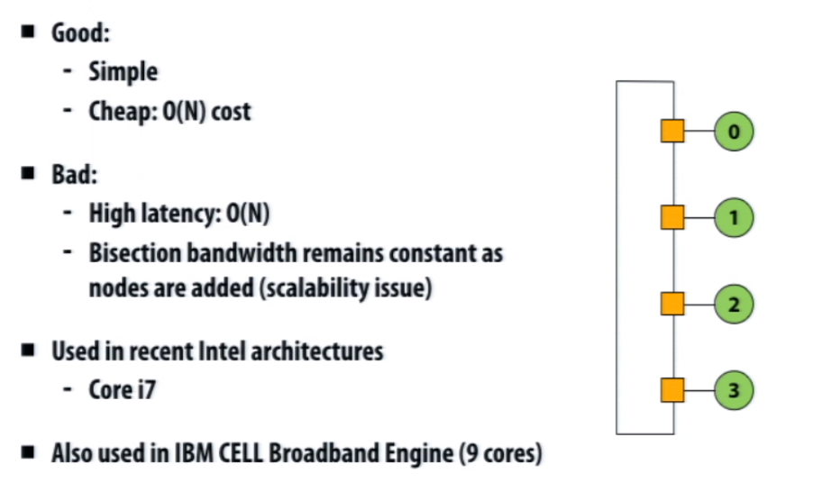
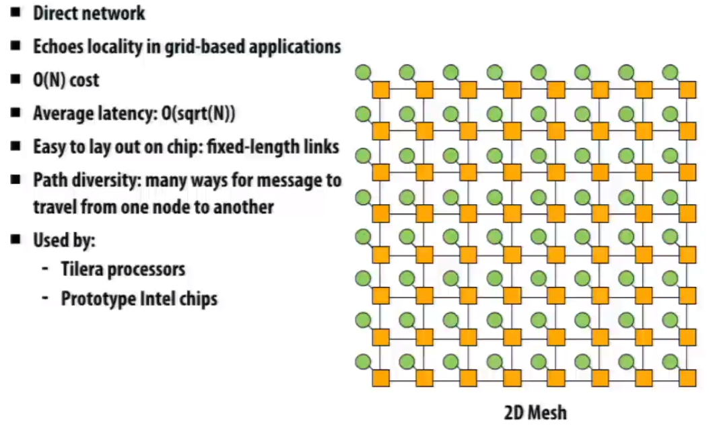

# Interconnect

## Topology

### Bus

           <!--块级封装-->    
    <!--将图片和文字居中-->       

### Crossbar

* Every node is connected to every other node (non-blocking, indirect)
* Good
  * latency and high bandwdth

* Bad
  * Not scalable
  * high cost

           <!--块级封装-->    
    <!--将图片和文字居中-->       

### Ring

           <!--块级封装-->    
    <!--将图片和文字居中-->       

### Mesh

           <!--块级封装-->    
    <!--将图片和文字居中-->       

### Trees

           <!--块级封装-->    
    <!--将图片和文字居中-->       

