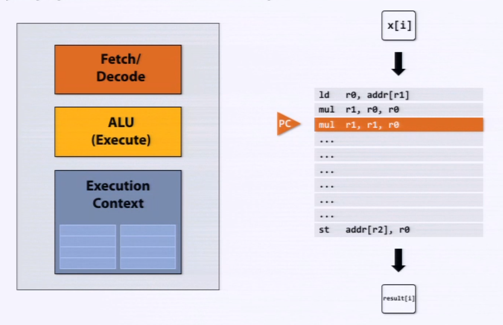
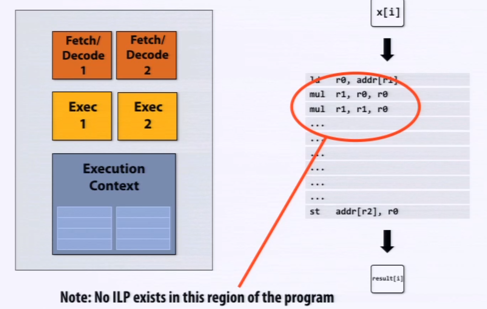
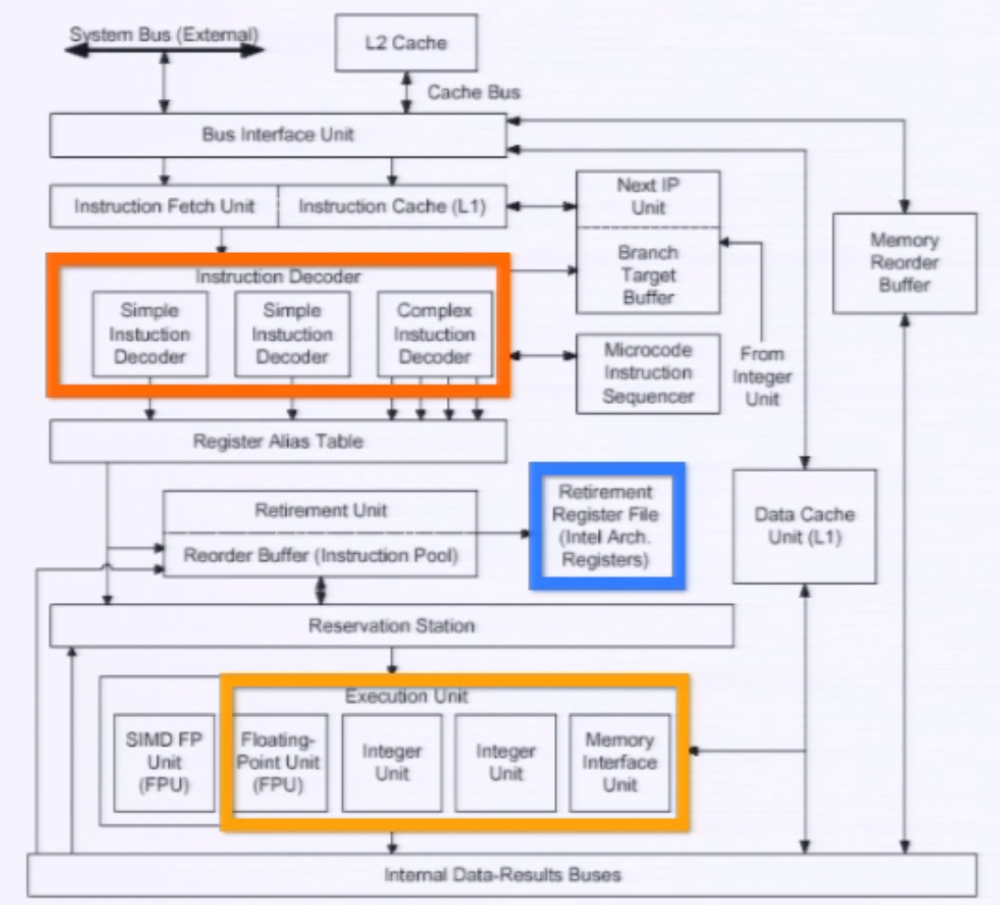
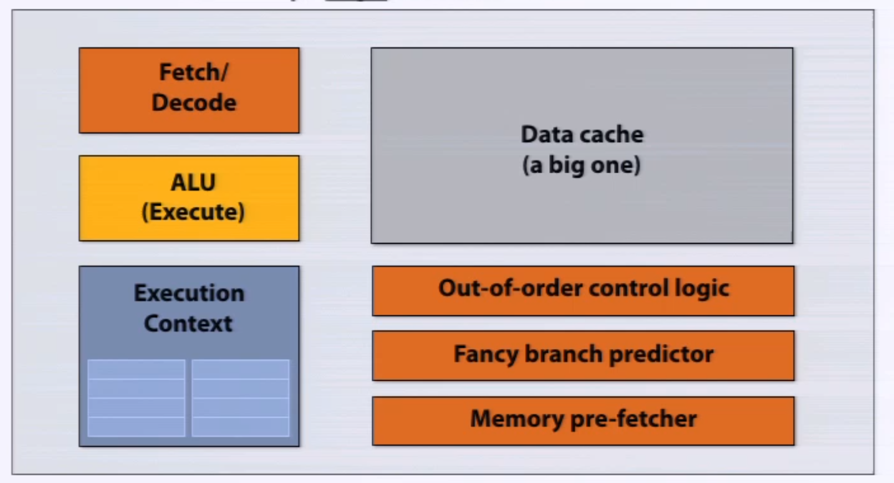
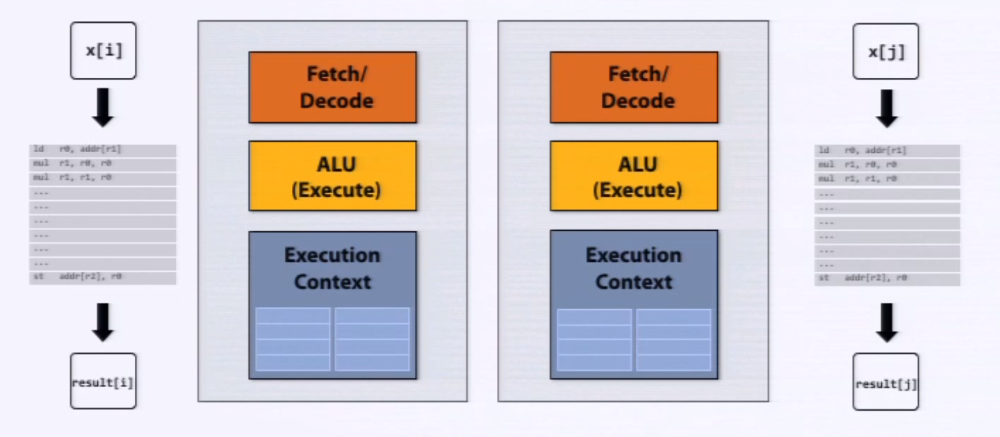
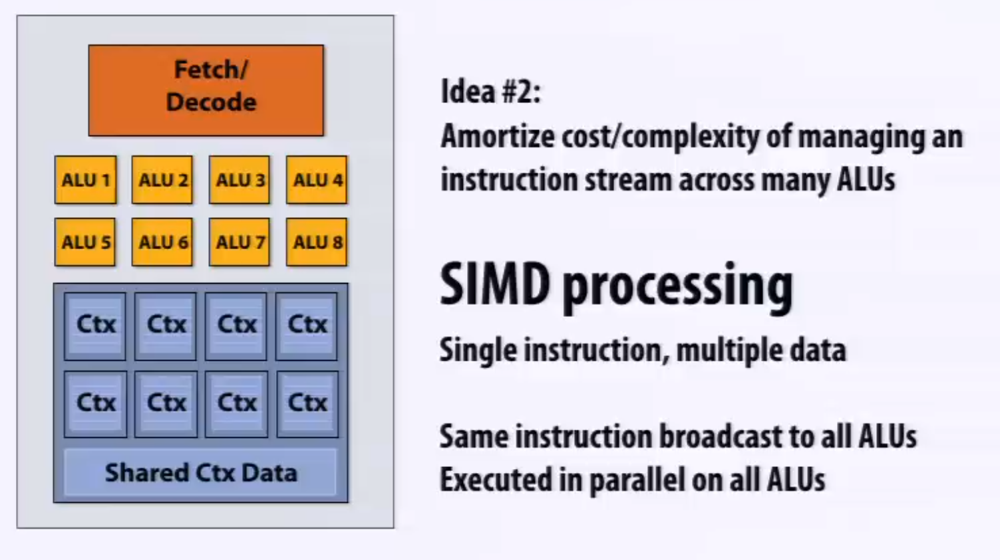
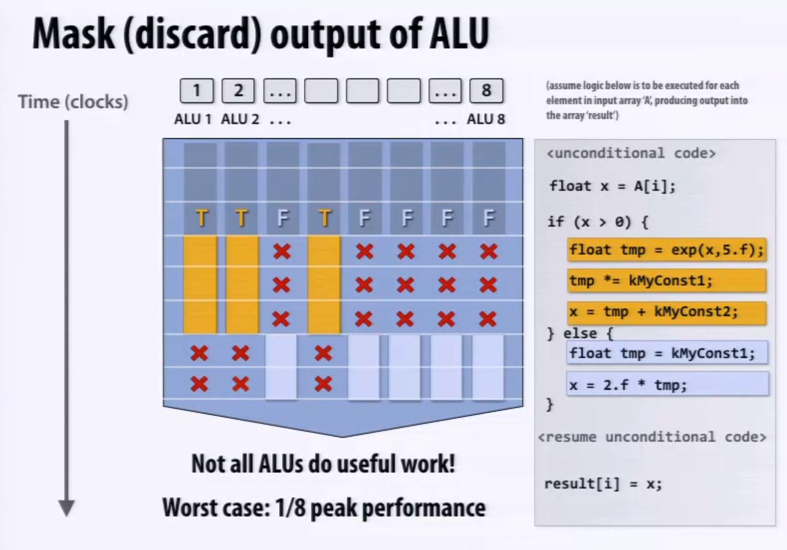
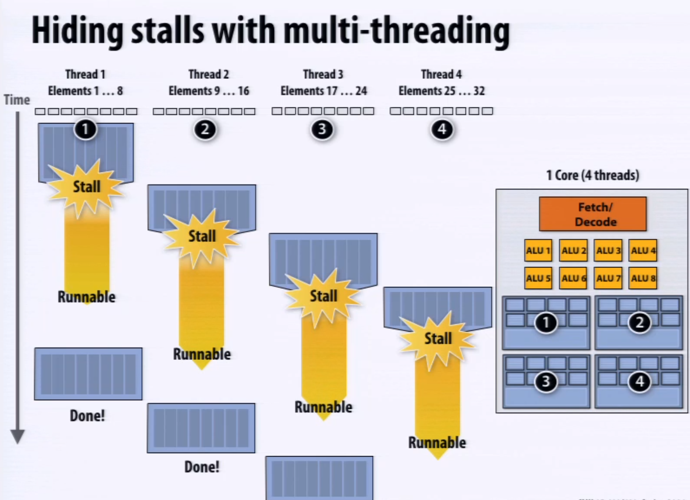

# Modern Multi-Core Processor

## Simple Processor

Simple processor executes one single instruction per clock

 

## ILP

Decode and execute two instructions per clock, when the instrucion stream contains a lot of independent instructions.

## Pentium 4

Pentium 4 was released back in 2000.

3 instructon decoders: up to 3-way super-scalar

## Multiple Instruction Stream

## SIMD

Since there are a lot of scenario where we use the same instruction stream but different input data.

We can increase the compute capability of a single core by adding ALUs in each core.

### When SIMD meets conditional branches

When data in the vector has to be executed by different instrunction stream, we have to mask off the results of some ALU, to prevent unconsistency.

* SSE instructions: 128-bit operations
* AVX instructions: 256-bit operations
* Instructions are generated by the compiler

## Summary: parallel execution

* Multi-core:
  * Provides thread-level parallelism
  * Software decides when to create threads
* SIMD: multiple ALUs controlled by same instruction stream (within a core)
  * Efficient design for data-parallel workloads: controll amortized over many ALUs
  * Vectorization can be done by compiler (explicit SIMD) or at runtime by hardware
  * Dependencies are declared by programmer, but can be inferred by compiler
* Super-scalar: exploit ILP, process different instructions from the same instruction stream (within core)
  * Parallelism automatically and dynamically discovered by the hardware (not visible to programmer)

# Memory Access

### Terminology

* Memory latency
  * The amount of time for memory request
  * Example: 100 cycles
* Memory bandwith
  * The rate at which the memory system can provide data to a processor
  * Example: 20GB/s

* Cache: to reduce the memory latency

## CPU stall

### Prefetching

Prefetching reduces CPU stalls (hides latency)

* All modern CPUs have logic for prefetching data into caches
* Reduces stalls since data is resident in cache when accessed

### Multi-threading

