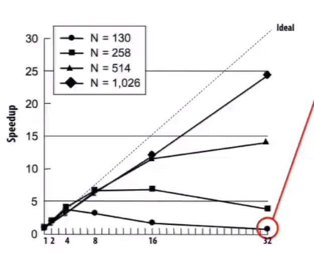
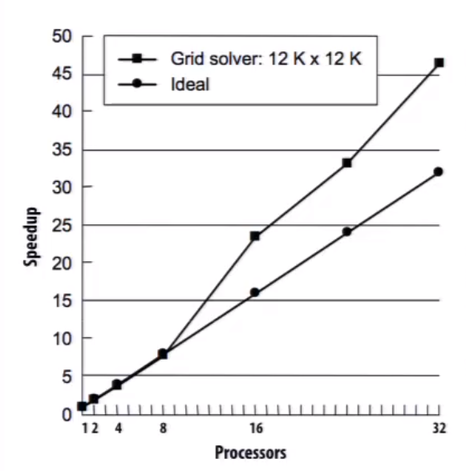

# Performance Evaluation

## Problem size

Increasing processor count when problem size is small may entail **large communication-to-computation ratio**

           <!--块级封装-->    
    <!--将图片和文字居中-->       

Add more processors **includes their L1 and L2 cache**

           <!--块级封装-->    
    <!--将图片和文字居中-->       

                          

## Time-constrained

The  amount of time is fixed

* Real-time computer vision for robotics: pedestrain detection in 10ms

