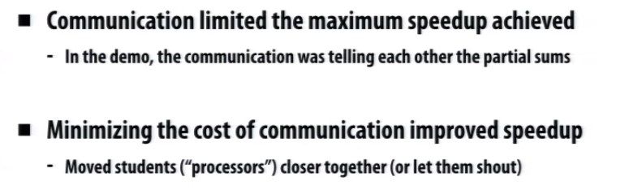

# Demo1

There are a bunch of cards with number on them, and we're trying to add those numbers up.

* Just one guy involved
  * It costs 40 seconds

* Two person involved, but can only commucate with each other by writting on a piece of paper, and they far from each in distance
  * It costs 25 seconds
  * The overhead of communication which in this case is one guy walking to the front and write down his answer on the paper, it costs 10 seconds.

* Four person involved, closer to each other, but still only communicate using paper, the cards are unevenly distributed

  * It costs 17 seconds
  * Some parcitipants are only assigned 1 or 2 cards, and the other got a lot of cards, more evenly distribution of work may help
  * There is only one pen, it is the shared resource

  

# Demo2

Adding up the age of every person in the classroom.

The communication costs are way more than the acutally computation costs.

 

# Why parallelism?

