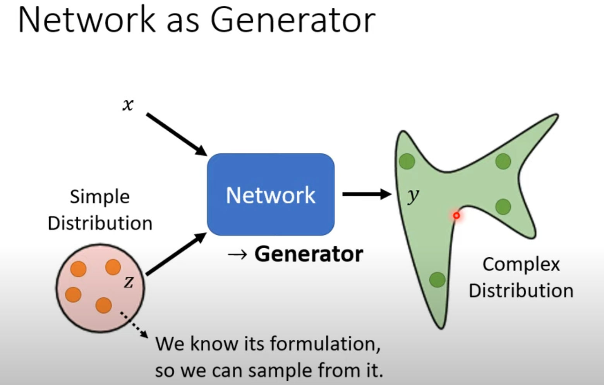
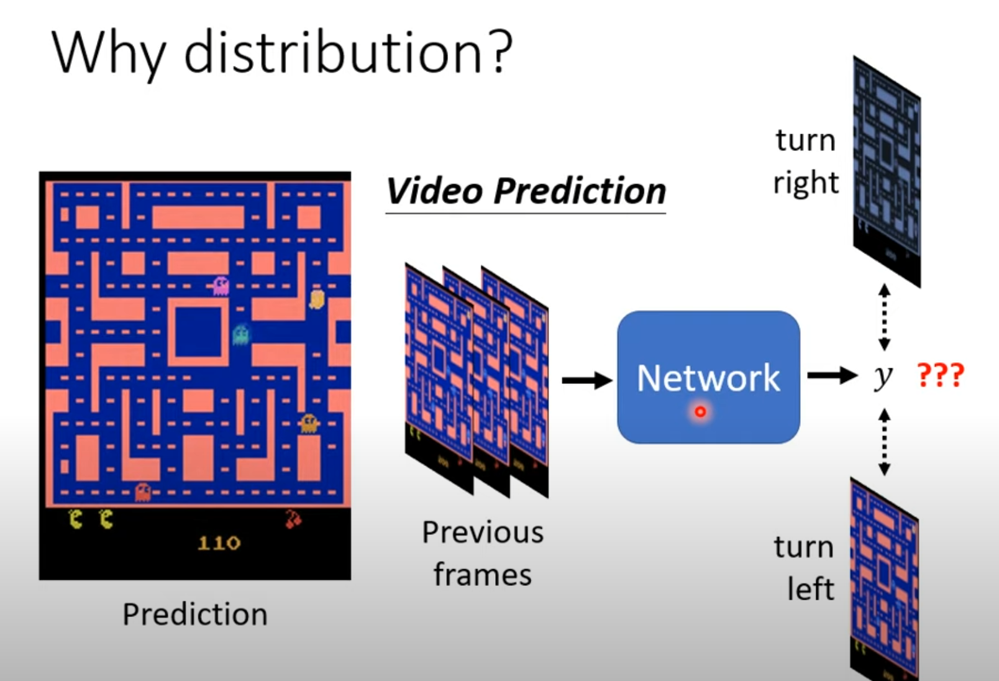
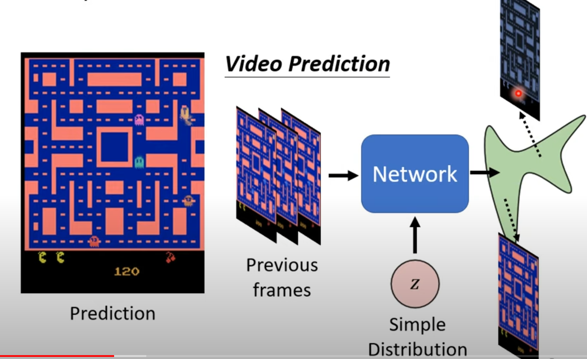
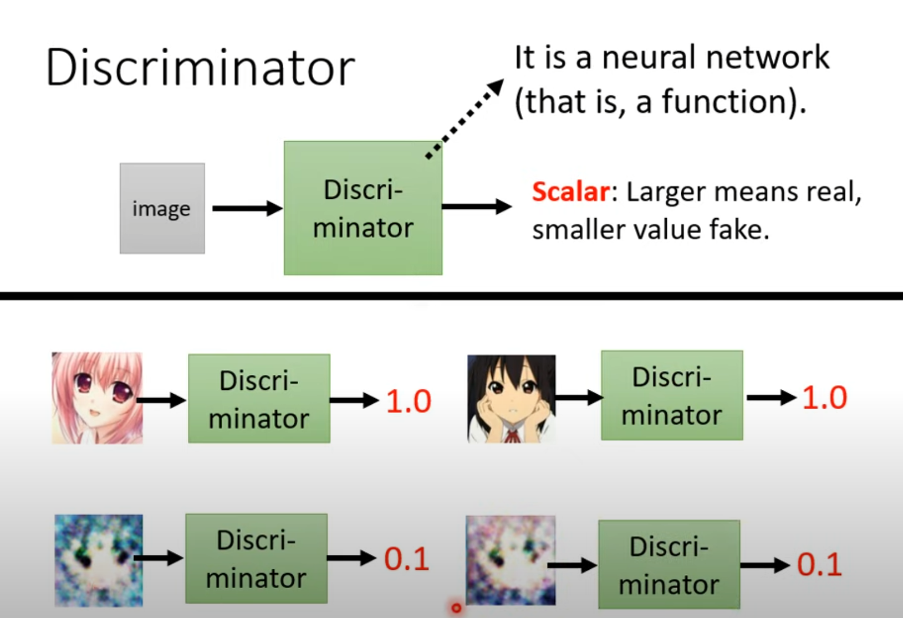
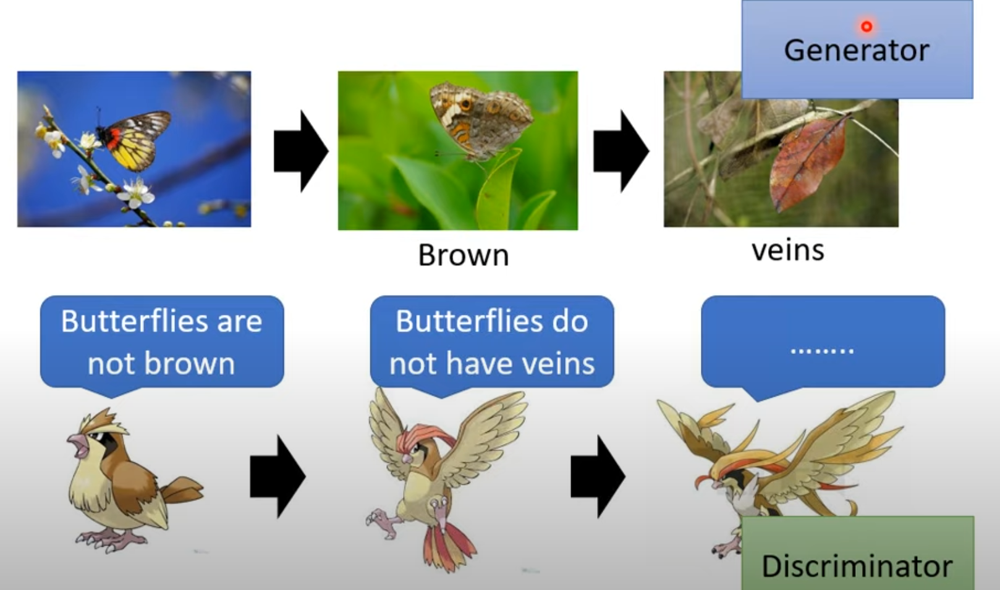
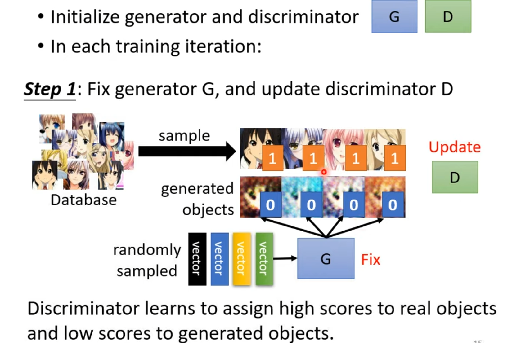
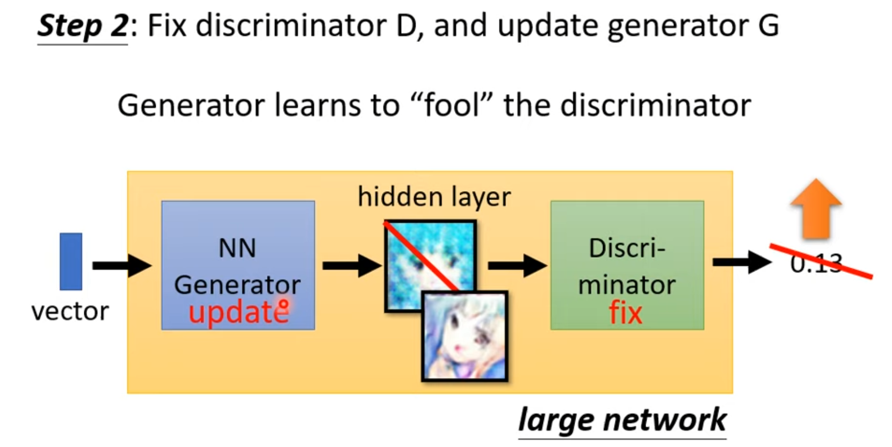
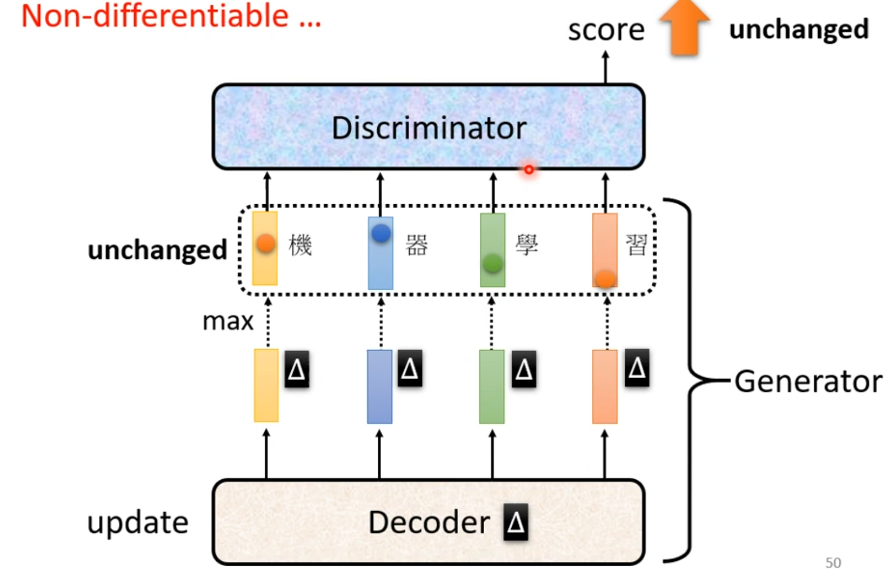

# GAN

Generative Adverarial Network

## Why distribution 

* why distribution?

When predicting the elf's direction, in our training set there could be both turning right and left at the same time, but what we want is mutual exclusive or non-fixed ouput. 

The solution to this could be that we take a random input from a simple distribution then feed it to the network, and because one of our input is a distribution then the ouput would also be a distribution instead of a fixed outcome.

In this case, we can make *z* here a sample from binary distribution, then model may learn that when z is false, then turn left, when z is true, then turn right.

## Discriminator

Discriminator is just an abstraction, you can implement with any network architecture you want

## Intuitive idea of GAN

An anology of **biological evolution**

## Algorithm

In each iteration, first train the Discriminator then train Generator with Discriminator being fixed.

## GAN for Sequence Generation

Different from image generation, slight changes to the parameter can be detected or can cause some differences in the ouput, but when it comes to text generation, the chenge the of parameters are often too slight that the tokens stay the same. As for images, small changes can effect pixels, but for text, bigger changes are often needed to change to another token, it's because of the basic unit granularity.

So, in this case, **gradient descent doesn't work**, a possible solution to this is **Reinforcement Learning**, but RL is also very hard to train. Thus GAN is mostly used for image generation not text generation.

