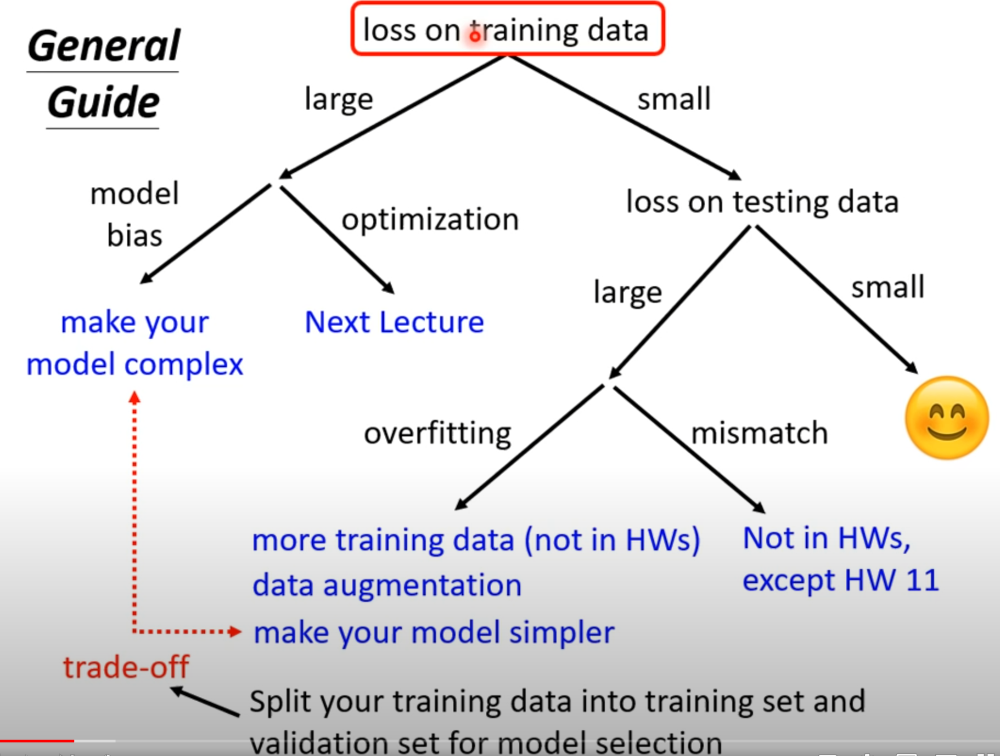
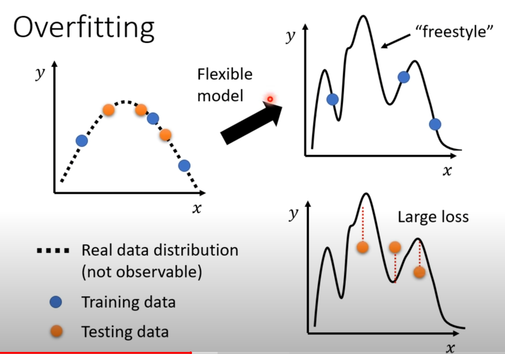

# General Guide

## Large Loss

### Model Bias

* The model is too simple 
* Solution: redesign your model to make it more flexible

### Optimization Issue

* Large loss not always imply model bias.
* Gradient descent has some limitations when finding the proper function

## Small Loss

 Pay attention to the difference between **loss on training data and testing data**.

* Loss on training is small 	and loss on testing data is all small, then it is a good result

but if loss on training data is small wheras loss on testing data is large, then it could be 2 reasons.

* overfitting
* mismatch

### overfitting

**Overfitting is characterized by a low training loss and a high testing loss.**

* Flexible models are more likely to be overfitting

* One way to get rid of overfitting is to prepare more  data

* Early stopping
* Regularization
* Dropout
* Less parameter or sharing parameters

In general, we need trade-off between model bias and complexity

