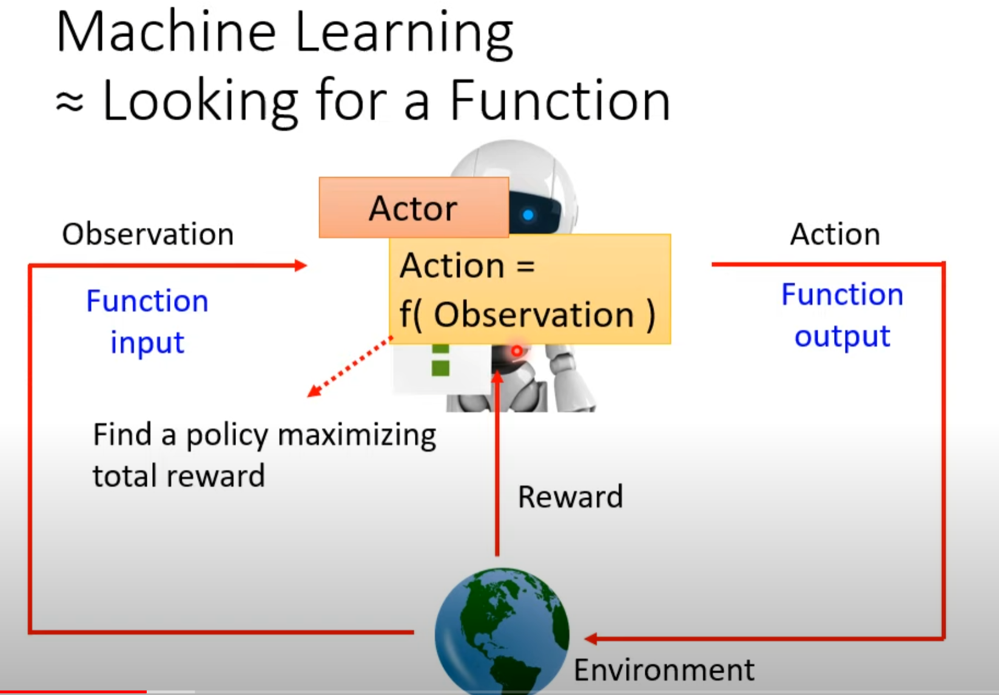
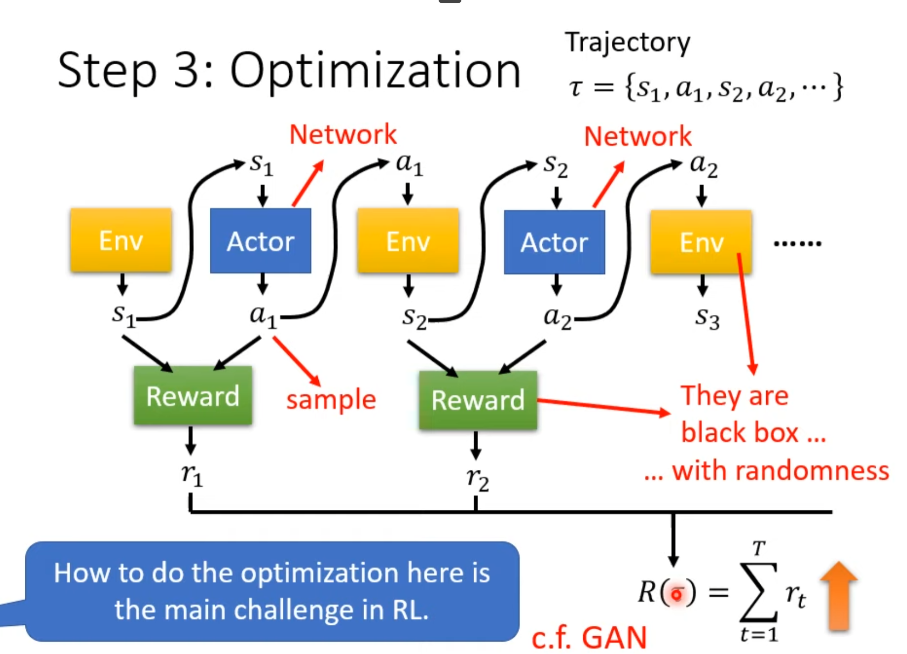

# Introduction to Reinforcement Learning

**Abstraction**: finding a function to generate action based on observation of the current environment and get the maximum reward.

## Function with Unknown

**Policy Network**: Actor

* Input of neural network: the observation of machine represented as a vector or a matrix
* Ouput neural network: each action corresponds to a neuron in output layer

## Define Loss

Reciprocal number of the total reward

## Optimization

