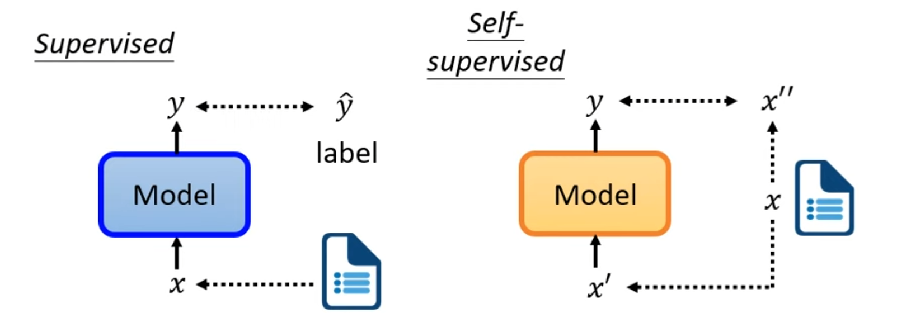

# Self-supervised Learning

Self-supervised Learning is a type of unsupervised learning. To be simple, supervised learning is learning with labels, whereas unsupervised learning is learning without labels.

