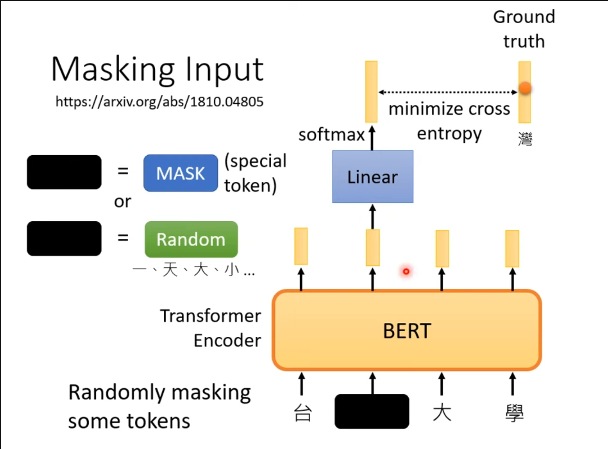
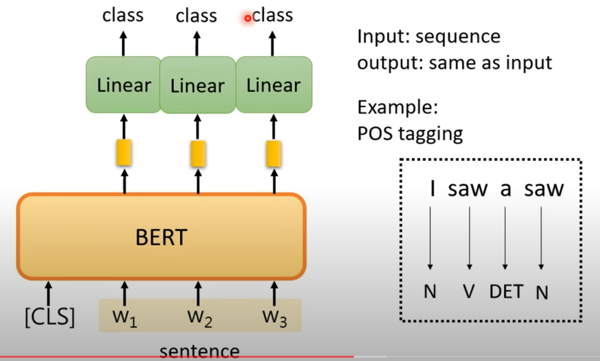

# Self-supervised Learning

Self-supervised Learning is a type of unsupervised learning. To be simple, supervised learning is learning with labels, whereas unsupervised learning is learning without labels.

## BERT

BERT is the pre-trained encoder of a transformer

When training, randomly mask some tokens, and train the model itself using the masked data.

So in general, BERT is capable to *'fill in the blanks'*, and after some **fine-tune** it can be used to do a lot of downstream tasks.

BERT is a **pre-trained** model. It is like the stem cell in an animal's body.

**GLUE**: General Language Understanding Evaluation

### BERT Use Case

## Why BERT works

* Context is considered
* Contextualized word embedding
