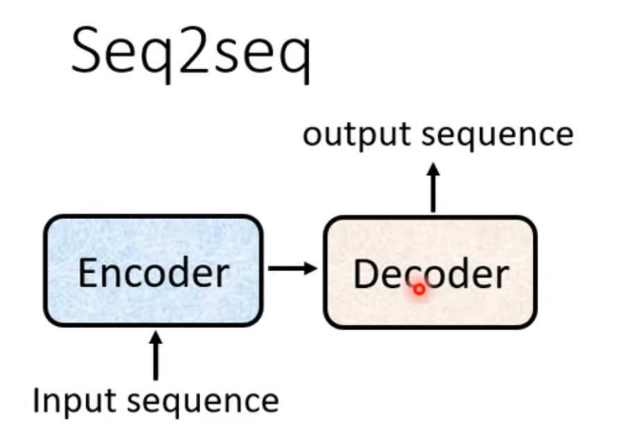
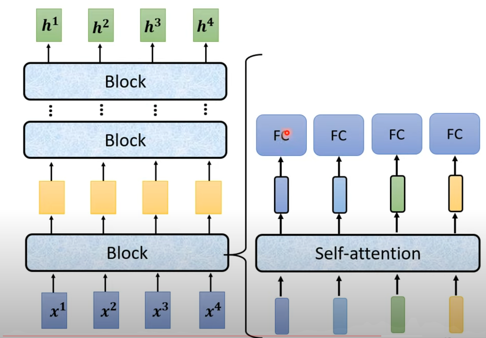
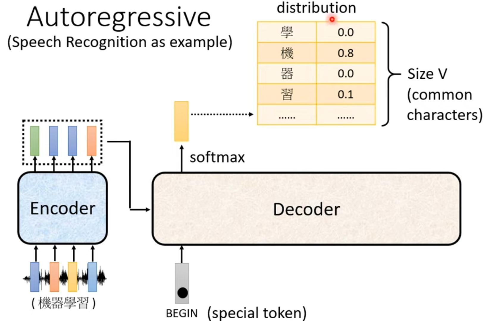
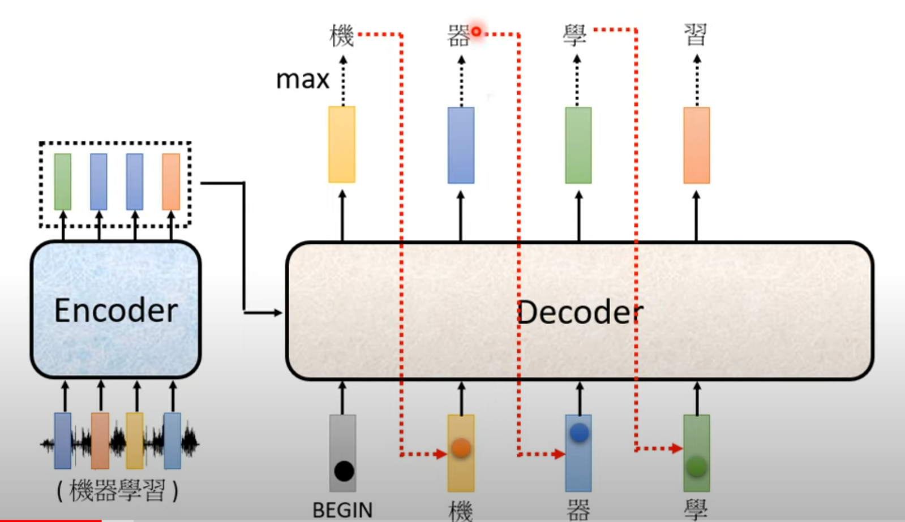
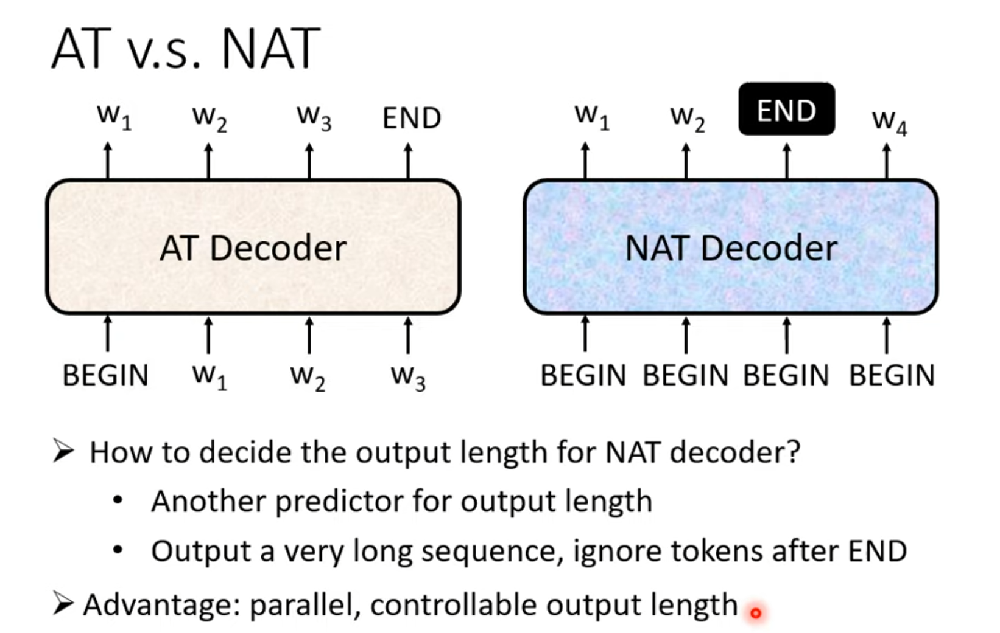

# Transformer

Transformer is a **seq2seq** model. Input a sequence, output a sequence, the output length is determined by model.

## Encoder

## Decoder

### Autoregressive(AT)

using softmax to amplify distribution vector

Decoder will take its own last ouput vector as input for next ouput.

### Non-autoregressive(NAT)

## Training Tips

**Teacher Forcing**: using the ground truth as each input vector

**Copy Mechanism**: for example: in summarization task, some ouput is from the input itself, we can just copy it instead of generating it from scratch