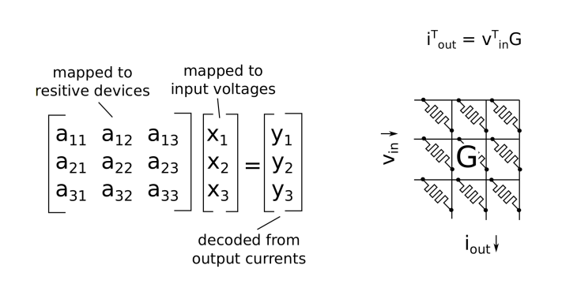
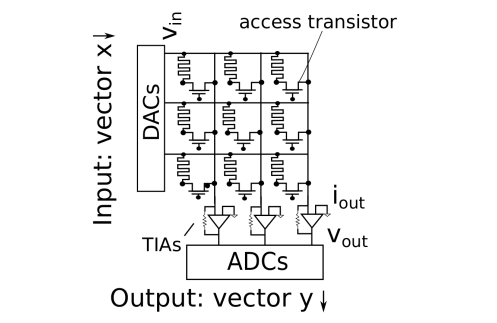
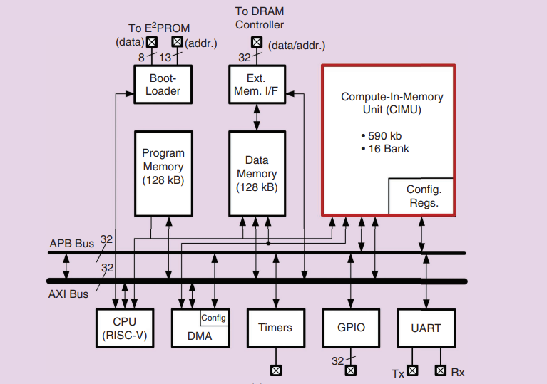
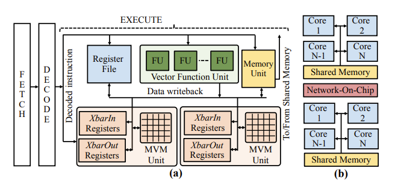
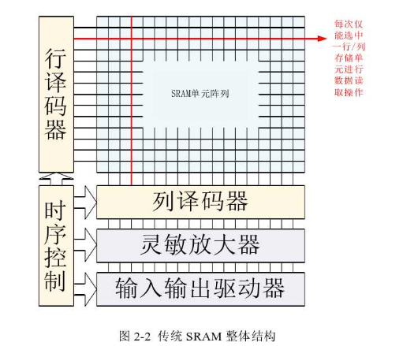
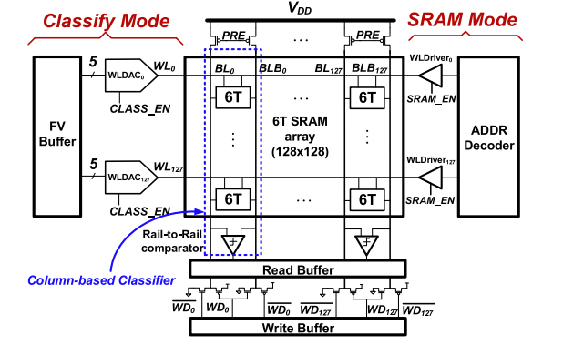
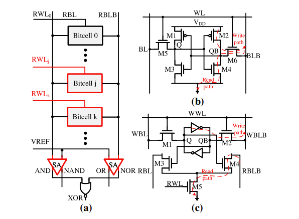
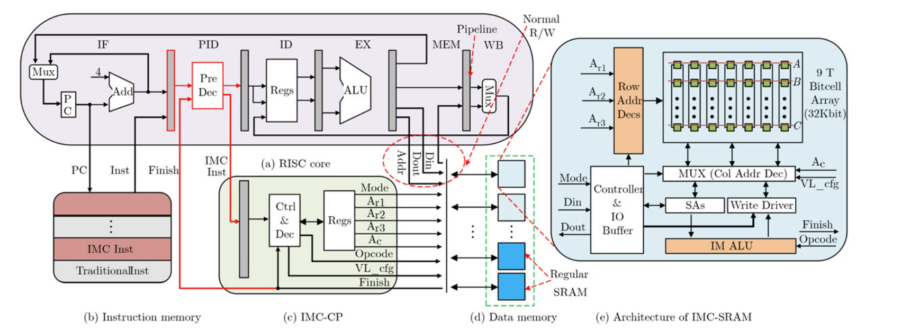

<h1 style="text-align: center;">感存算一体</h1>

***此文侧重于存算一体架构在AI方向的应用，最后会探讨general purpose的存算一体***

### 必要性

  存算一体技术概念的形成，最早可以追溯到上个世纪70年代。随着近几年云计算和人工智能（AI）应用的发展，面对计算中心的数据洪流，数据搬运慢、搬运能耗大等问题成为了计算的**关键瓶颈**。在过去二十年，处理器性能以每年大约55%的速度提升，内存性能的提升速度每年只有10%左右。结果长期下来，不均衡的发展速度造成了当前的存储速度严重滞后于处理器的计算速度。在传统计算机的设定里，存储模块是为计算服务的，因此设计上会考虑存储与计算的分离与优先级。但是如今，存储和计算不得不整体考虑，以最佳的配合方式为数据采集、传输和处理服务。

  对于传统的冯诺依曼架构，在执行深度学习模型训练时，很大的一部分时间和能源开销都集中于CPU和内存之间的数据搬移，并且由于大模型训练的数据量很可能超过Cache的容量导致传统的计算机架构的内存缓存很大程度上并不适用于AI领域的计算。

			<!--块级封装-->
    
	<!--将图片和文字居中-->
    
     		<!--换行-->
    image source: IBM The hardware behind analog AI	<!--标题-->
    

### 优势

存算一体属于非冯诺伊曼架构，在特定领域可以提供更大算力（1000TOPS以上）和更高能效（超过10-100TOPS/W），明显超越现有ASIC算力芯片。除了用于AI计算外，存算技术也可用于感存算一体芯片和类脑芯片，代表了未来主流的大数据计算芯片架构。存算一体技术的核心优势包括：

* 减少不必要的数据搬运。（降低能耗至1/10~1/100）

* 使用存储单元参与逻辑计算提升算力。（等效于在面积不变的情况下规模化增加计算核心数）

## 基于非易失内存的存算一体

### 数据如何存储

  由于需要同时提供密集存储和高能效模拟电路计算的特性，基于非易失性电阻技术(non-volatile)的内存计算已经成为一种吸引人的解决方案，如忆阻器(ReRAM)，以及磁存储器(MRAM)等。这里将总结基于**PCM**(phase-change memory)的数据存储方案。

  PCM，phase-change memory，相变存储器。使用相变存储器，向材料施加电脉冲会改变设备的导电性，通过将材料在非晶相和晶相之间切换来实现。低电脉冲会使相变存储器设备更加晶化（电阻更小）。高电脉冲会使设备更加非晶化（电阻更大）。相较于数字电路中的记录0或者1，相变存储器设备将自己的状态记录为两者之间的**连续值**。在AI领域中，这个值可以被看作突触权重。这些权重以非易失的方式存储在每个相变存储器中（在断电时仍然保留权重）。

  下图是PCM电阻变化的简单示意图。相变存储器设备通过施加不同强度的电脉冲进行编程，使其取得**0和1之间连续**的值。

           <!--块级封装-->    
    <!--将图片和文字居中-->                 <!--换行-->    image source: IBM The hardware behind analog AI <!--标题-->    

### 数据如何计算

**当相变存储器设备以交叉阵列结构排列时，可以在一个时间步骤内执行模拟矩阵向量乘法**

如下图是由PCM组成的交叉阵列(crossbar)

			<!--块级封装-->
    
	<!--将图片和文字居中-->
    
     		<!--换行-->
    image source: IBM The hardware behind analog AI	<!--标题-->
    

  如下图中显示一组字线与一组位线通过每个交点上的电阻器件连接在一起。通过每个电阻器件的电流可以使用欧姆定律得到，将施加在字线上的输入电压与电阻器件的电导值相乘。接下来，使用基尔霍夫电流定律沿着位线对电流进行求和。输入电压（V𝑖𝑛）与输出电流（I𝑜𝑢𝑡）之间的关系等于 iTout=vTinG，其中𝐺是电导矩阵。对于具有𝑁个字线和𝑀个位线的crossbar，电导矩阵𝐺的维度为(𝑁)×(𝑀)。

			<!--块级封装-->
    
	<!--将图片和文字居中-->
    
     		<!--换行-->
    image source: Accelerating AI Applications using Analog In-Memory
Computing: Challenges and Opportunities	<!--标题-->
    

### 如何并行

#### 基于冯诺依曼模型的异构计算机

​    PCM组成的crossbar的行列可以通过DAC和ADC来实现数字信号和模拟信号的转换。

​    如下图所示，交叉阵列的行和列由DAC和ADC连接。

			<!--块级封装-->
    
	<!--将图片和文字居中-->
    
     		<!--换行-->
    image source: Accelerating AI Applications using Analog In-Memory
Computing: Challenges and Opportunities	<!--标题-->
    

   这样一来，CPU可以通过**数字信号**操作crossbar，这个crossbar可以被视为一个基本的运算器，可以执行MVM(Matrix Vector Multiplication)。这种存算一体的设备可以与传统的冯诺依曼架构计算机结合，形成一种异构计算机。虽然在深度学习中，MVM运算占据主导地位，在模型的训练与推断中，矩阵向量乘法是总运算量的70%–95%，但是剩下的一些外设操作等功能仍然需要依赖通用CPU。并且目前的存算一体技术计算位数和精度仍然不够高，冯诺依曼架构的CPU与存算一体单元可以实现精度互补。

			<!--块级封装-->
    
	<!--将图片和文字居中-->
    
     		<!--换行-->
    image source: In-Memory Computing: Advances and prospects - cs.Princeton	<!--标题-->
    

#### 利用已有的优化思想

			<!--块级封装-->
    
	<!--将图片和文字居中-->
    
     		<!--换行-->
    image source: In-Memory Computing in Emerging Memory Technologies for Machine Learning: An Overview
Computing: Challenges and Opportunities	<!--标题-->
    

  将crossbar看作一个冯诺依曼模型下的Function Unit，那就可以沿用已有的加速策略

##### 单核

  如上图(a)展示了一种单核组成。

* 指令流水线，提高部件利用率，提高单核并行度。
* SIMD(Single Instruction Multiple Data)，可以同一时钟周期内同时对多个数据元素执行相同的指令，非常适合向量矩阵运算的场景，也能够很好地利用单核中的多个存算一体单元。
* 多线程，可以在单核中提供多份上下文。

##### 多核

  图3(b)展示了一个多核架构，它由多个核心与共享内存相连组成。共享内存可以在多核之间以及不同多核之间实现数据的移动。一组多核通过片上网络相连形成一个节点。进一步地，可以使用合适的芯片与芯片互连技术连接多个节点。

## 基于SRAM的存算一体

### 数据如何存储

​    6个场效应晶体管组成的6T SRAM单元仍是工业界使用最多的基本存储结构，如下图所示，其由2个PMOS管和4个NMOS管组成。

			<!--块级封装-->
    
	<!--将图片和文字居中-->
    
     		<!--换行-->
    image source: What is SRAM Memory: Static RAM	<!--标题-->
    

​    SRAM主要的外围电路包括**译码器，灵敏放大器和时序控制电路**

			<!--块级封装-->
    
	<!--将图片和文字居中-->
    
     		<!--换行-->
    image source: 基于SRAM结构的高效能存算一体技术研究	<!--标题-->
    

* 灵敏放大器（Sense Amplifier, SA）是存储器外围电路非常重要的一部分，所有的位线输出都要经过灵敏放大器实现信号放大的操作。在存储器进行传统读出数据操作时，灵敏放大器与存储单元的两条位线相连，检测两条位线上的电压差并放大，输出逻辑‘1’和逻辑‘0’，以此保证后续处理数据的电路能正确接收到SRAM单元中读取出的数据。

​    存算一体的SRAM一般都有两个模式，其一是基本的读写模式，其二便是计算模式。

### 数据如何计算

  如下图所示，以Jintao Zhang等人提出的原型机为例

			<!--块级封装-->
    
	<!--将图片和文字居中-->
    
     		<!--换行-->
    image source: In-Memory Computation of a Machine-Learning Classifier in a Standard 6T SRAM Array	<!--标题-->
    

​    它由一个标准6T SRAM存储阵列和两种不同操作模式的外围电路（数模转换器和轨对轨灵敏放大器）构成。在SRAM模式下，该电路的操作与传统SRAM的数字数据读写方式相同，这就是从训练中将机器学习模型存储在SRAM单元中的操作。在分类模式下，所有选中的SRAM单元的WL都会同时开启，SRAM单元多行并行操作，每个WL的模拟电压对应于需要分类的特征向量中的一个特征值。这些特征值以数字数据的形式通过特征向量缓冲器（FV Buffer）加载，并在每行中使用WLDAC生成模拟电压。

​    接着是乘法计算阶段，即分类模式下，该结构实现的函数为： 

​    其中Dout为点乘累加计算的输出值，N为并行乘加计算的操作单元数，sgn为激活函数，Wi为权重值，INi为输入特征值。根据存储单元内写入的权重值，实现位线/负位线的放电操作，这一操作可以视为特征值和权重值的乘法操作。

​    第三阶段为灵敏放大器阶段，在该阶段实现乘法结果的累加和最终数据的放大读出。通过将 BL/BLB上所有的SRAM 单元的电荷共享，得到最终总的放电结果，即完成加法运算。位线上电平所代表的逻辑值是被打开的单元所存储比特的相与结果。

## 基于SRAM的通用存算一体

​    DM-IMCA：基于SRAM的通用IMC(In Memory Computing)架构平台。该架构由来自合肥工业大学和中山大学的学者合作提出。

​    他们在SRAM中引入一些额外的门电路来实现了额外几种内存算术和内存操作。

			<!--块级封装-->
    
	<!--将图片和文字居中-->
    
     		<!--换行-->
    image source: DM-IMCA: A dual-mode in-memory computing architecture for general purpose processing	<!--标题-->
    

​    如果在SRAM列的同一位线上同时读取两个或更多个位单元，相关的感应放大器（SA）的输出可以看作是对这些位做ADD逻辑与的结果。然后，我们用双输入双输出的SA替代单输出SA。如上图(a)所示，可以同时得到四个逻辑结果，即AND、NAND、OR和NOR。引入一个额外的NOR门可以实现XOR功能。

### 数据如何计算

			<!--块级封装-->
    
	<!--将图片和文字居中-->
    
     		<!--换行-->
    image source: 基于SRAM的通用存算一体架构平台在物联网中的应用	<!--标题-->
    

​     如上图(e)所示，将 向量操作数A和B沿字线方向对齐存储，那么只需 1次操作，便可对存储阵列中某一行的A和B分量 计算完，然后将计算结果回写至同样与A和B对齐 存储的向量C中。在IMC-SRAM进行存内计算时， 数据存储器中的常规SRAM仍然可以进行数据的读写操作。数据内存包括常规SRAM和IMC-SRAM。IMC-SRAM被映射到较高的地址空间，而常规的SRAM则映射到较低的地址空间。

​    在DM-IMCA中，运行着两套指令：传统MIPS32指令和IMC指令(IMC instruction)。前者通过完整的处理器核流水线来执行，后者在处理器核的指令预译码流水级之后，传送至IMC-CP进行二级译码，再由IMC-SRAM进行执行。两套指令长度 一致，因此，并不需要设计两组不同的指令存储 器，可以将传统MIPS32指令和IMC指令混合存储 于同一个指令存储器中。这样做的好处是便于对系 统进行程序设计，达到真正的传统指令和IMC指令混合编程的目的。

​    完成一个存内计算操作需要DM-IMCA连续执 行两条IMC指令。第1条为地址配置指令， 第2条则是一条计算指令。第1条指令执行所包含的 内容为第2条指令将执行的存内计算操作的源操作数和目的操作数的行地址信息。

## 感存算一体技术

#### 触觉感存算一体技术

   触觉仿生皮肤由压力感受器实时感知压力空间分布，并将压力数据存储在外部存储器中以操纵分配的识别和智能任务。具有存算单元的压力感觉神经元不仅可以检测外部刺激信号，还可在模拟的大 脑皮层中存储复杂信号并进行预处理。

#### 视觉感存算一体技术

   人类视觉感知系统收集信息后经过简单预处理并发送至大脑皮层进行深度识别，处理后的图像信息根据重要度进行短期或长期存储。传统视觉感知将图像感知、处理、存储相分割，产生的冗余数据 大大降低感知速度。受人类视觉系统和忆阻器突触 功能的启发，研究人员将光学感知器和忆阻器进行 集成，为光学学习、存储、计算和识别融合发展提 供了一种新思路。

#### 嗅觉感存算一体技术

​    嗅觉感存算技术起步较晚、应用范围小且识别精度较差，目前的研究热点集中在纳米气体传感器 材料、瞬态响应以及感测精度等基础研究方面。

#### 听觉感存算一体技术

​    现有机器听觉通过大数据的整合处理，实现语言翻译、语意理解、歌曲识别等功能。将忆阻系统用于听觉信号处理的研究尚处于初期阶段，声波的 多尺度、时间依赖性、独特时空编码等特点使得构建听觉感存算一体技术富有挑战。
