# Intel OneAPI and DPC++

## Introduction

### Programming Challenges for Multiple Architecture

			<!--块级封装-->
    
	<!--将图片和文字居中-->
    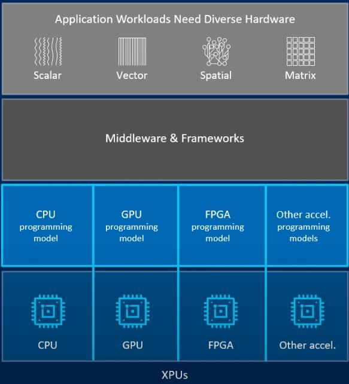
     		<!--换行-->
    

### OneAPI

			<!--块级封装-->
    
	<!--将图片和文字居中-->
    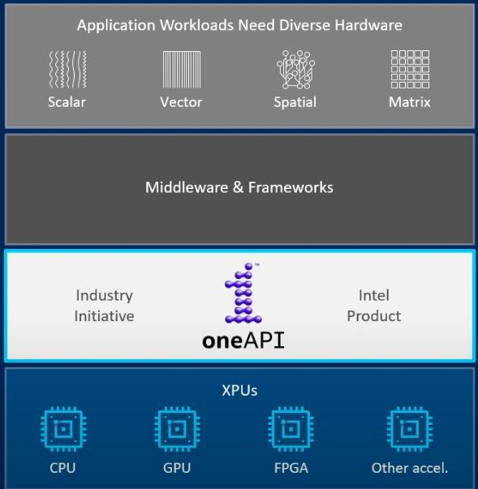
     		<!--换行-->
    

* Cross-architecture programming that delivers freedom tochoose the best hardware
* Based on industry standards and open specificationsExposes cutting-edge performance features of latest hardware
* Compatible with existing high-performance languages andprogramming models including C++, OpenMP, Fortran, and MPI

#### Features

Break the chains of proprietary lock-in

			<!--块级封装-->
    
	<!--将图片和文字居中-->
    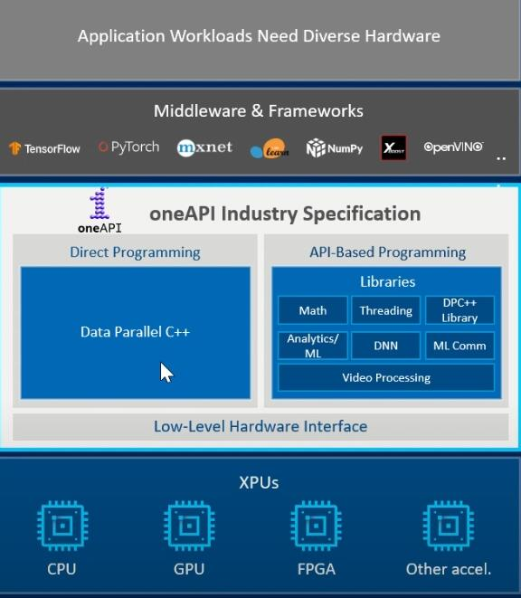
     		<!--换行-->
    

* A cross-architecture language based on C++ and SYCL standards
* Powerful libraries designed for acceleration of domain-specificfunctions
* Low-level hardware abstraction layer
* Open to promote community and industry collaboration
* <u>Enables code reuse across architectures and vendors</u>

#### Powerful libraries

			<!--块级封装-->
    
	<!--将图片和文字居中-->
    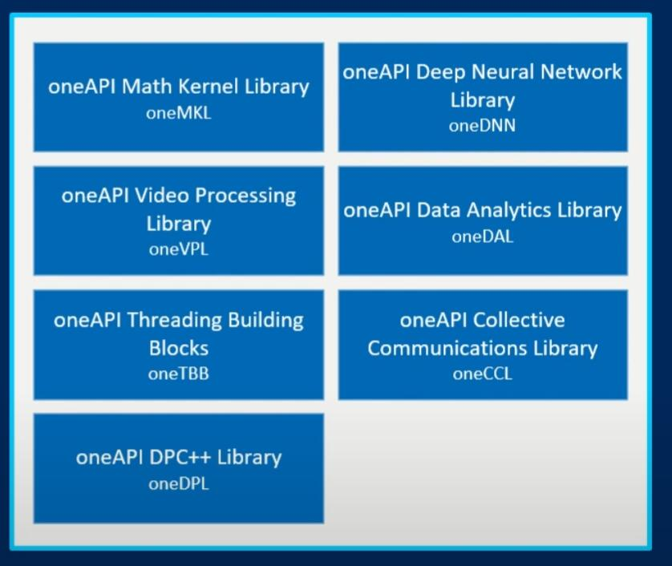
     		<!--换行-->
    

## DPC++

Data Prallel C++

Standards-based,Cross-architecture Language

**DPC++ = ISO C++ and Khronos SYCL**

* Delivers C++ productivity benefits, using common, familiar C and C++ constructs
* Incorporates SYCL from the Khronos Group to support data parallelism and heterogeneous programming

### Compiler

			<!--块级封装-->
    
	<!--将图片和文字居中-->
    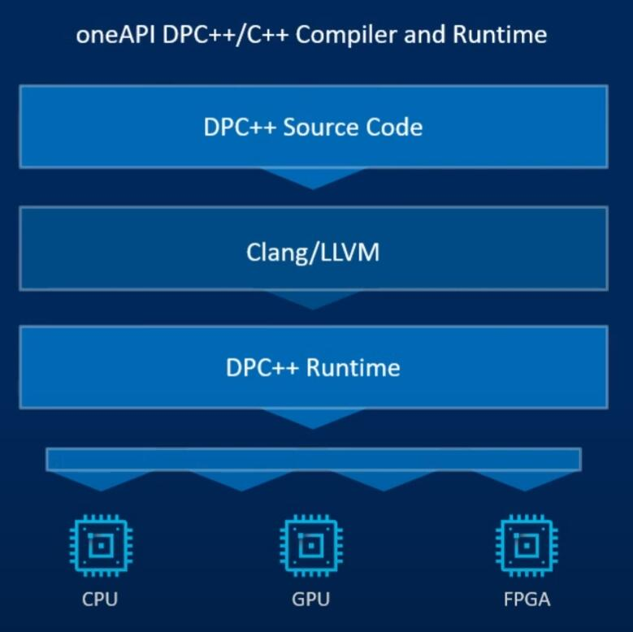
     		<!--换行-->
    

### Cuda migration

			<!--块级封装-->
    
	<!--将图片和文字居中-->
    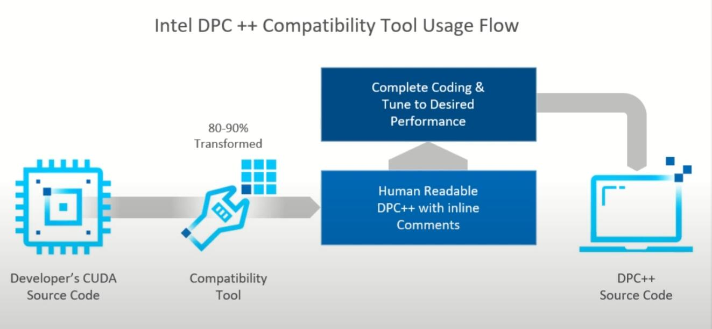
     		<!--换行-->
    

## DPC++

			<!--块级封装-->
    
	<!--将图片和文字居中-->
    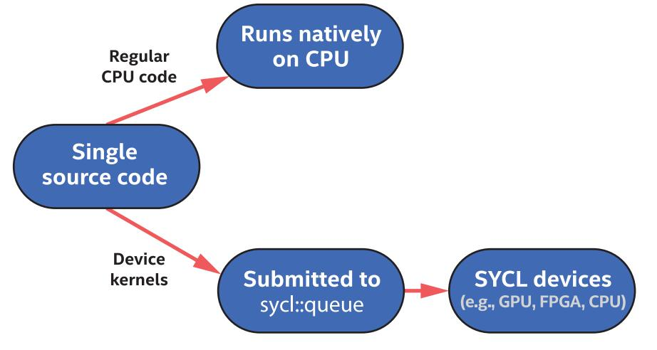
     		<!--换行-->
    

### Choosing Devices

Method#1: 

* Running device code somewhere, when we  don’t care which device is used. This is often  the first step in development because it is the  simplest.

Method#2: 

* Explicitly running device code on the host  device, which is often used for debugging. The  host device is guaranteed to be always available  on any system.

 Method#3: 

* Dispatching device code to a GPU or another  accelerator.

Developers will typically debug their code as much as possible with  Method#2 and only move to Methods #3 when code has been tested as much as is practical with Method#2.

### Queue

A queue is an abstraction to which actions are submitted for execution  on a single device.

Actions are usually the launch of data-parallel compute, although other commands are also available such as manual  control of data motion for when we want more control than the automatic movement provided by the runtime.

			<!--块级封装-->
    
	<!--将图片和文字居中-->
    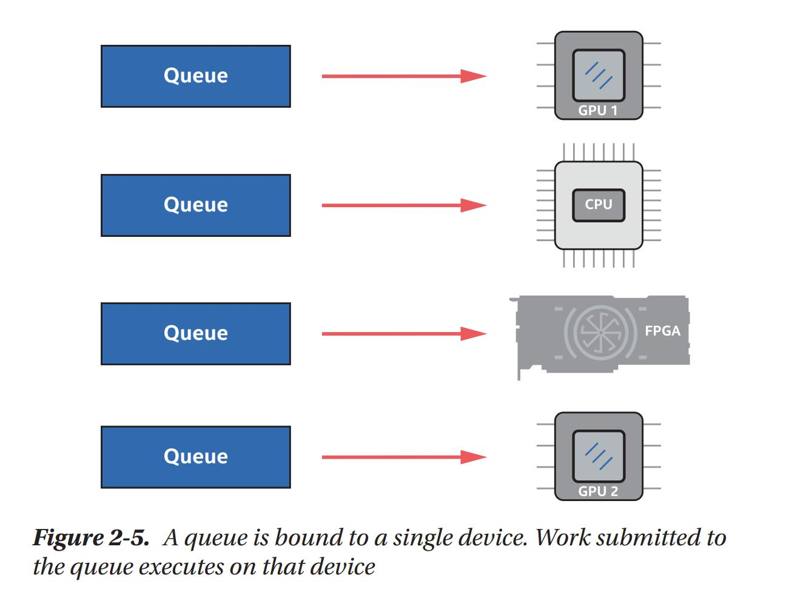
     		<!--换行-->
    

			<!--块级封装-->
    
	<!--将图片和文字居中-->
    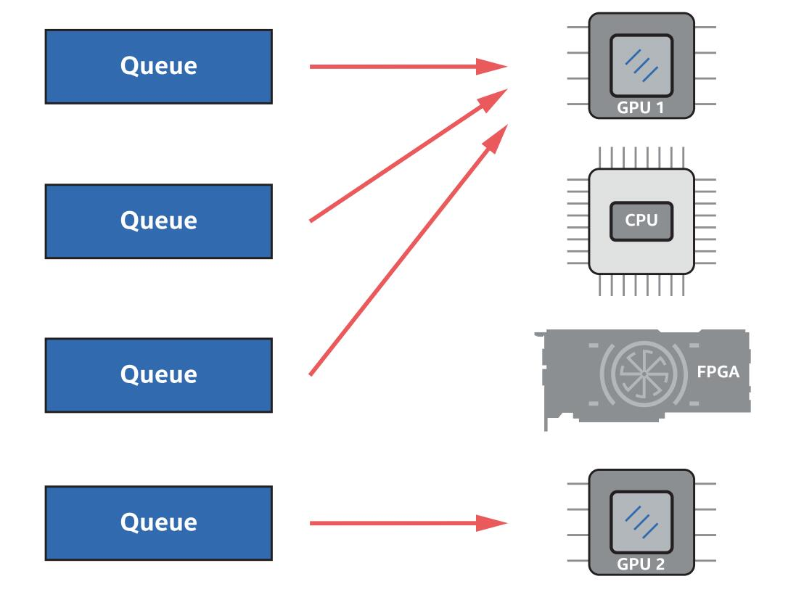
     		<!--换行-->
    

### Task graph

A fundamental concept in the SYCL execution model is a graph of nodes.  Each node (unit of work) in this graph contains an action to be performed  on a device, with the most common action being a data-parallel device  kernel invocation.

			<!--块级封装-->
    
	<!--将图片和文字居中-->
    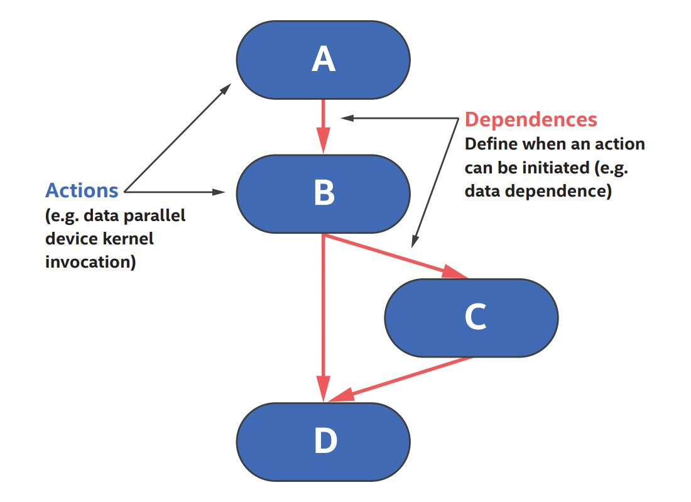
     		<!--换行-->
    

### Memory management

#### USM

Having a unified virtual address  space means that any pointer value returned by a USM allocation routine  on the host will be a valid pointer value on the device.

USM supports both explicit and implicit data movement strategies, and different allocation types map to different strategies. Device allocations require us to explicitly move data between host and device, while host and shared allocations provide implicit data movement.

#### Buffers

Data structures in buffers must be C++ trivially copyable,  which means that an object can be safely copied byte by byte where copy constructors do not need to be invoked.

### Kernels

			<!--块级封装-->
    
	<!--将图片和文字居中-->
    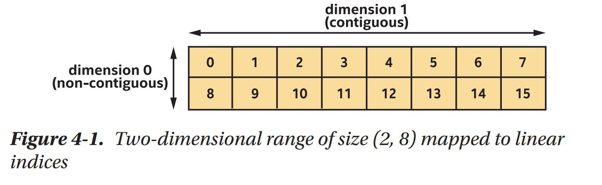
     		<!--换行-->
    

#### Basic DP kernel

With basic kernels, we sacrifice  control over low-level features like scheduling in order to make the  expression of the kernel as simple as possible.

The execution space of a basic parallel kernel is referred to as its execution  range, and each instance of the kernel is referred to as an item.

			<!--块级封装-->
    
	<!--将图片和文字居中-->
    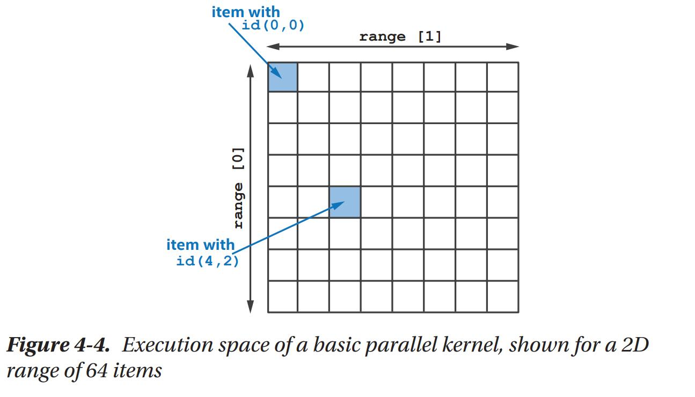
     		<!--换行-->
    

			<!--块级封装-->
    
	<!--将图片和文字居中-->
    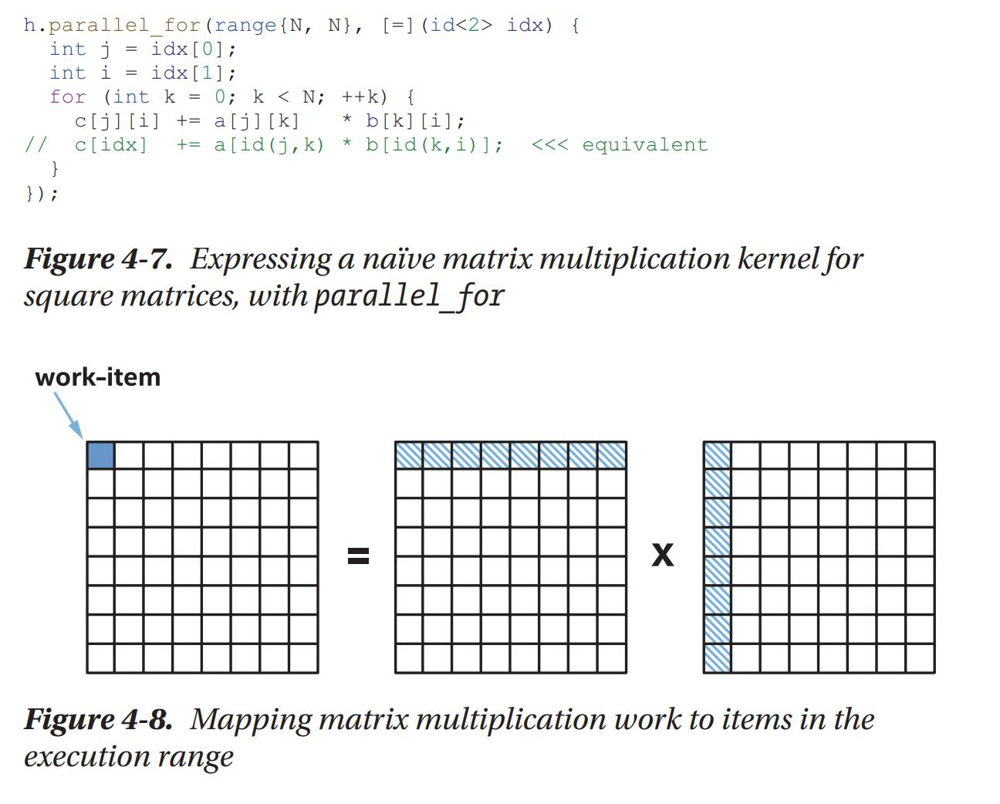
     		<!--换行-->
    

#### ND-Range Kernel

The second form of parallel kernel replaces the flat execution range of  basic data-parallel kernels with an execution range where items belong to  groups and is appropriate for cases where we would like to express some  notion of locality within our kernels. Different behaviors are defined and  guaranteed for different types of groups, giving us more insight into and/or  control over how work is mapped to specific hardware platforms.

Like basic data-parallel kernels, ND-range kernels are written in a  SPMD style where all work-items execute the same kernel "program"  applied to multiple pieces of data. The key difference is that each program instance can query its position within the groups that contain it and can  access additional functionality specific to each type of group.

			<!--块级封装-->
    
	<!--将图片和文字居中-->
    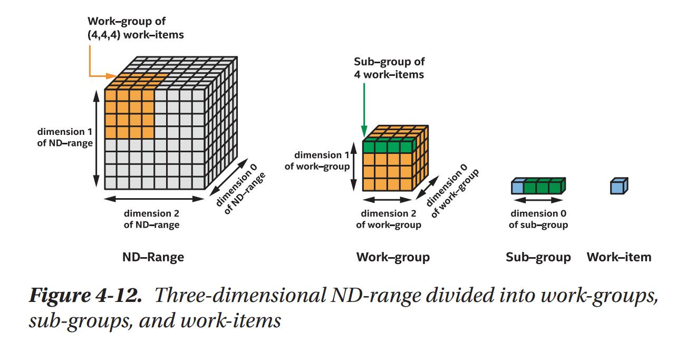
     		<!--换行-->
    

Figure 4-12 shows an example of an ND-range of size (8, 8, 8) divided into  8 work-groups of size (4, 4, 4). Each work-group contains 16 one-dimensional  sub-groups of 4 work-items. Pay careful attention to the numbering of the  dimensions: sub-groups are always one-dimensional, and so dimension 2 of  the ND-range and work-group becomes dimension 0 of the sub-group.

##### Work-group

1. Work-items in a work-group have access to workgroup local memory, which may be mapped to  a dedicated fast memory on some devices
2. Work-items in a work-group can synchronize using work-group barriers and guarantee memory  consistency using work-group memory fences

Communication and synchronization between work-items in the same  work-group is only guaranteed to be safe when performed using the barrier  and collective functions provided, and hand-coded synchronization routines may deadlock

##### Sub-group

As with work-groups, the work-items within a sub-group can  synchronize, guarantee memory consistency, or execute common parallel  patterns via group functions. However, there is no equivalent of workgroup local memory for sub-groups (i.e., there is no sub-group local  memory). Instead, the work-items in a sub-group can exchange data  directly—without explicit memory operations—using shuffle operations 

If we are coming from a programming model that requires us to think about  explicit vectorization, it may be useful to think of each sub-group as a set of  work-items packed into a **SIMD** register, where each work-item in the subgroup corresponds to a SIMD lane. 

			<!--块级封装-->
    
	<!--将图片和文字居中-->
    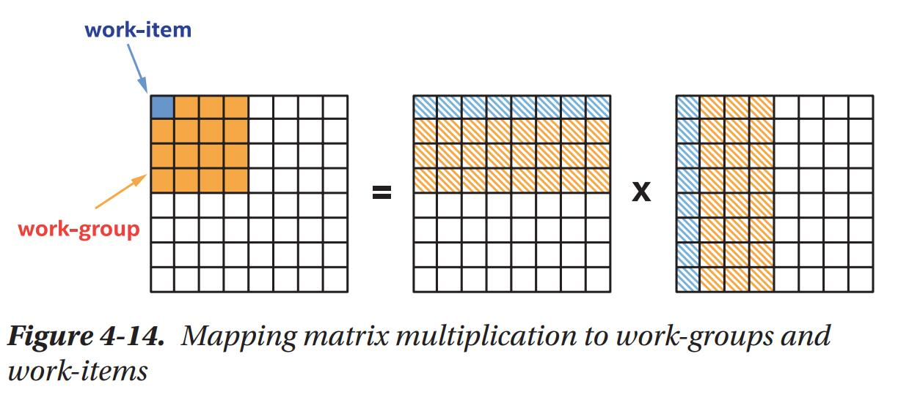
     		<!--换行-->
    

### Synchronzing with host

The first method for host synchronization is waiting **on a queue**. 

The next method for host synchronization is to synchronize **on events**. This gives more flexibility over synchronizing on a queue since it lets an  application only synchronize on specific actions or command groups. 

### Communication and Synchronization

			<!--块级封装-->
    
	<!--将图片和文字居中-->
    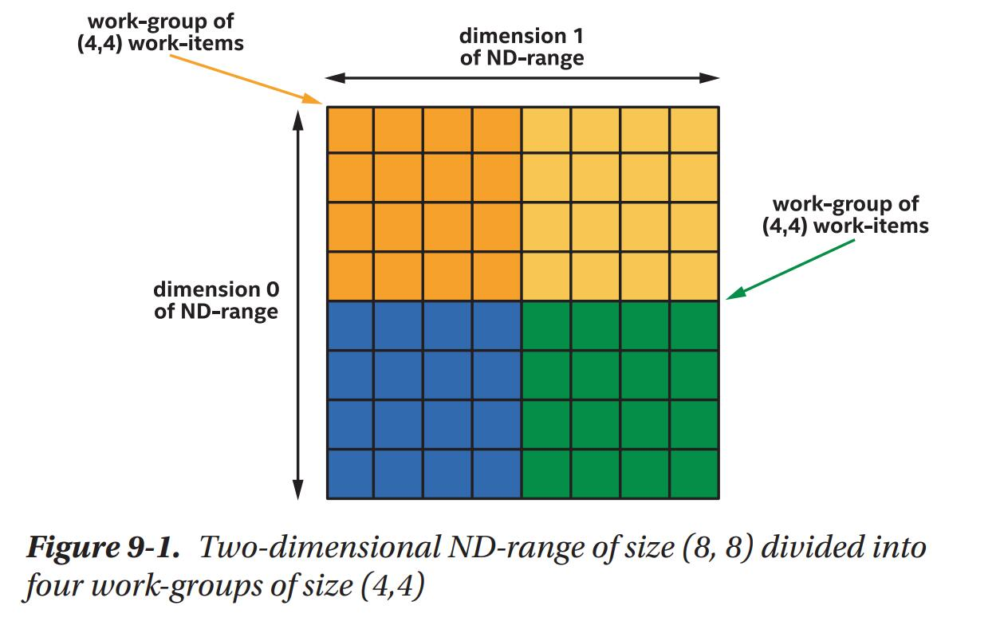
     		<!--换行-->
    

work-item may  communicate with other work-items that share the same color.

#### Barrier

First, the barrier function synchronizes execution of work-items in  a group.

Second, the barrier function synchronizes how each work-item views  the state of memory

#### Work-group local memory

To simplify kernel development and accelerate communication between  work-items in a work-group, SYCL defines a special local memory space  specifically for communication between work-items in a work-group.

			<!--块级封装-->
    
	<!--将图片和文字居中-->
    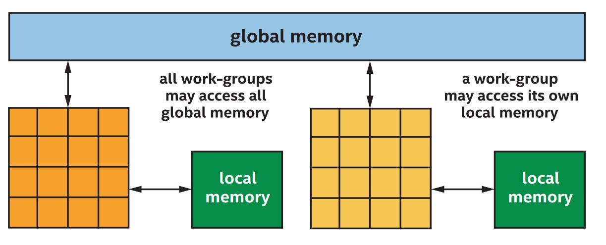
     		<!--换行-->
    

When a work-group begins, the contents of its local memory are  uninitialized, and local memory does not persist after a work-group  finishes executing. Because of these properties, local memory may only be  used for temporary storage while a work-group is executing

### Sub-groups

 A subgroup is an implementation-defined subset of work-items in a work-group that execute together on the same hardware resources or with additional  scheduling guarantees. Because the implementation decides how to group  work-items into sub-groups, the work-items in a sub-group may be able to  communicate or synchronize more efficiently than the work-items in an  arbitrary work-group.

<u>*Sub-group is similar to warp in CUDA and collective function like broadcast, shuffle are similar to CUDA warp-level primitives*</u>

