# OneAPI GPU optimization guide

## Intel Iris X GPU architecture

The Intel® Iris® X e GPU family consists of a series of microarchitectures, ranging from integrated/low power (Xe - LP), to enthusiast/high performance gaming (Xe -HPG), data center/AI (Xe -HP) and high performance computing (Xe -HPC)

<div>			<!--块级封装-->
    <center>	<!--将图片和文字居中-->
    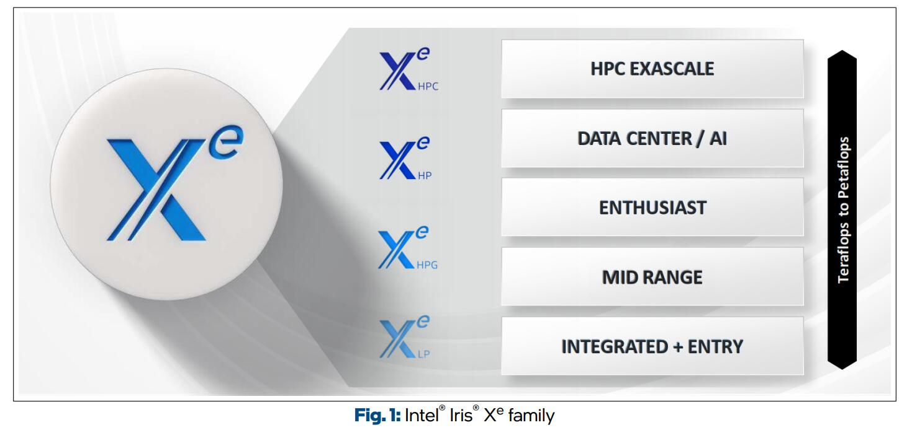
    <br>		<!--换行-->
    </center>
</div>

### Xe-LP

#### Execution Unit

An Execution Unit (EU) is the smallest thread-level building block of the Intel® Iris® X e -LP GPU architecture. Each EU is simultaneously multithreaded (SMT) with seven threads. The primary computation unit consists of a 8-wide Single Instruction Multiple Data (SIMD) Arithmetic Logic Units (ALU) supporting SIMD8 FP/INT operations and a 2-wide SIMD ALU supporting SIMD2 extended math operations. Each hardware thread has 128 general-purpose registers (GRF) of 32B wide.

<div>			<!--块级封装-->
    <center>	<!--将图片和文字居中-->
    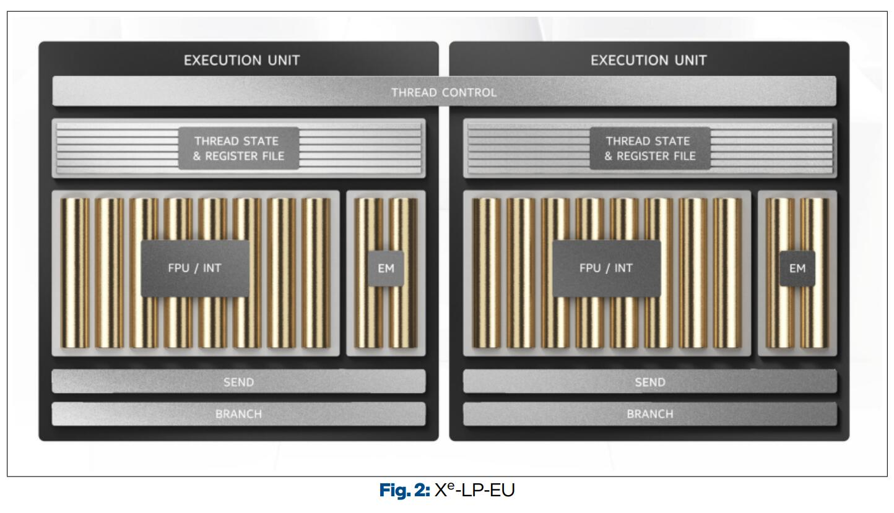
    <br>		<!--换行-->
    </center>
</div>

#### Xe-LP Dual Subslice

Each Xe -LP Dual Subslice (DSS) consists of an EU array of 16 EUs, an instruction cache, a local thread dispatcher, **Shared Local Memory (SLM)**, and a data port of 128B/cycle. <u>It is called dual subslice because the hardware can pair two EUs for SIMD16 executions</u>. The SLM is a 128KB High Bandwidth Memory (HBM) accessible from the EUs in the subslice. One important usage of SLM is to share atomic data and signals among the concurrent work-items executing in a subslice. 

For this reason, if a kernel’s work-group contains synchronization operations, <u>all work-items of the work-group must be allocated to a single subslice</u> so that they have shared access to the same 128KB SLM. 

The work-group size must be chosen carefully to maximize the occupancy and utilization of the subslice. In contrast, <u>if a kernel does not access SLM, its work-items can be dispatched across multiple subslices.</u>


#### Xe-LP Slice

Each Xe -LP slice consists of six (dual) subslices for a total of 96 EUs

<div>			<!--块级封装-->
    <center>	<!--将图片和文字居中-->
    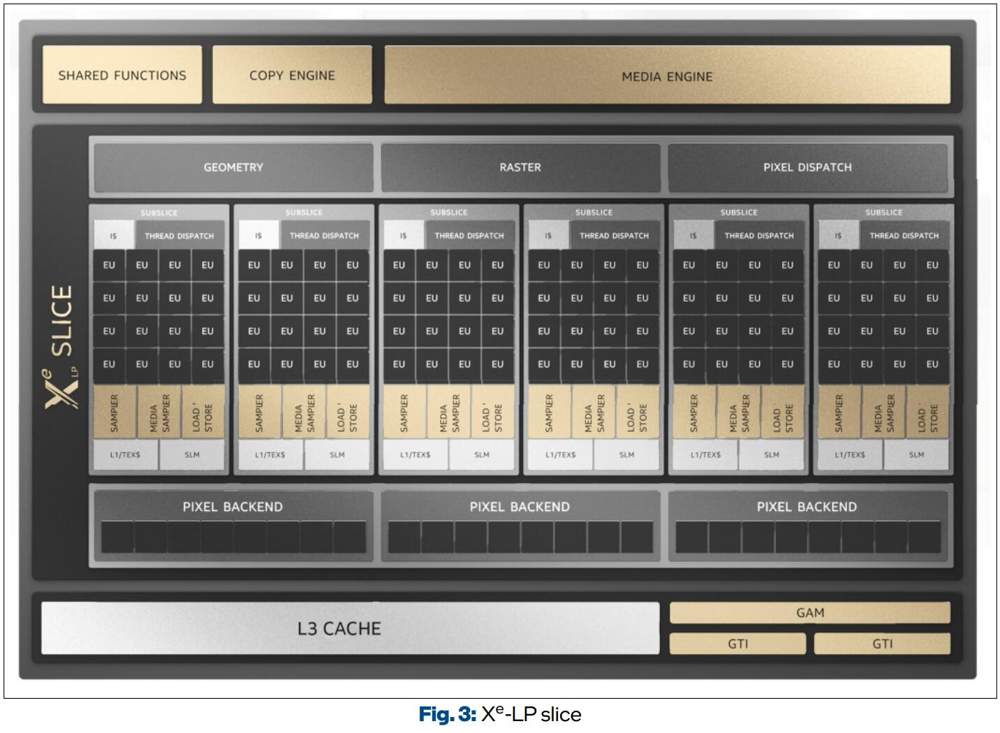
    <br>		<!--换行-->
    </center>
</div>


### Xe-core

Unlike the Xe -LP and prior generations of Intel GPUs that used the Execution Unit (E`

 U) as a compute unit, Xe - HPG and Xe -HPC use the Xe -core. **This is similar to an Xe -LP dual subslice.**

An Xe -core contains vector and matrix ALUs, which are referred to as vector and matrix engines.


<div>			<!--块级封装-->
    <center>	<!--将图片和文字居中-->
    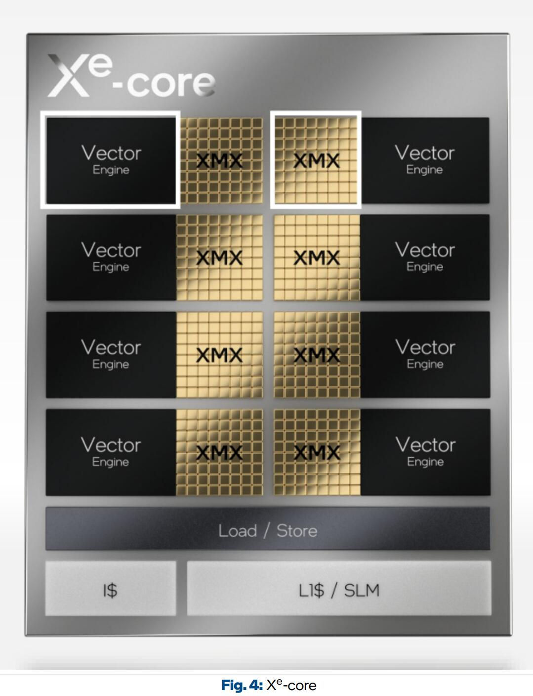
    <br>		<!--换行-->
    </center>
</div>

#### Xe-slice

<div>			<!--块级封装-->
    <center>	<!--将图片和文字居中-->
    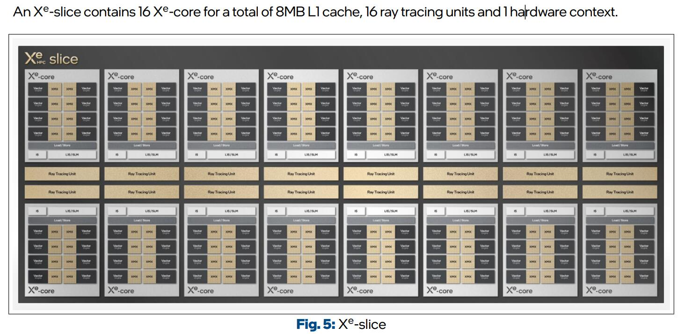
    <br>		<!--换行-->
    </center>
</div>


## Thread mapping

* **Work-item** A work-item represents one of a collection of parallel executions of a kernel. 

* **Sub-group** A sub-group represents a short range of consecutive work-items that are processed together as a SIMD vector of length 8, 16, 32, or a multiple of the native vector length of a CPU with Intel® UHD Graphics. 

* **Work-group** A work-group is a 1-, 2-, or 3-dimensional set of threads within the thread hierarchy. In SYCL, synchronization across work-items is only possible with barriers for the work-items within the same workgroup

<div>			<!--块级封装-->
    <center>	<!--将图片和文字居中-->
    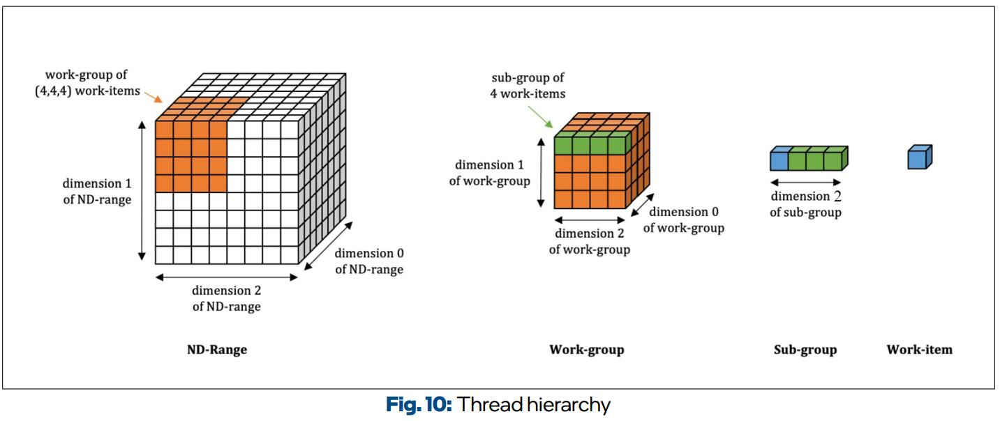
    <br>		<!--换行-->
    </center>
</div>

### GPU occupancy

<div>			<!--块级封装-->
    <center>	<!--将图片和文字居中-->
    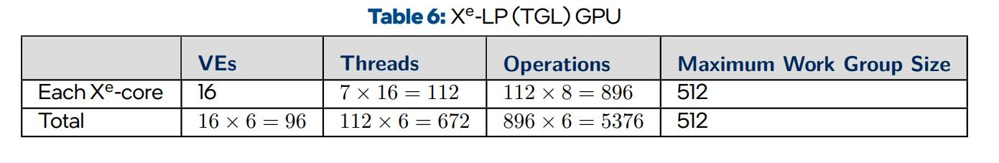
    <br>		<!--换行-->
    </center>
</div>

The maximum work-group size is a <u>constraint imposed by the hardware and GPU driver.</u>

The two most important GPU resources are:

* Thread Contexts

*  SIMD Units and SIMD Registers

#### Group size selection

```python
Work group size = Threads x SIMD sub-group size
```

<div>			<!--块级封装-->
    <center>	<!--将图片和文字居中-->
    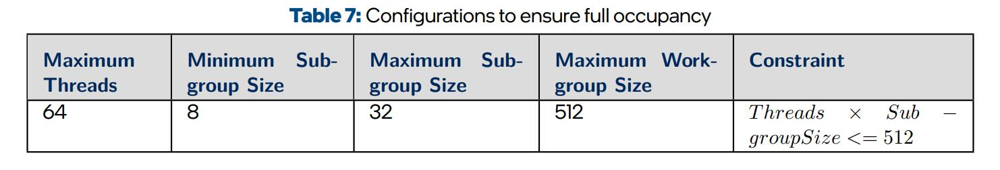
    <br>		<!--换行-->
    </center>
</div>

In general, choosing a larger work-group size has the advantage of reducing the number of rounds of work-group dispatching. Increasing sub-group size can reduce the number of threads required for a work-group at the expense of longer latency and higher register pressure for each sub-group execution.

```c++
cgh.parallel_for(nd_range(sycl::range(64, 64, 128), // global range
sycl::range(1, R, 128) // local range
```

<div>			<!--块级封装-->
    <center>	<!--将图片和文字居中-->
    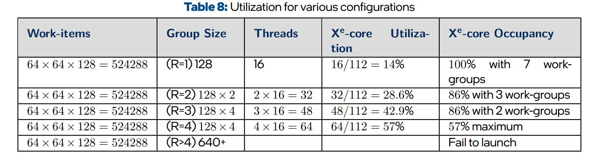
    <br>		<!--换行-->
    </center>
</div>

The ***Intel® GPU Occupancy Calculator*** can be used to calculate the occupancy on an Intel GPU for a given kernel, and its work-group parameters


## Kernels

### Memory coalescing

<div>           <!--块级封装-->    <center>    <!--将图片和文字居中-->    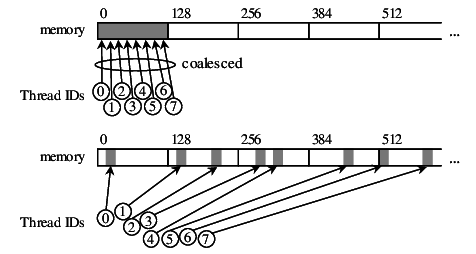    <br>        <!--换行-->    </center></div>

```C++
constexpr int N = 1024 * 1024;
int *data = sycl::malloc_shared<int>(N, q);

auto e = q.submit([&](auto &h) {
h.parallel_for(sycl::nd_range(sycl::range{N / 16}, sycl::range{32}),
	[=](sycl::nd_item<1> it) {
 		int i = it.get_global_linear_id();
 		i = i * 16;
 		for (int j = i; j < (i + 16); j++) {
 			data[j] = -1;
 		}
 	});
 });
 q.wait();
```

This simple kernel initializes an array of 1024 x 1024 integers. Each work-item initializes 16 contiguous integers. Assuming the sub-group size chosen by the compiler is 16, 256 integers are initialized in each sub-group or thread. However, the stores in 16 SIMD lanes are scattered.

This simple kernel initializes an array of 1024 x 1024 integers. Each work-item initializes 16 contiguous integers. Assuming the sub-group size chosen by the compiler is 16, 256 integers are initialized in each sub-group or thread. However, the stores in 16 SIMD lanes are scattered.

### Shared Local Memory

<div>			<!--块级封装-->
    <center>	<!--将图片和文字居中-->
    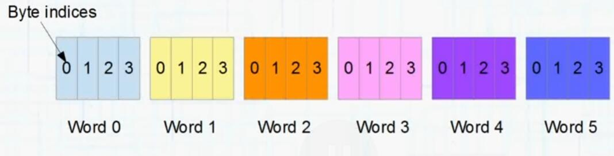
    <br>		<!--换行-->
    </center>
</div>

<div>			<!--块级封装-->
    <center>	<!--将图片和文字居中-->
    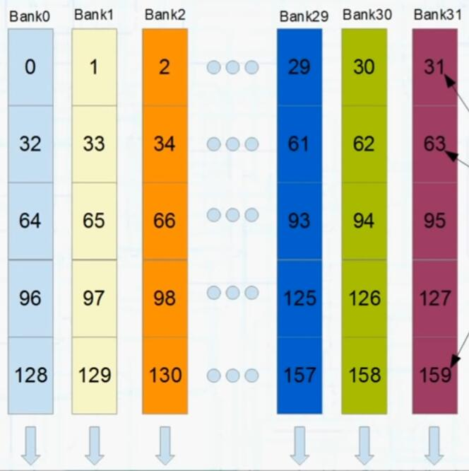
    <br>		<!--换行-->
    </center>
</div>


#### Bank conflict

This wil happen when working with doubles, structures of 2 floats, or any other 8 byte data type

<div>           <!--块级封装-->    <center>    <!--将图片和文字居中-->    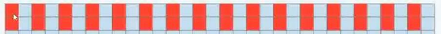    <br>        <!--换行-->    </center></div>

Padding sometimes mitigates the problem

<div>           <!--块级封装-->    <center>    <!--将图片和文字居中-->        <br>        <!--换行-->    </center></div>

 