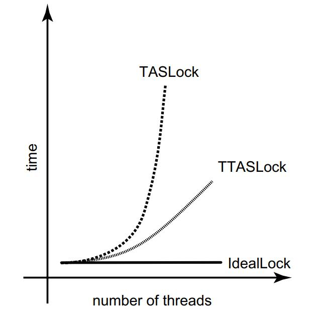
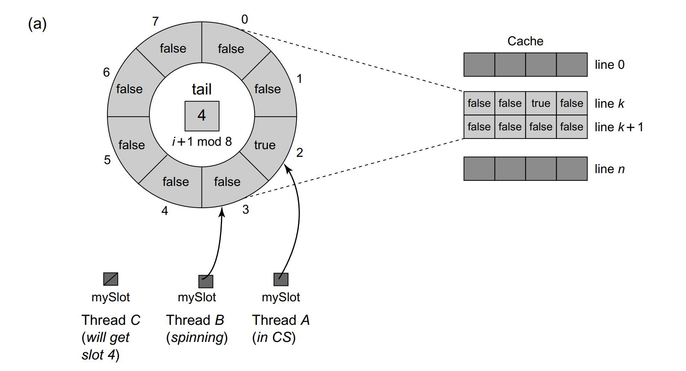
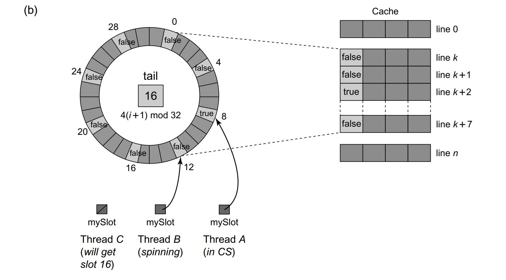
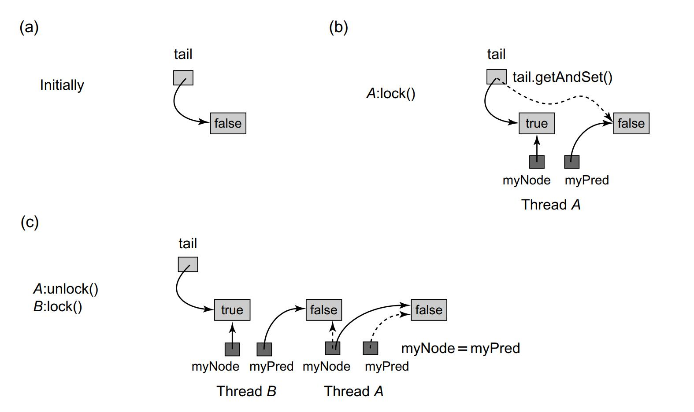
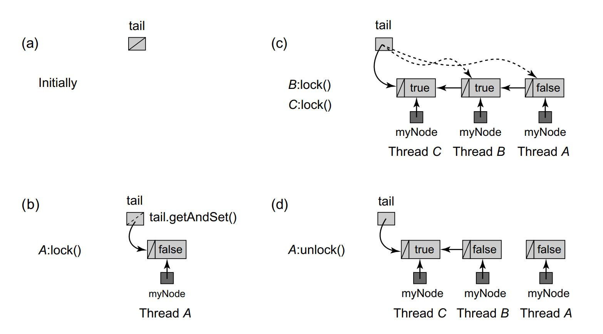
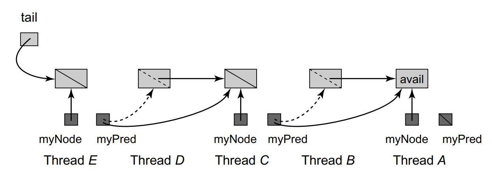
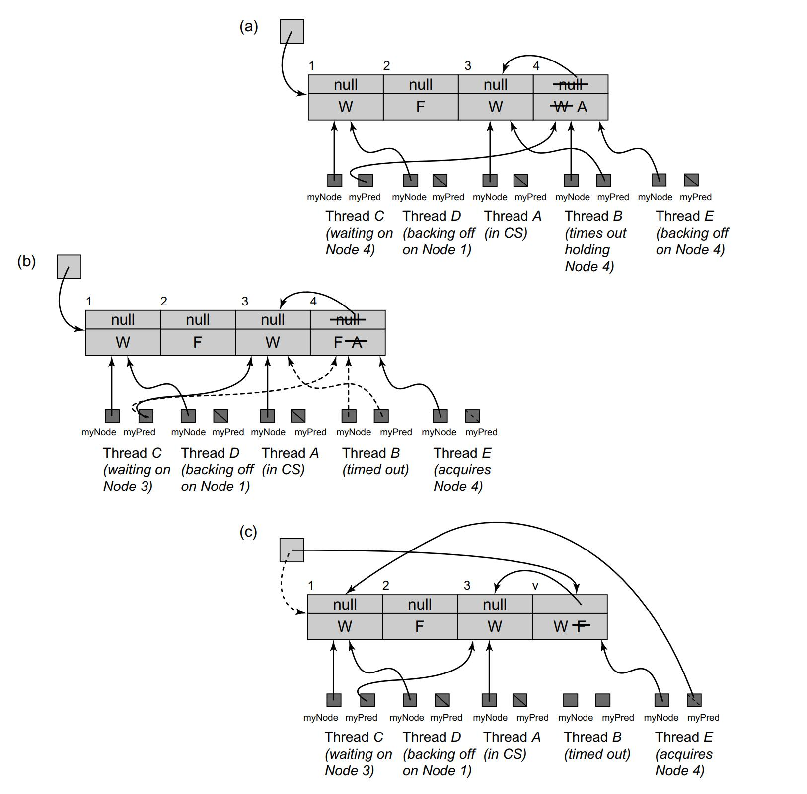
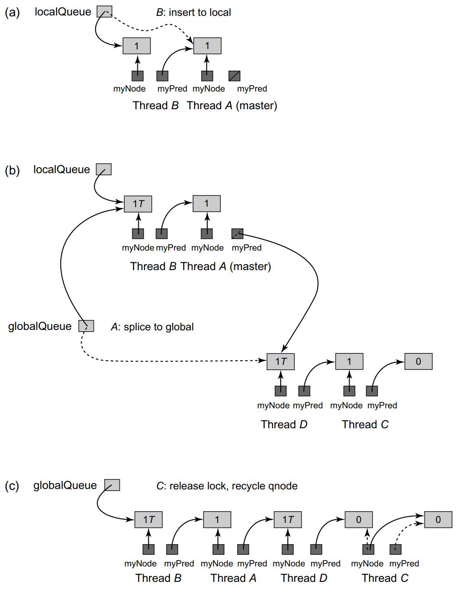

# Spin Locks and Contention

## Test-and-set locks

```Java
1 public class TASLock implements Lock {
2 	AtomicBoolean state = new AtomicBoolean(false);
3 	public void lock() {
4 		while (state.getAndSet(true)) {}
5 	}
6 	public void unlock() {
7 		state.set(false);
8 	}
9 }
```


## Test-and-test-and-set locks

```Java
1 public class TTASLock implements Lock {
2 AtomicBoolean state = new AtomicBoolean(false);
3 public void lock() {
4 	while (true) {
5 		while (state.get()) {};
6 		if (!state.getAndSet(true))
7 			return;
8 		}
9 	}
10 public void unlock() {
11 	state.set(false);
12 	}
13 }
```

<div>			<!--块级封装-->
    <center>	<!--将图片和文字居中-->
    
    <br>		<!--换行-->
    </center>
</div>

## Exponential backoff

If some other thread acquires the lock between the first and second step, then, most likely, there is high contention for that lock. Clearly, it is a bad idea to try to acquire a lock for which there is high contention. Such an attempt contributes to bus traffic (making the traffic jam worse), at a time when the thread’s chances of acquiring the lock are slim. I nstead, it is more effective for the thread to back off for some duration, giving competing threads a chance to finish.

```Java
1 public class Backoff {
2 	final int minDelay, maxDelay;
3 	int limit;
4 	final Random random;
5 	public Backoff(int min, int max) {
6 		minDelay = min;
7 		maxDelay = min;
8 		limit = minDelay;
9 		random = new Random();
10 	}
11 	public void backoff() throws InterruptedException {
12 		int delay = random.nextInt(limit);
13 		limit = Math.min(maxDelay, 2 * limit);
14 		Thread.sleep(delay);
15 	}
16 }
```


## Queue locks

### Array-based locks

***Padded versua Non-padded***

<div>			<!--块级封装-->
    <center>	<!--将图片和文字居中-->
    
    <br>		<!--换行-->
    </center>
</div>

<div>			<!--块级封装-->
    <center>	<!--将图片和文字居中-->
    
    <br>		<!--换行-->
    </center>
</div>

### CLH queue locks

```Java
1 public class CLHLock implements Lock {
2 	AtomicReference<QNode> tail = new AtomicReference<QNode>(new QNode());
3 	ThreadLocal<QNode> myPred;
4 	ThreadLocal<QNode> myNode;
5 	public CLHLock() {
6 		tail = new AtomicReference<QNode>(new QNode());
7 		myNode = new ThreadLocal<QNode>() {
8 		protected QNode initialValue() {
9 		return new QNode();
10 		}
11 	};
12 	myPred = new ThreadLocal<QNode>() {
13 		protected QNode initialValue() {
14 			return null;
15 		}
16 	};
17 	}
18 	...
19 	}
20 	public void lock() {
21 		QNode qnode = myNode.get();
22 		qnode.locked = true;
23 		QNode pred = tail.getAndSet(qnode);
24 		myPred.set(pred);
25 		while (pred.locked) {}
26 	}
27 	public void unlock() {
28 		QNode qnode = myNode.get();
29 		qnode.locked = false;
30 		myNode.set(myPred.get());
31 	}
32 }
```

<div>			<!--块级封装-->
    <center>	<!--将图片和文字居中-->
    
    <br>		<!--换行-->
    </center>
</div>

***myNode*** and ***myPred*** are thread-local variables, when trying to lock, set global ***tail*** to myNode, and myPred to last tail, each thread waiting on its pred.


Like the ALock, this algorithm has each thread spin on a distinct location, so when one thread releases its lock, it invalidates only its successor’s cache. This algorithm requires much less space than the ALock class, and does not require knowledge of the number of threads that might access the lock. Like the ALock class, it provides first-come-first-served fairness. 


Perhaps the only disadvantage of this lock algorithm is that it performs poorly on cache-less NUMA architectures. Each thread spins waiting for its predecessor’s node’s locked field to become false. If this memory location is remote, then performance suffers. 


### MCS queue locks

Unlike the CLHLock class, the list is explicit, not virtual: instead of embodying the list in thread-local variables, it is embodied in the (globally accessible) QNode objects, via their next fields.

```Java
1 public class MCSLock implements Lock {
2 	AtomicReference<QNode> tail;
3 	ThreadLocal<QNode> myNode;
4 	public MCSLock() {
5 		queue = new AtomicReference<QNode>(null);
6 		myNode = new ThreadLocal<QNode>() {
7 			protected QNode initialValue() {
8 				return new QNode();
9 				}
10 		};
11 	}
12 	...
13 	class QNode {
14 		boolean locked = false;
15 		QNode next = null;
16 	}
17 }
18 public void lock() {
19 	QNode qnode = myNode.get();
20 	QNode pred = tail.getAndSet(qnode);
21 	if (pred != null) {
22 		qnode.locked = true;
23 		pred.next = qnode;
24 		// wait until predecessor gives up the lock
25 		while (qnode.locked) {}
26 	}
27 }
28 public void unlock() {
29 QNode qnode = myNode.get();
30 	if (qnode.next == null) {
31 		if (tail.compareAndSet(qnode, null))
32 			return;
33 		// wait until predecessor fills in its next field
34 		while (qnode.next == null) {}
35 	}
36 	qnode.next.locked = false;
37 	qnode.next = null;
38 }
```

<div>			<!--块级封装-->
    <center>	<!--将图片和文字居中-->
    
    <br>		<!--换行-->
    </center>
</div>

To acquire the lock, a thread appends its own QNode at the tail of the list.

The unlock() method checks whether the node’s next field is null (Line 30). <u>If so, then either no other thread is contending for the lock, or there is another thread, but it is slow. Let q be the thread’s current node.</u> To distinguish between these cases, the method applies compareAndSet(q, null) to the tail field. If the call succeeds, then no other thread is trying to acquire the lock, tail is set to null, and the method returns. Otherwise, another (slow) thread is trying to acquire the lock, so the method spins waiting for it to finish (Line 34). In either case, once the successor has appeared, the unlock() method sets its successor’s locked field to false, indicating that the lock is now free. At this point, no other thread can access this QNode, and so it can be reused.

This lock shares the advantages of the CLHLock, in particular, the property that each lock release invalidates only the successor’s cache entry. It is better suited to cache-less NUMA architectures because each thread controls the location on which it spins. 

***Because the list is globally visible, so threads spin on its own memory address, the lock-holder thread set the target thread's memory.*** This fits NUMA better.


### Timeout queue locks

```Java
1 public class TOLock implements Lock{
2 	static QNode AVAILABLE = new QNode();
3 	AtomicReference<QNode> tail;
4 	ThreadLocal<QNode> myNode;
5 	public TOLock() {
6 		tail = new AtomicReference<QNode>(null);
7 		myNode = new ThreadLocal<QNode>() {
8 			protected QNode initialValue() {
9 			return new QNode();
10 		}
11 		};
12 	}
13 	...
14 	static class QNode {
15 		public QNode pred = null;
16 	}
17 }
```

```Java
1 public boolean tryLock(long time, TimeUnit unit)
2 		throws InterruptedException {
3 	long startTime = System.currentTimeMillis();
4 	long patience = TimeUnit.MILLISECONDS.convert(time, unit);
5 	QNode qnode = new QNode();
6 	myNode.set(qnode);
7 	qnode.pred = null;
8 	QNode myPred = tail.getAndSet(qnode);
9 	if (myPred == null || myPred.pred == AVAILABLE) {
10 		return true;
11 	}
12 	while (System.currentTimeMillis() - startTime < patience) {
13 		QNode predPred = myPred.pred;
14 		if (predPred == AVAILABLE) {
15 			return true;
16 		} else if (predPred != null) {
17 			myPred = predPred;
18 		}
19 	}
20 	if (!tail.compareAndSet(qnode, myPred))
21 		qnode.pred = myPred;
22 	return false;
23 }
24 public void unlock() {
25 	QNode qnode = myNode.get();
26 	if (!tail.compareAndSet(qnode, null))
27 		qnode.pred = AVAILABLE;
28 	}
29 }
```

<div>			<!--块级封装-->
    <center>	<!--将图片和文字居中-->
    
    <br>		<!--换行-->
    </center>
</div>

As in the CLHLock, the lock is a virtual queue of nodes, and each thread spins on its predecessor’s node waiting for the lock to be released. As noted, when a thread times out, it cannot simply abandon its queue node, because its successor will never notice when the lock is released. On the other hand, it seems extremely difficult to unlink a queue node without disrupting concurrent lock releases. 

Instead, we take a ***lazy*** approach: when a thread times out, it marks its node as abandoned. Its successor in the queue, if there is one, notices that the node on which it is spinning has been abandoned, and starts spinning on the abandoned node’s predecessor. This approach has the added advantage that <u>*the successor can recycle the abandoned node*</u>. (Helping mechanism)

* line16-18 is doing the cleaning job for timeout nodes.

* line20-21 and line26-27 using CAS not to contend but to check if myNode has successor.


### Composite lock

Consider the following simple observation: in a queue lock, only the threads at the front of the queue need to perform lock handoffs. One way to balance the merits of queue locks versus backoff locks is to keep a small number of waiting threads in a queue on the way to the critical section, and have the rest use exponential backoff while attempting to enter this short queue.

The CompositeLock class keeps a short, fixed-size array of lock nodes. Each thread that tries to acquire the lock selects a node in the array at random. If that node is in use, the thread backs off (adaptively), and tries again. Once the thread acquires a node, it enqueues that node in a TOLock-style queue. The thread spins on the preceding node, and when that node’s owner signals it is done, the thread enters the critical section. When it leaves, either because it completed or timed-out, it releases ownership of the node, and another backed-off thread may acquire it. The tricky part of course, is how to recycle the freed nodes of the array while multiple threads attempt to acquire control over them.

```Java
1 public class CompositeLock implements Lock{
2 	private static final int SIZE = ...;
3 	private static final int MIN_BACKOFF = ...;
4 	private static final int MAX_BACKOFF = ...;
5 	AtomicStampedReference<QNode> tail;
6 	QNode[] waiting;
7 	Random random;
8 	ThreadLocal<QNode> myNode = new ThreadLocal<QNode>() {
9 		protected QNode initialValue() { return null; };
10 	};
11 	public CompositeLock() {
12 		tail = new AtomicStampedReference<QNode>(null,0);
13 		waiting = new QNode[SIZE];
14 		for (int i = 0; i < waiting.length; i++) {
15 			waiting[i] = new QNode();
16 		}
17 	random = new Random();
18 }
19 public void unlock() {
20 	QNode acqNode = myNode.get();
21 	acqNode.state.set(State.RELEASED);
22 	myNode.set(null);
23 }
24 	...
25 }
```

```Java
1 enum State {FREE, WAITING, RELEASED, ABORTED};
2 class QNode {
3 	AtomicReference<State> state;
4 	QNode pred;
5 	public QNode() {
6 		state = new AtomicReference<State>(State.FREE);
7 	}
8 }
```

```Java
1 public boolean tryLock(long time, TimeUnit unit)
2 		throws InterruptedException {
3 	long patience = TimeUnit.MILLISECONDS.convert(time, unit);
4 	long startTime = System.currentTimeMillis();
5 	Backoff backoff = new Backoff(MIN_BACKOFF, MAX_BACKOFF);
6 	try {
7 		QNode node = acquireQNode(backoff, startTime, patience);
8 		QNode pred = spliceQNode(node, startTime, patience);
9 		waitForPredecessor(pred, node, startTime, patience);
10 		return true;
11 	} catch (TimeoutException e) {
12 		return false;
13 	}
14 }
```

```Java
1 private QNode acquireQNode(Backoff backoff, long startTime,
2 		long patience)
3 		throws TimeoutException, InterruptedException {
4 	QNode node = waiting[random.nextInt(SIZE)];
5 	QNode currTail;
6 	int[] currStamp = {0};
7 	while (true) {
8 		if (node.state.compareAndSet(State.FREE, State.WAITING)) {
9 			return node;
10 	}
11 	currTail = tail.get(currStamp);
12 	State state = node.state.get();
13 	if (state == State.ABORTED || state == State.RELEASED) {
14 		if (node == currTail) {
15 			QNode myPred = null;
16 			if (state == State.ABORTED) {
17 				myPred = node.pred;
18 			}
19 			if (tail.compareAndSet(currTail, myPred,
20 				currStamp[0], currStamp[0]+1)) {
21 				node.state.set(State.WAITING);
22 				return node;
23 				}
24 			}
25 		}
26 		backoff.backoff();
27 		if (timeout(patience, startTime)) {
28 			throw new TimeoutException();
29 		}
30 	}
31 }
```

```Java
1 private QNode spliceQNode(QNode node, long startTime, long patience)
2 		throws TimeoutException {
3 	QNode currTail;
4 	int[] currStamp = {0};
5 	do {
6 		currTail = tail.get(currStamp);
7 		if (timeout(startTime, patience)) {
8 			node.state.set(State.FREE);
9 			throw new TimeoutException();
10 		}
11 	} while (!tail.compareAndSet(currTail, node,
12 		currStamp[0], currStamp[0]+1));
13 		return currTail;
14 }
```

```Java
1 private void waitForPredecessor(QNode pred, QNode node, long startTime,
2 	long patience)
3 	throws TimeoutException {
4 		int[] stamp = {0};
5 		if (pred == null) {
6 			myNode.set(node);
7 			return;
8 		}
9 		State predState = pred.state.get();
10 		while (predState != State.RELEASED) {
11 			if (predState == State.ABORTED) {
12 				QNode temp = pred;
13 				pred = pred.pred;
14 				temp.state.set(State.FREE);
15 			}
16 			if (timeout(patience, startTime)) {
17 				node.pred = pred;
18 				node.state.set(State.ABORTED);
19 				throw new TimeoutException();
20 			}
21 			predState = pred.state.get();
22		 	}
23 			pred.state.set(State.FREE);
24 			myNode.set(node);
25 			return;
26 }
```

<div>			<!--块级封装-->
    <center>	<!--将图片和文字居中-->
    
    <br>		<!--换行-->
    </center>
</div>


## Hierarchical locks

### Hierarchical backoff lock

A test–and–test–and–set lock can easily be adapted to exploit clustering. Suppose the lock is held by thread A. If threads from A’s cluster have shorter backoff times, then when the lock is released, local threads are more likely to acquire the lock than remote threads, reducing the overall time needed to switch lock ownership. 

One drawback of the HBOLock is that it may be too successful in exploiting locality. There is a danger that threads from the same cluster will repeatedly transfer the lock among themselves while threads from other clusters starve. Moreover, acquiring and releasing the lock invalidates remotely cached copies of the lock field, which can be expensive on cache-coherent NUMA architectures.

```Java
1 public class HBOLock implements Lock {
2 	private static final int LOCAL_MIN_DELAY = ...;
3 	private static final int LOCAL_MAX_DELAY = ...;
4 	private static final int REMOTE_MIN_DELAY = ...;
5 	private static final int REMOTE_MAX_DELAY = ...;
6 	private static final int FREE = -1;
7 	AtomicInteger state;
8 	public HBOLock() {
9 		state = new AtomicInteger(FREE);
10 	}
11 	public void lock() {
12 		int myCluster = ThreadID.getCluster();
13 		Backoff localBackoff =
14 		new Backoff(LOCAL_MIN_DELAY, LOCAL_MAX_DELAY);
15 		Backoff remoteBackoff =
16 			new Backoff(REMOTE_MIN_DELAY, REMOTE_MAX_DELAY);
17 		while (true) {
18 			if (state.compareAndSet(FREE, myCluster)) {
19 				return;
20 			}
21 			int lockState = state.get();
22 			if (lockState == myCluster) {
23 				localBackoff.backoff();
24 			} else {
25 				remoteBackoff.backoff();
26 			}
27 		}
28 	}
29 	public void unlock() {
30 		state.set(FREE);
31 	}
32 }
```


### Hierarchical CLH queue lock

The HCLHLock queue lock (Fig. 7.28) consists of a collection of local queues, one per cluster, and a single global queue. Each queue is a linked list of nodes, where the links are implicit, in the sense that they are held in thread-local fields, myQNode and myPred.

<div>			<!--块级封装-->
    <center>	<!--将图片和文字居中-->
    
    <br>		<!--换行-->
    </center>
</div>

```Java
1 public class HCLHLock implements Lock {
2 	static final int MAX_CLUSTERS = ...;
3 	List<AtomicReference<QNode>> localQueues;
4 	AtomicReference<QNode> globalQueue;
5 	ThreadLocal<QNode> currNode = new ThreadLocal<QNode>() {
6 		protected QNode initialValue() { return new QNode(); };
7 	};
8 	ThreadLocal<QNode> predNode = new ThreadLocal<QNode>() {
9 		protected QNode initialValue() { return null; };
10 	};
11 public HCLHLock() {
12 	localQueues = new ArrayList<AtomicReference<QNode>>(MAX_CLUSTERS);
13 	for (int i = 0; i < MAX_CLUSTERS; i++) {
14 		localQueues.add(new AtomicReference <QNode>());
15 	}
16 	QNode head = new QNode();
17 	globalQueue = new AtomicReference<QNode>(head);
18 }
```

```Java
1 class QNode {
2 	// private boolean tailWhenSpliced;
3 	private static final int TWS_MASK = 0x80000000;
4 	// private boolean successorMustWait = false;
5 	private static final int SMW_MASK = 0x40000000;
6 	// private int clusterID;
7 	private static final int CLUSTER_MASK = 0x3FFFFFFF;
8 	AtomicInteger state;
9 	public QNode() {
10 		state = new AtomicInteger(0);
11 	}
12 	public void unlock() {
13 		int oldState = 0;
14 		int newState = ThreadID.getCluster();
15 		// successorMustWait = true;
16 		newState |= SMW_MASK;
17 		// tailWhenSpliced = false;
18 		newState &= (ˆTWS_MASK);
19 		do {
20 			oldState = state.get();
21 		} while (! state.compareAndSet(oldState, newState));
22 	}
23 	public int getClusterID() {
24 		return state.get() & CLUSTER_MASK;
25 	}
26 // other getters and setters omitted.
27 }
```

