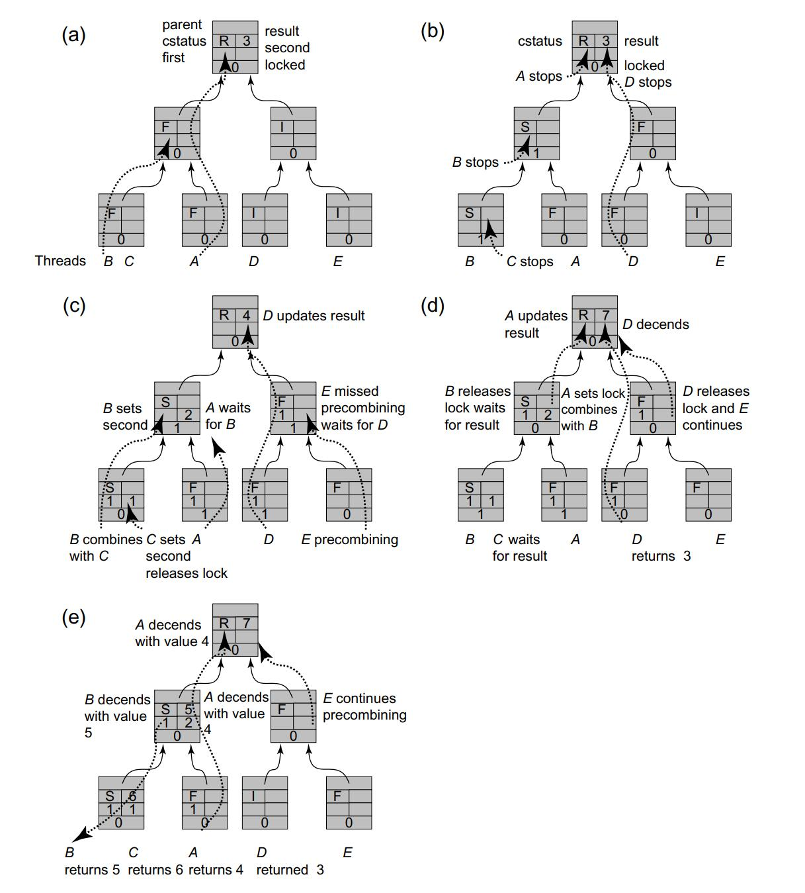

# Counting, Sorting, Distributed Coordination

This chapter shows how some important problems that seem inherently sequential can be made highly parallel by “**spreading out**” coordination tasks among multiple parties. 

Here, we cover several useful patterns for distributed coordination:

* Combining
* Counting
* Diffraction
* Sampling

We also cover two basic structures underlying these patterns:

* Trees 
* Combinatorial Networks


# Shared counting

One way to implement a pool is to use coarse-grained locking

Let us consider the following alternative. The pool’s items reside in a cyclic array, where each array entry contains either an item or null. We route threads through two counters. Threads calling put() increment one counter to choose an array index into which the new item should be placed. (If that entry is full, the thread waits until it becomes empty.) Similarly, threads calling get() increment another counter to choose an array index from which the new item should be removed. (If that entry is empty, the thread waits until it becomes full.) 

<u>This approach replaces one bottleneck: the lock, with two: the counters.</u>

We now explore the idea that shared counters need not be bottlenecks, and can be effectively parallelized. We face two challenges.

1. We must avoid memory contention, where too many threads try to access the same memory location, stressing the underlying communication network and cache coherence protocols. 
2. We must achieve real parallelism. Is incrementing a counter an inherently sequential operation, or is it possible for n threads to increment a counter faster than it takes one thread to increment a counter n times?


## Software combining

A ***CombiningTree*** is a binary tree of nodes, where each node contains bookkeeping information. The counter’s value is stored at the root. Each thread is assigned a leaf, and at most two threads share a leaf, so if there are *p* physical processors, then there are *p*/2 leaves.

To increment the counter, a thread starts at its leaf, and works its way up the tree to the root. If two threads reach a node at approximately the same time, then they combinetheir increments by adding them together.

One thread, the ***active*** thread, propagates their combined increments up the tree, while the other, the ***passive*** thread, waits for the active thread to complete their combined work. <u>A thread may be active at one level and become passive at a higher level.</u>

When a thread reaches the root, it adds the sum of its combined increments to the counter’s current value. The thread then moves back down the tree, notifying each waiting thread that the increments are now complete.

The CombiningTree class, like other techniques we consider later, is intended to benefit **throughput**, not latency.


##### Schematic

The concurrent traversal of a width 8 combining tree by 5 threads. The structure is initialized with all nodes unlocked, the root node having the CStatus ROOT and all other nodes having the CStatus IDLE.

<div>			<!--块级封装-->
    <center>	<!--将图片和文字居中-->
    
    <br>		<!--换行-->
    </center>
</div>

This algorithm uses two kinds of synchronization. Short-term synchronization is provided by synchronized methods of the Node class. Each method locks the node for the duration of the call to ensure that it can read–write node fields without interference from other threads.

The algorithm also requires excluding threads from a node for durations longer than a single method call. Such long-term synchronization is provided by a Boolean locked field. When this field is true, no other thread is allowed to access the node.

Every tree node has a ***combining status***, which defines whether the node is in the early, middle, or late stages of combining concurrent requests. 

```java
enum CStatus{FIRST, SECOND, RESULT, IDLE, ROOT};
```

* **FIRST**: One active thread has visited this node, and will return to check whether another passive thread has left a value with which to combine.
* **SECOND**: A second thread has visited this node and stored a value in the node’s value field to be combined with the active thread’s value, but the combined operation is not yet complete. 
* **RESULT**: Both threads’ operations have been combined and completed, and the second thread’s result has been stored in the node’s result field.
* **ROOT**: This value is a special case to indicate that the node is the root, and must be treated specially.

```java
1 public class Node {
2 	enum CStatus{IDLE, FIRST, SECOND, RESULT, ROOT};
3 	boolean locked;
4 	CStatus cStatus;
5 	int firstValue, secondValue;
6 	int result;
7 	Node parent;
8 	public Node() {
9 		cStatus = CStatus.ROOT;
10 		locked = false;
11 	}
12 	public Node(Node myParent) {
13 		parent = myParent;
14 		cStatus = CStatus.IDLE;
15 		locked = false;
16 	}
17 	...
18 }
19 synchronized boolean precombine() {
20 	while (locked) wait();
21 		switch (cStatus) {
22 			case IDLE:
23 				cStatus = CStatus.FIRST;
24 				return true;
25 			case FIRST:
26 				locked = true;
27 				cStatus = CStatus.SECOND;
28 				return false;
29 			case ROOT:
30 				return false;
31 			default:
32 				throw new PanicException("unexpected Node state" + cStatus);
33 	}
34 }
35 synchronized int combine(int combined) {
36 	while (locked) wait();
37 	locked = true;
38 	firstValue = combined;
39 	switch (cStatus) {
40 		case FIRST:
41 			return firstValue;
42 		case SECOND:
43 			return firstValue + secondValue;
44 		default:
45 			throw new PanicException("unexpected Node state " + cStatus);
46 	}
47 }
48 synchronized int op(int combined) {
49 	switch (cStatus) {
50 		case ROOT:
51 			int prior = result;
52 			result += combined;
53 			return prior;
54 		case SECOND:
55 			secondValue = combined;
56 			locked = false;
57 			notifyAll(); // wake up waiting threads
58 			while (cStatus != CStatus.RESULT) wait();
59 			locked = false;
60 			notifyAll();
61 			cStatus = CStatus.IDLE;
62 			return result;
63 		default:
64 			throw new PanicException("unexpected Node state");
65 	}
66 }
67 synchronized void distribute(int prior) {
68 	switch (cStatus) {
69 		case FIRST:
70 			cStatus = CStatus.IDLE;
71 			locked = false;
72 			break;
73 		case SECOND:
74 			result = prior + firstValue;
75 			cStatus = CStatus.RESULT;
76 			break;
77 		default:
78 			throw new PanicException("unexpected Node state");
79 	}
80 	notifyAll();
81 }
```

To initialize the CombiningTree for p threads, we create a width w = 2p array of Node objects. The root is node[0], and for 0<i<w, the parent of node[i] is node[(i − 1)/2]. The leaf nodes are the last (w + 1)/2 nodes in the array, where thread i is assigned to leaf i/2. The root’s initial combining state is ROOT and the other nodes combining state is IDLE.

```java
1 public CombiningTree(int width) {
2 	Node[] nodes = new Node[width - 1];
3 	nodes[0] = new Node();
4 	for (int i = 1; i < nodes.length; i++) {
5 		nodes[i] = new Node(nodes[(i-1)/2]);
6 	}
7 	leaf = new Node[(width + 1)/2];
8 	for (int i = 0; i < leaf.length; i++) {
9 		leaf[i] = nodes[nodes.length - i - 1];
10 	}
11 }
12 public int getAndIncrement() {
13 	Stack<Node> stack = new Stack<Node>();
14 	Node myLeaf = leaf[ThreadID.get()/2];
15 	Node node = myLeaf;
16 	// precombining phase
17 	while (node.precombine()) {
18 		node = node.parent;
19 	}
20 	Node stop = node;
21 	// combining phase
22 	node = myLeaf;
23 	int combined = 1;
24 	while (node != stop) {
25 		combined = node.combine(combined);
26 		stack.push(node);
27 		node = node.parent;
28 	}
29 	// operation phase
30 	int prior = stop.op(combined);
31 	// distribution phase
32 	while (!stack.empty()) {
33 		node = stack.pop();
34 		node.distribute(prior);
35 	}
36 	return prior;
37 }

```

##### Precombine

The precombine() method returns a Boolean indicating whether the thread was the first to arrive at the node. If so, the getAndIncrement() method continues moving up the tree. The stop variable is set to the last node visited, which is either the last node at which the thread arrived second, or the root. Before it returns, the thread places a *<u>long-term lock</u>* on the node (by setting locked to true) to prevent the earlier visiting thread from proceeding without combining with the thread’s value.

##### Combine

The thread revisits the nodes it visited in the precombining phase, combining its value with values left by other threads. It stops when it arrives at the node stop where the precombining phase ended. Later on, we traverse these nodes in reverse order, so as we go we push the nodes we visit onto a stack.