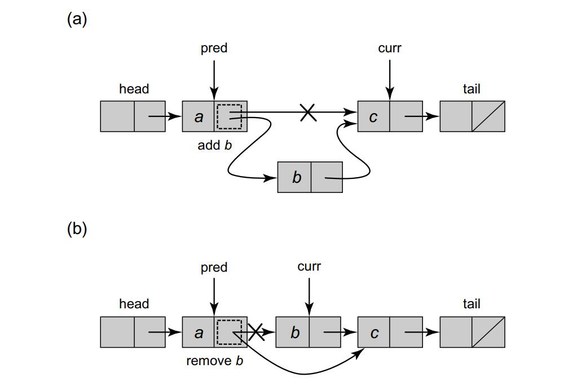
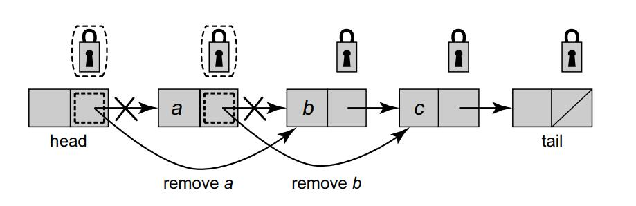
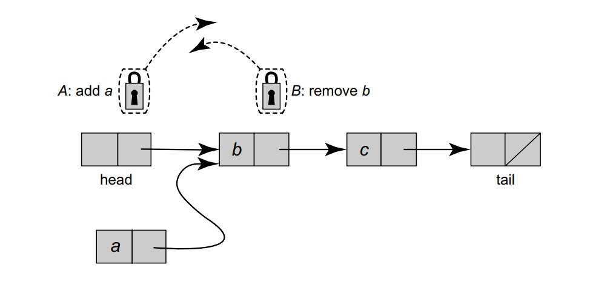
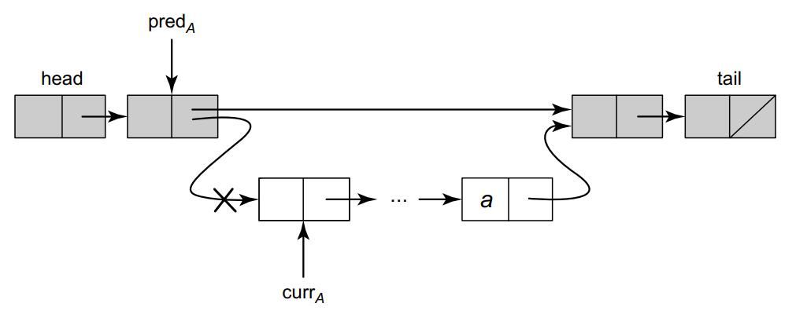
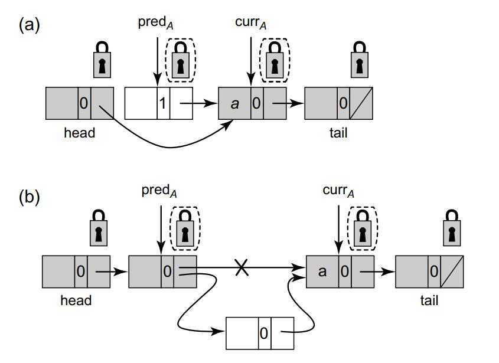
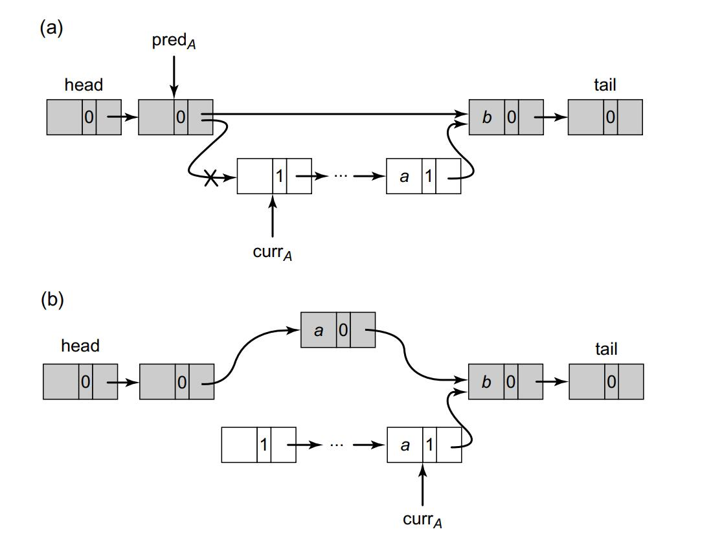
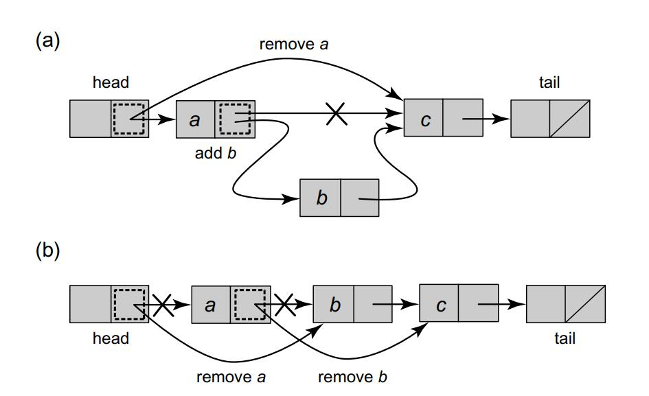

# Linked Lists

* ***Fine-grained synchronization***: 
  * Instead of using a single lock to synchronize every access to an object, we split the object into independently synchronized components, ensuring that method calls interfere only when trying to access the same component at the same time. 
* ***Optimistic synchronization***: 
  * Many objects, such as trees or lists, consist of multiple components linked together by references. Some methods search for a particular component (e.g., a list or tree node containing a particular key). One way to reduce the cost of fine-grained locking is to search without acquiring any locks at all. If the method finds the sought-after component, it locks that component, and then checks that the component has not changed in the interval between when it was inspected and when it was locked. This technique is worthwhile only if it succeeds more often than not, which is why we call it optimistic

* ***Lazy synchronization***: 
  * Sometimes it makes sense to postpone hard work. For example, the task of removing a component from a data structure can be split into two phases: the component is logically removed simply by setting a tag bit, and later, the component can be physically removed by unlinking it from the rest of the data structure. 
* ***Nonblocking synchronization***: 
  * Sometimes we can eliminate locks entirely, relying on built-in atomic operations such as compareAndSet() for synchronization.


## List-based sets

```Java
1 private class Node {
2 	T item;
3 	int key;
4 	Node next;
5 }
```

The list has two kinds of nodes. In addition to regular nodes that hold items in the set, we use two sentinel nodes, called head and tail, as the first and last list elements. Sentinel nodes are never added, removed, or searched for, and their keys are the minimum and maximum integer values.

<div>			<!--块级封装-->
    <center>	<!--将图片和文字居中-->
    
    <br>		<!--换行-->
    </center>
</div>

Each thread A has two **local** variables used to traverse the list: currA is the current node and predA is its predecessor. To add an item to the set, thread A sets local variables predA and currA to head, and moves down the list, comparing currA’s key to the key of the item being added. If they match, the item is already present in the set, so the call returns false. If predA precedes currA in the list, then predA’s key is lower than that of the inserted item, and currA’s key is higher, so the item is not present in the list. The method creates a new node b to hold the item, sets b’s nextA field to currA, then sets predA to b. Removing an item from the set works in a similar way.


## Concurrent reasoning

Often, the key to understanding a concurrent data structure is to understand its invariants: properties that always hold. We can show that a property is invariant by showing that: 

1. The property holds when the object is created, and 
2. Once the property holds, then no thread can take a step that makes the property *false*

Let us think of the representation invariant as a contract among the object’s methods. Each method call preserves the invariant, and also relies on the other methods to preserve the invariant. In this way, we can reason about each method in isolation, without having to consider all the possible ways they might interact.


## Coarse-grained synchronization

The list itself has a single lock which every method call must acquire.

```Java
1 public class CoarseList<T> {
2 	private Node head;
3 	private Lock lock = new ReentrantLock();
4 	public CoarseList() {
5 		head = new Node(Integer.MIN_VALUE);
6 		head.next = new Node(Integer.MAX_VALUE);
7 	}
8 	public boolean add(T item) {
9 		Node pred, curr;
10 		int key = item.hashCode();
11 		lock.lock();
12 		try {
13 			pred = head;
14 			curr = pred.next;
15 			while (curr.key < key) {
16 				pred = curr;
17 				curr = curr.next;
18 			}
19 			if (key == curr.key) {
20 				return false;
21 			} else {
22 				Node node = new Node(item);
23 				node.next = curr;
24 				pred.next = node;
25 				return true;
26 			}
27 		} finally {
28 			lock.unlock();
29 		}
30 }
```


## Fine-grained synchronization

We can improve concurrency by locking individual nodes, rather than locking the list as a whole. Instead of placing a lock on the entire list, let us add a Lock to each node, along with lock() and unlock() methods. As a thread traverses the list, it locks each node when it first visits, and sometime later releases it. Such fine-grained locking permits concurrent threads to traverse the list together in a **pipelined fashion.**

Let us consider two nodes a and b where a points to b. It is not safe to unlock a before locking b because another thread could remove b from the list in the interval between unlocking a and locking b. Instead, thread A must acquire locks in a kind of “hand-over-hand” order: except for the initial head sentinel node, acquire the lock for currA only while holding the lock for predA. This locking protocol is sometimes called ***lock coupling***.

```Java
1 public boolean add(T item) {
2 	int key = item.hashCode();
3 	head.lock();
4 	Node pred = head;
5 	try {
6 		Node curr = pred.next;
7 		curr.lock();
8 		try {
9 			while (curr.key < key) {
10 				pred.unlock();
11 				pred = curr;
12 				curr = curr.next;
13 				curr.lock();
14 			}
15 			if (curr.key == key) {
16 				return false;
17 			}
18 			Node newNode = new Node(item);
19 			newNode.next = curr;
20 			pred.next = newNode;
21 			return true;
22 		} finally {
23 			curr.unlock();
24 		}
25 	} finally {
26 		pred.unlock();
27 	}
28 }
29 public boolean remove(T item) {
30 	Node pred = null, curr = null;
31 	int key = item.hashCode();
32 	head.lock();
33 	try {
34 		pred = head;
35 		curr = pred.next;
36 		curr.lock();
37 		try {
38 			while (curr.key < key) {
39 				pred.unlock();
40 				pred = curr;
41 				curr = curr.next;
42 				curr.lock();
43 			}
44 			if (curr.key == key) {
45 				pred.next = curr.next;
46 				return true;
47 			}
48 			return false;
49 		} finally {
50 			curr.unlock();
51 		}
52 	} finally {
53 		pred.unlock();
54 	}
55 }
```

<div>			<!--块级封装-->
    <center>	<!--将图片和文字居中-->
    
    <br>		<!--换行-->
    </center>
</div>

To be safe, remove() must lock both predA and currA. To see why, let us consider the following scenario, illustrated above. Thread A is about to remove node a, the first node in the list, while thread B is about to remove node b, where a points to b. Suppose A locks head, and B locks a. A then sets head.next to b, while B sets a.next to c. The net effect is to remove a, but not b. The problem is that there is no overlap between the locks held by the two remove() calls 


To guarantee progress, it is important that all methods acquire locks in the same order, starting at the head and following next references toward the tail. As below shows, a deadlock could occur if different method calls were to acquire locks in different orders.

<div>			<!--块级封装-->
    <center>	<!--将图片和文字居中-->
    
    <br>		<!--换行-->
    </center>
</div>


## Optimistic synchonization

One way to reduce synchronization costs is to take a chance: search without acquiring locks, lock the nodes found, and then confirm that the locked nodes are correct. If a synchronization conflict causes the wrong nodes to be locked, then release the locks and start over. Normally, this kind of conflict is rare, which is why we call this technique optimistic synchronization.

```Java
1 public boolean add(T item) {
2 	int key = item.hashCode();
3 	while (true) {
4 		Node pred = head;
5 		Node curr = pred.next;
6 		while (curr.key <= key) {
7 			pred = curr; curr = curr.next;
8 		}
9 		pred.lock(); curr.lock();
10 		try {
11 			if (validate(pred, curr)) {
12 				if (curr.key == key) {
13 					return false;
14 				} else {
15 					Node node = new Node(item);
16 					node.next = curr;
17 					pred.next = node;
18 					return true;
19 					}
20 				}
21 		} finally {
22 			pred.unlock(); curr.unlock();
23 		}
24 	}
25 }
26 public boolean remove(T item) {
27 	int key = item.hashCode();
28 	while (true) {
29 		Node pred = head;
30 		Node curr = pred.next;
31 		while (curr.key < key) {
32 			pred = curr; curr = curr.next;
33 		}
34 		pred.lock(); curr.lock();
35 		try {
36 			if (validate(pred, curr)) {
37 			if (curr.key == key) {
38 				pred.next = curr.next;
39 				return true;
40 			} else {
41 				return false;
42 			}
43 		}
44 		} finally {
45 			pred.unlock(); curr.unlock();
46 		}
47 	}
48 }
49 public boolean contains(T item) {
50 	int key = item.hashCode();
51 	while (true) {
52 		Entry pred = this.head; // sentinel node;
53 		Entry curr = pred.next;
54 		while (curr.key < key) {
55 			pred = curr; curr = curr.next;
56 		}
57 		try {
58 			pred.lock(); curr.lock();
59 			if (validate(pred, curr)) {
60 				return (curr.key == key);
61 			}
62 		} finally { // always unlock
63 			pred.unlock(); curr.unlock();
64 		}
65 	}
66 }
67 private boolean validate(Node pred, Node curr) {
68 	Node node = head;
69 	while (node.key <= pred.key) {
70 		if (node == pred)
71 			return pred.next == curr;
72 		node = node.next;
73 	}
74 	return false;
75 }
```

Thread A makes an optimistic add(a). It **traverses the list without acquiring any locks** (Lines 6 through 8). In fact, it ignores the locks completely. It stops the traversal when currA’s key is greater than, or equal to a’s. It then locks predA and currA, and calls validate() to check that predA is reachable and its next field still refers to currA. If validation succeeds, then thread A proceeds as before: if currA’s key is greater than a, thread A adds a new node with item a between predA and currA, and returns true. Otherwise it returns false. The remove() and contains() methods operate similarly, traversing the list without locking, then locking the target nodes and validating they are still in the list.

#### why validation is needed?


<div>			<!--块级封装-->
    <center>	<!--将图片和文字居中-->
    
    <br>		<!--换行-->
    </center>
</div>

The OptimisticList class: why validation is needed. Thread A is attempting to remove a node a. While traversing the list, currA and all nodes between currA and a (including a) might be removed (denoted by a lighter node color). In such a case, thread A would proceed to the point where currA points to a, and, without validation, would successfully remove a, even though it is no longer in the list. Validation is required to determine that a is no longer reachable from head


Traversing any dynamically changing lock-based data structure while ignoring locks requires careful thought. We must make sure to use some form of ***validation*** and guarantee freedom from ***interference***.


The OptimisticList algorithm is not starvation-free, even if all node locks are individually starvation-free. A thread might be delayed forever if new nodes are repeatedly added and removed.Nevertheless, we would expect this algorithm to do well in practice, since starvation is rare.


## Lazy synchronization

One drawback of the above algorithm is that contains() acquires locks, which is unattractive since contains() calls are likely to be much more common than calls to other methods.

The next step is to refine this algorithm so that contains() calls are wait-free, and add() and remove() methods, while still blocking, traverse the list only once (in the absence of contention). We add to each node a Boolean marked field indicating whether that node is in the set. Now, traversals do not need to lock the target node, and there is no need to validate that the node is reachable by retraversing the whole list. 

```Java
1 private boolean validate(Node pred, Node curr) {
2 	return !pred.marked && !curr.marked && pred.next == curr;
3 }
```

```Java
1 public boolean add(T item) {
2 	int key = item.hashCode();
3 	while (true) {
4 		Node pred = head;
5 		Node curr = head.next;
6 		while (curr.key < key) {
7 			pred = curr; curr = curr.next;
8 		}
9 		pred.lock();
10 		try {
11 			curr.lock();
12 			try {
13 				if (validate(pred, curr)) {
14 					if (curr.key == key) {
15 						return false;
16 					} else {
17 						Node node = new Node(item);
18 						node.next = curr;
19 						pred.next = node;
20 						return true;
21 					}
22 				}
23 			} finally {
24 				curr.unlock();
25 			}
26 		} finally {
27 			pred.unlock();
28 		}
29 	}
30 }
```

```Java
1 public boolean remove(T item) {
2 	int key = item.hashCode();
3 	while (true) {
4 		Node pred = head;
5 		Node curr = head.next;
6 		while (curr.key < key) {
7 			pred = curr; curr = curr.next;
8 		}
9 		pred.lock();
10 `	try {
11 			curr.lock();
12 			try {
13 				if (validate(pred, curr)) {
14 					if (curr.key != key) {
15 						return false;
16 					} else {
17 						curr.marked = true;
18 						pred.next = curr.next;
19 						return true;
20 					}
21 				}
22 			} finally {
23 				curr.unlock();
24 			}
25 		} finally {
26 			pred.unlock();
27 		}
28 	}
29 }
```

```Java
1 public boolean contains(T item) {
2 	int key = item.hashCode();
3 	Node curr = head;
4 	while (curr.key < key)
5 		curr = curr.next;
6 	return curr.key == key && !curr.marked;
7 }
```

To add an element to the list, add() traverses the list, locks the target’s predecessor, and inserts the node.

The remove() method is lazy, taking two steps: first, mark the target node, **logically** removing it, and second, redirect its predecessor’s next field, physically removing it.

In more detail, all methods traverse the list (possibly traversing logically and physically removed nodes) ignoring the locks. The add() and remove() methods lock the predA and currA nodes as before, but validation does not retraverse the entire list (Fig. 9.18) to determine whether a node is in the set. <u>*Instead, because a node must be marked before being physically removed, validation need only check that currA has not been marked.*</u>


#### **Why validation is needed?**

<div>			<!--块级封装-->
    <center>	<!--将图片和文字居中-->
    
    <br>		<!--换行-->
    </center>
</div>

In Part (a) of the figure, thread A is attempting to remove node a. After it reaches the point where predA refers to currA, and before it acquires locks on these nodes, the node predA is logically and physically removed. After A acquires the locks, validation will detect the problem. In Part (b) of the figure, A is attempting to remove node a. After it reaches the point where predA equals currA, and before it acquires locks on these nodes, a new node is added between predA and currA. After A acquires the locks, even though neither predA or currA are marked, validation detects that predA is not the same as currA, and A’s call to remove() will be restarted.


<div>			<!--块级封装-->
    <center>	<!--将图片和文字居中-->
    
    <br>		<!--换行-->
    </center>
</div>

One benefit of lazy synchronization is that we can separate unobtrusive logical steps such as setting a flag, from disruptive physical changes to the structure, such as disconnecting a node. The example presented here is simple because we disconnect one node at a time. In general, however, delayed operations can be **batched** and performed lazily at a convenient time, reducing the overall disruptiveness of physical modifications to the structure.


## Non-blocking synchronization

We have seen that it is sometimes a good idea to mark nodes as logically removed before physically removing them from the list. We now show how to extend this idea to eliminate locks altogether, allowing all three methods, add(), remove(), and contains(), to be nonblocking.

##### why mark and reference fields must be modified atomically?

<div>			<!--块级封装-->
    <center>	<!--将图片和文字居中-->
    
    <br>		<!--换行-->
    </center>
</div>

The LazyList class: why mark and reference fields must be modified atomically. In Part (a) of the figure, thread A is about to remove a, the first node in the list, while B is about to add b. Suppose A applies compareAndSet() to head.next, while B applies compareAndSet() to a.next. The net effect is that a is correctly deleted but b is not added to the list. In Part (b) of the figure, thread A is about to remove a, the first node in the list, while B is about to remove b, where a points to b. Suppose A applies compareAndSet() to head.next, while B applies compareAndSet() to a.next. The net effect is to remove a, but not b.

We need a way to ensure that a node’s fields cannot be updated, after that node has been logically or physically removed from the list. Our approach is to treat the node’s next and marked fields as a single **atomic** unit: any attempt to update the next field when the marked field is true will fail.


```Java
1 class Window {
2 	public Node pred, curr;
3 	Window(Node myPred, Node myCurr) {
4 		pred = myPred; curr = myCurr;
5 	}
6 }
7 public Window find(Node head, int key) {
8 	Node pred = null, curr = null, succ = null;
9 	boolean[] marked = {false};
10 	boolean snip;
11 	retry: while (true) {
12 		pred = head;
13 		curr = pred.next.getReference();
14 		while (true) {
15 			succ = curr.next.get(marked);
16 			while (marked[0]) {
17 				snip = pred.next.compareAndSet(curr, succ, false, false);
18 				if (!snip) continue retry;
19 				curr = succ;
20 				succ = curr.next.get(marked);
21 			}
22 			if (curr.key >= key)
23 				return new Window(pred, curr);
24 			pred = curr;
25 			curr = succ;
26 			}
27 		}
28 }
```

```Java
1 public boolean add(T item) {
2 	int key = item.hashCode();
3 	while (true) {
4 		Window window = find(head, key);
5 		Node pred = window.pred, curr = window.curr;
6 		if (curr.key == key) {
7 			return false;
8 		} else {
9 			Node node = new Node(item);
10 			node.next = new AtomicMarkableReference(curr, false);
11 			if (pred.next.compareAndSet(curr, node, false, false)) {
12 				return true;
13 			}
14 		}
15 	}
16 }
17 public boolean remove(T item) {
18 	int key = item.hashCode();
19 	boolean snip;
20 	while (true) {
21 		Window window = find(head, key);
22 		Node pred = window.pred, curr = window.curr;
23 		if (curr.key != key) {
24 			return false;
25 		} else {
26 			Node succ = curr.next.getReference();
27 			snip = curr.next.attemptMark(succ, true);
28 			if (!snip)
29 				continue;
30 			pred.next.compareAndSet(curr, succ, false, false);
31 			return true;
32 		}
33 	}
34 }
35 public boolean contains(T item) {
36 	boolean[] marked = false{};
37 	int key = item.hashCode();
38 	Node curr = head;
39 	while (curr.key < key) {
40 		curr = curr.next;
41 		Node succ = curr.next.get(marked);
42 	}
43 	return (curr.key == key && !marked[0])
44 }
```

Threads performing add() and remove() do not traverse marked nodes, they remove them before continuing. The contains() method remains the same as in the LazyList algorithm, traversing all nodes whether they are marked or not, and testing if an item is in the list based on its key and mark.

##### Why do the physical removal in add() and remove()?

Suppose that thread A were to traverse marked nodes without physically removing them, and after logically removing currA, were to attempt to physically remove it as well. It could do so by calling compareAndSet() to try to redirect predA’s next field, simultaneously verifying that predA is not marked and that it refers to currA. The difficulty is that because A is not holding locks on predA and currA, other threads could insert new nodes or remove predA before the compareAndSet() call.

In a nutshell, this ensure that all the threads have some **consensus** which is, when the CAS to phsically remove the marked node failed, it is clear that some other thread must succeeded. (***Helping***)

