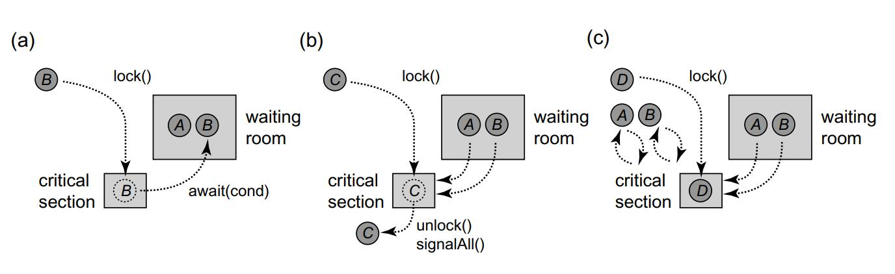

# Monitors and Blocking Synchronizaiton

Monitors are a structured way of combining synchronization and data. A class encapsulates both data and methods in the same way that <u>a monitor combines data, methods, and synchronization in a single modular</u> package.

## Condition variable

A condition is associated with a lock, and is created by calling that lock’s newCondition() method. If the thread holding that lock calls the associated condition’s await() method, it releases that lock and suspends itself, giving another thread the opportunity to acquire the lock. When the calling thread awakens, it reacquires the lock, perhaps competing with other thread

**Usage**:

- A thread must acquire the mutex before calling `pthread_cond_wait()`, which will release the mutex. Calling `pthread_cond_wait()` without having locked the mutex leads to undefined behavior.
- Calls to `pthread_cond_wait()` should be made inside a while loop. The POSIX specification allows threads to wake up even if the signal was not sent (called a *spurious wake up*). By checking the return value of `pthread_cond_wait()`, the thread can determine if the wake up was spurious and go back to waiting if necessary.
- Just calling `pthread_cond_signal()` or `pthread_cond_broadcast()` is insufficient to wake up waiting threads, as the threads are locked by the mutex rather than the condition variable. The functions must be followed by a call to `pthread_mutex_unlock()`, which will allow `pthread_cond_wait()` to acquire the mutex and return.


<div>			<!--块级封装-->
    <center>	<!--将图片和文字居中-->
    
    <br>		<!--换行-->
    </center>
</div>

In Part (a) thread A has acquired the monitor lock, called await() on a condition, released the lock, and is now in the waiting room. Thread B then goes through the same sequence of steps, entering the critical section, calling await() on the condition, relinquishing the lock and entering the waiting room. In Part (b) both A and B leave the waiting room after thread C exits the critical section and calls signalAll(). A and B then attempt to reacquire the monitor lock. However, thread D manages to acquire the critical section lock first, and so both A and B spin until C leaves the critical section. Notice that if C would have issued a signal() instead of a signalAll(), only one of A or B would have left the waiting room, and the other would have continued to wait

<u>*This combination of methods, mutual exclusion locks, and condition objects is called a monitor.*</u>

The key characteristic of a monitor is that <u>*all methods are mutually exclusive*</u> in execution. That is, as with the thread functions above, methods in a monitor begin by locking the monitor’s mutex. Doing so guarantees that only one thread is *in the monitor* at any given moment. The method ends by releasing the mutex, allowing other threads to enter the monitor.

Readers familiar with the Java synchronized keyword have been essentially using monitors by a different name. That is, the primary function of the synchronized keyword is to have injected code that acquires a hidden mutex at the beginning of the method execution, then releases it when returning.


### Lost-wakeup problem

Just as locks are inherently vulnerable to deadlock, Condition objects are inherently vulnerable to lost wakeups, in which one or more threads wait forever without realizing that the condition for which they are waiting has become true.

```Java
1 class LockedQueue<T> {
2 	final Lock lock = new ReentrantLock();
3 	final Condition notFull = lock.newCondition();
4 	final Condition notEmpty = lock.newCondition();
5 	final T[] items;
6 	int tail, head, count;
7 	public LockedQueue(int capacity) {
8 		items = (T[])new Object[100];
9 	}
10 	public void enq(T x) {
11 		lock.lock();
12 		try {
13 			while (count == items.length)
14 				notFull.await();
15 			items[tail] = x;
16 			if (++tail == items.length)
17 				tail = 0;
18 			++count;
19 			notEmpty.signal();
20 		} finally {
21 			lock.unlock();
22 		}
23 	}
24 	public T deq() {
25 		lock.lock();
26 		try {
27 			while (count == 0)
28 				notEmpty.await();
29 			T x = items[head];
30 			if (++head == items.length)
31 				head = 0;
32 			--count;
33 			notFull.signal();
34 			return x;
35 		} finally {
36 		lock.unlock();
37 		}
38 	}
39 }
```

**Illed opmization**: 

```Java
1 public void enq(T x) {
2 	lock.lock();
3 	try {
4 		while (count == items.length)
5 			notFull.await();
6 		items[tail] = x;
7 		if (++tail == items.length)
8 			tail = 0;
9 		++count;
10 		if (count == 1) { // Wrong!
11 			notEmpty.signal();
12 		}
13 	} finally {
14 		lock.unlock();
15 	}
16 }
```

Instead of signaling the notEmpty condition each time enq() enqueues an item, would it not be more efficient to signal the condition only when the queue actually transitions from empty to non-empty?

Consider the following scenario: consumers A andB both try to dequeue an item from an empty queue, both detect the queue is empty, and both block on the notEmpty condition.Producer C enqueues an item in the buffer, and signals notEmpty, waking A. Before A can acquire the lock, however, another producer D puts a second item in the queue, and because the queue is not empty, it does not signal notEmpty. Then A acquires the lock, removes the first item, but B, victim of a lost wakeup, waits forever even though there is an item in the buffer to be consumed.


### Pitfalls

#### Why firstly aquire lock before waiting on condition?

Acquiring the lock before waiting on condition is to protect the condition variable, more specifically: to protect the ***waiting room***.

The whole process of waiting for condition consists of 3 steps, and it happens atomically.

1. Push current thread into the waiting queue
2. Release the lock
3. Before returning the function, acquire the lock

If the queue is not thread-safe, contention will incur problems.


#### Why use while loop to check condition?

##### Spurious wakeup problem

Consider:

1. You put a job on a queue.
2. You signal the condition variable, waking thread A.
3. You put a job on a queue.
4. You signal the condition variable, waking thread B.
5. Thread A gets scheduled, does the first job.
6. Thread A finds the queue non-empty and does the second job.
7. Thread B gets scheduled, having been woken, but finds the queue still empty.


#### Unlock and signal, what's the order?

The code above actually encapsulate unlock and signal into one signal function.

