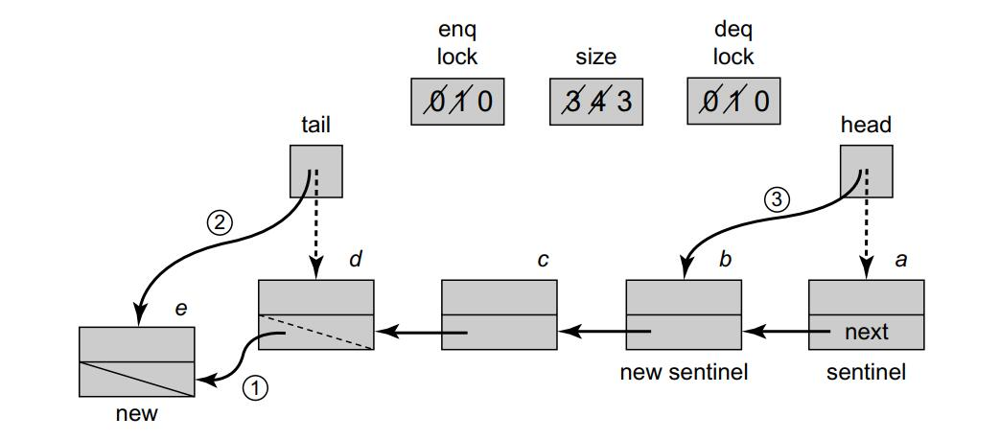
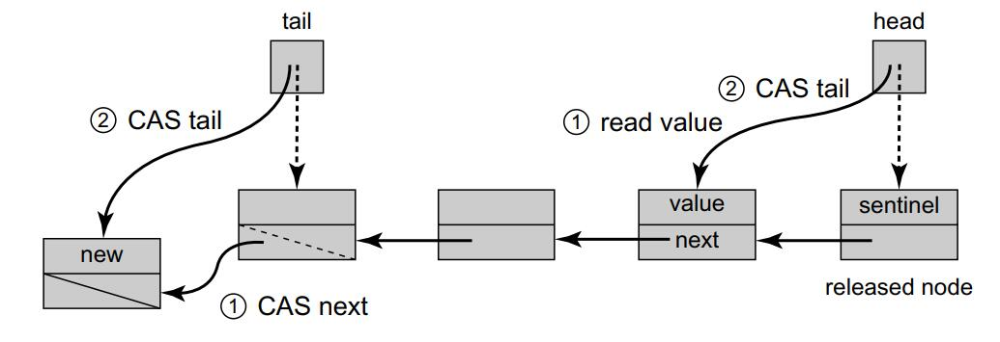
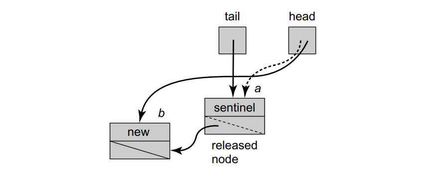
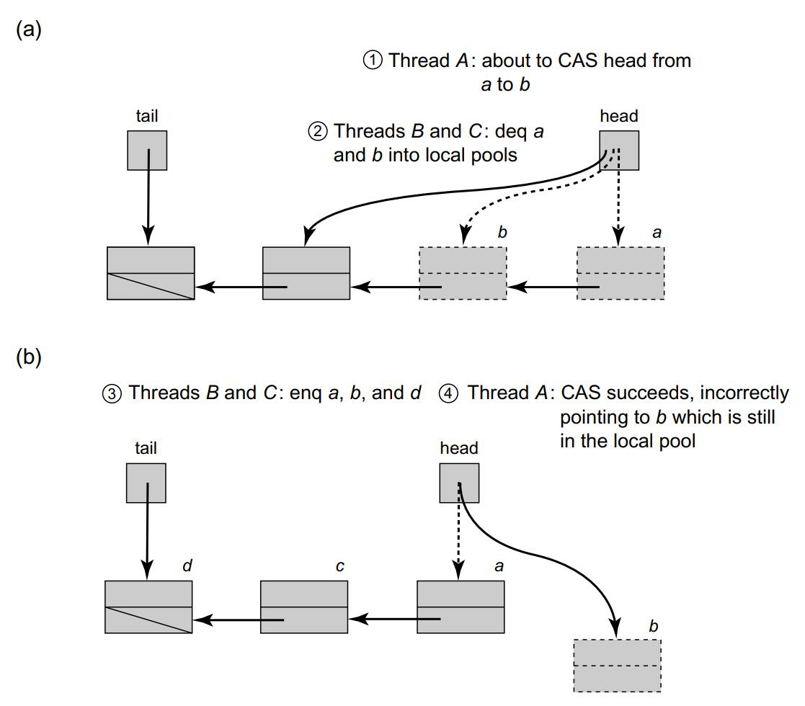

# Queues and ABA problem

## Pool

Pools come in several varieties.

* A pool can be bounded or unbounded. A bounded pool holds a limited number of items. This limit is called its capacity. By contrast, an unbounded pool can hold any number of items. Bounded pools are useful when we want to keep producer and consumer threads loosely synchronized, ensuring that producers do not get too far ahead of consumers. Bounded pools may also be simpler to implement than unbounded pools. On the other hand, unbounded pools are useful when there is no need to set a fixed limit on how far producers can outstrip consumers.
* Pool methods may be total, partial, or synchronous.
  * A method is total if calls do not wait for certain conditions to become true. For example, a get() call that tries to remove an item from an empty pool immediately returns a failure code or throws an exception. A total interface makes sense when the producer (or consumer) thread has something better to do than wait for the method call to take effect.
  * A method is partial if calls may wait for conditions to hold. For example, a partial get() call that tries to remove an item from an empty pool blocks until an item is available to return.A partial interface makes sense when the producer (or consumer) has nothing better to do than to wait for the pool to become nonempty (or nonfull)
  * A method is synchronous if it waits for another method to overlap its call interval.

## Queues

### Bounded Partial Queue

For simplicity, we assume it is illegal to add a null value to a queue. 

Here, we implement a bounded queue as a linked list.

We use two distinct locks, enqLock and deqLock, to ensure that at most one enqueuer, and at most one dequeuer at a time can manipulate the queue object’s fields. Using two locks instead of one ensures that an enqueuer does not lock out a dequeuer unnecessarily, and vice versa. Each lock has an associated condition field. 

The enqLock is associated with the *notFullCondition* condition, used to notify waiting enqueuers when the queue is no longer full. The deqLock is associated with *notEmptyCondition*, used to notify waiting enqueuers when the queue is no longer empty.

Since the queue is bounded, we must keep track of the number of empty slots. The *size* field is an AtomicInteger that tracks the number of objects currently in the queue. This field is decremented by deq() calls and incremented by enq() calls.


<div>			<!--块级封装-->
    <center>	<!--将图片和文字居中-->
    
    <br>		<!--换行-->
    </center>
</div>

```Java
1 public class BoundedQueue<T> {
2 	ReentrantLock enqLock, deqLock;
3 	Condition notEmptyCondition, notFullCondition;
4 	AtomicInteger size;
5 	Node head, tail;
6 	int capacity;
7 	public BoundedQueue(int _capacity) {
8 		capacity = _capacity;
9 		head = new Node(null);
10 		tail = head;
11 		size = new AtomicInteger(0);
12 		enqLock = new ReentrantLock();
13 		notFullCondition = enqLock.newCondition();
14 		deqLock = new ReentrantLock();
15 		notEmptyCondition = deqLock.newCondition();
16 	}
17 	public void enq(T x) {
18 		boolean mustWakeDequeuers = false;
19 		enqLock.lock();
20 		try {
21 			while (size.get() == capacity)
22 				notFullCondition.await();
23 			Node e = new Node(x);
24 			tail.next = tail = e;
25 			if (size.getAndIncrement() == 0)
26 				mustWakeDequeuers = true;
27 		} finally {
28 			enqLock.unlock();
29 		}
30 		if (mustWakeDequeuers) {
31 			deqLock.lock();
32 			try {
33 				notEmptyCondition.signalAll();
34 			} finally {
35 				deqLock.unlock();
36 			}
37 		}
38 	}
39 	public T deq() {
40 		T result;
41 		boolean mustWakeEnqueuers = true;
42 		deqLock.lock();
43 		try {
44 			while (size.get() == 0)
45 				notEmptyCondition.await();
46 			result = head.next.value;
47 			head = head.next;
48 			if (size.getAndIncrement() == capacity) {
49 				mustWakeEnqueuers = true;
50 			}
51 		} finally {
52 			deqLock.unlock();
53 		}
54 		if (mustWakeEnqueuers) {
55 			enqLock.lock();
56 			try {
57 				notFullCondition.signalAll();
58 			} finally {
59 				enqLock.unlock();
60 			}
61 		}
62 		return result;
63 	}
64 	protected class Node {
65 		public T value;
66 		public Node next;
67 		public Node(T x) {
68		value = x;
69 		next = null;
70 		}
71 	}
72 }
```


### Unbounded total queue

```java
1 public void enq(T x) {
2 	enqLock.lock();
3 	try {
4 		Node e = new Node(x);
5 		tail.next = e;
6 		tail = e;
7 	} finally {
8 		enqLock.unlock();
9 	}
10 }
11 public T deq() throws EmptyException {
12 	T result;
13 	deqLock.lock();
14 	try {
15 		if (head.next == null) {
16 		throw new EmptyException();
17 	}
18 	result = head.next.value;
19 	head = head.next;
20 	} finally {
21 		deqLock.unlock();
22 	}
23 	return result;
24 }
```


### Unbounded lock-free queue

This implementation prevents method calls from starving by having the quicker threads ***help*** the slower threads.

```Java
1 public class Node {
2 	public T value;
3 	public AtomicReference<Node> next;
4 	public Node(T value) {
5 		value = value;
6 		next = new AtomicReference<Node>(null);
7 	}
8 }
9 public void enq(T value) {
10 	Node node = new Node(value);
11 	while (true) {
12 		Node last = tail.get();
13 		Node next = last.next.get();
14 		if (last == tail.get()) {
15 			if (next == null) {
16 				if (last.next.compareAndSet(next, node)) {
17 					tail.compareAndSet(last, node);
18 					return;
19 				}
20 			} else {
21 				tail.compareAndSet(last, next);
22 			}
23 		}
24 }
25 public T deq() throws EmptyException {
26 	while (true) {
27 		Node first = head.get();
28 		Node last = tail.get();
29 		Node next = first.next.get();
30 		if (first == head.get()) {
31 			if (first == last) {
32 				if (next == null) {
33 					throw new EmptyException();
34 				}
35 				tail.compareAndSet(last, next);
36 			} else {
37 				T value = next.value;
38 				if (head.compareAndSet(first, next))
39 					return value;
40 				}
41 			}
42 		}
43 }
```

The lazy lock-free enq() and deq() methods of the LockFreeQueue. A node is inserted into the queue in two steps. First, a compareAndSet() call changes the next field of the node referenced by the queue’s tail from null to the new node. Then a compareAndSet() call advances tail itself to refer to the new node. An item is removed from the queue in two steps. A compareAndSet() call reads the item from the node referred to by the sentinel node, and then redirects head from the current sentinel to the sentinel’s next node, making the latter the new sentinel. Both enq() and deq() methods help complete unfinished tail updates.

<div>			<!--块级封装-->
    <center>	<!--将图片和文字居中-->
    
    <br>		<!--换行-->
    </center>
</div>

An interesting aspect of the enq() method is that it is ***lazy***: it takes place in two distinct steps. To make this method lock-free, threads may need to help one another. Image above illustrates these steps

1. It calls *compareAndSet()* to append the new node (Line 16), and 
2. calls *compareAndSet()* to change the queue’s tail field from the prior last node to the current last node (Line 17).

Because these two steps are not executed atomically, every other method call must be prepared to encounter a **half-finished** enq() call, and to finish the job. This is a real-world example of the “**helping**” technique we first saw in the universal construction of Chapter 6.

 To verify that node is indeed last, it checks whether that node has a successor (Line 15). If so, the thread attempts to append the new node by calling compareAndSet() (Line 16). (A compareAndSet() is required because other threads may be trying the same thing.) If the compareAndSet() succeeds, the thread uses a second compareAndSet() to advance tail to the new node (Line 17). Even if this second compareAndSet() call fails, the thread can still return successfully because, as we will see, the call fails **only** if some other thread “**helped**” it by advancing tail.

If the queue is nonempty, the dequeuer calls compareAndSet() to change head from the sentinel node to its successor, making the successor the new sentinel node. The deq() method makes sure that the queue is not empty in the same way as before: by checking that the next field of the head node is not null.


#### Why dequeuers must help advance tail?

Consider the scenario in which a thread enqueuing node b has redirected a’s next field to b, but has yet to redirect tail from a to b. If another thread starts dequeuing, it will read b’s value and redirect head from a to b, effectively removing a while tail still refers to it. To avoid this problem, the dequeuing thread must help advance tail from a to b before redirecting head.

<div>			<!--块级封装-->
    <center>	<!--将图片和文字居中-->
    
    <br>		<!--换行-->
    </center>
</div>


## Memory reclaimation and ABA problem

A natural way to recycle nodes in a lock-free manner is to have each thread maintain its own private free list of unused queue entries.

This design works well, as long as each thread performs roughly the same number of enqueues and dequeues. If there is an imbalance, then there may be a need for more complex techniques, such as periodically ***stealing*** nodes from other threads.

#### An ABA scenario

Assume that we use local pools of recycled nodes in our lock-free queue algorithm. In Part (a), the dequeuer thread A of Fig. 10.11 observes that the sentinel node is a, and next node is b. (Step 1) It then prepares to update head by applying a compareAndSet() with old value a and new value b. (Step 2) Suppose however, that before it takes another step, other threads dequeue b, then its successor, placing both a and b in the free pool. In Part (b) (Step 3) node a is reused, and eventually reappears as the sentinel node in the queue. (Step 4) thread A now wakes up, calls compareAndSet(), and succeeds in setting head to b, since the old value of head is indeed a. Now, head is incorrectly set to a recycled node

<div>			<!--块级封装-->
    <center>	<!--将图片和文字居中-->
    
    <br>		<!--换行-->
    </center>
</div>