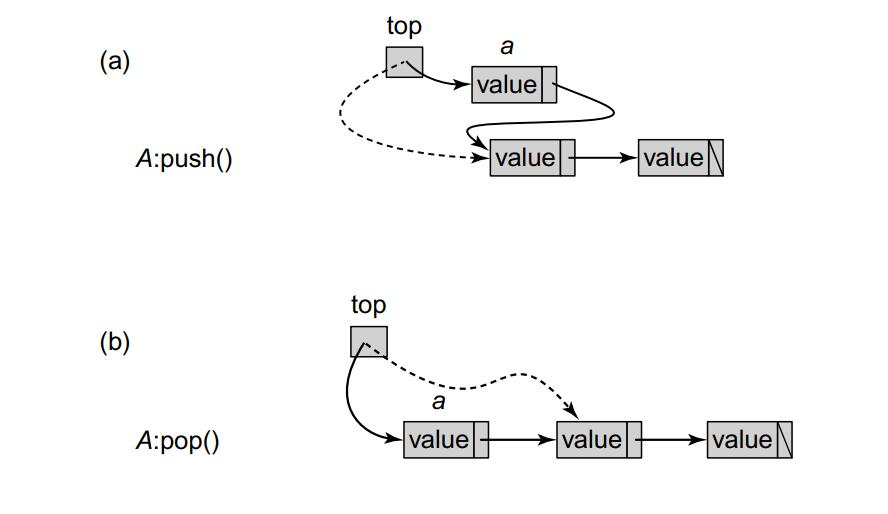
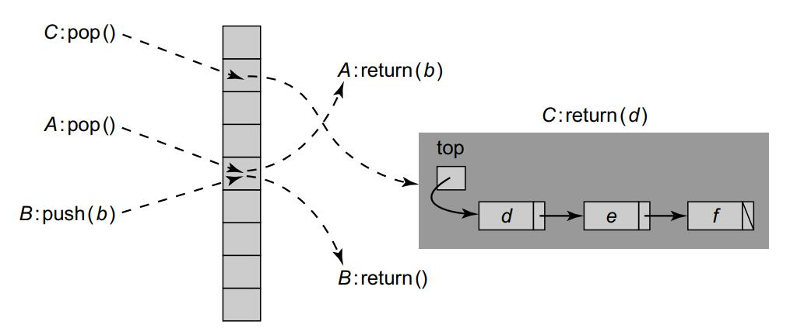

# Concurrent Stacks and Elimination

## Unbounded lock-free stack

Surprisingly, perhaps, stacks are not inherently sequential. In this chapter, we show how to implement concurrent stacks that can achieve a high degree of parallelism. Because there is only one single CAS in push and pop.

```Java
1 public class LockFreeStack<T> {
2 	AtomicReference<Node> top = new AtomicReference<Node>(null);
3 	static final int MIN_DELAY = ...;
4 	static final int MAX_DELAY = ...;
5 	Backoff backoff = new Backoff(MIN_DELAY, MAX_DELAY);
6
7 	protected boolean tryPush(Node node){
8 		Node oldTop = top.get();
9 		node.next = oldTop;
10 		return(top.compareAndSet(oldTop, node));
11 	}
12 	public void push(T value) {
13 		Node node = new Node(value);
14 		while (true) {
15 			if (tryPush(node)) {
16 				return;
17 			} else {
18 				backoff.backoff();
19 			}
20 		}
21 	}
```

```java
1 public class Node {
2 	public T value;
3 	public Node next;
4 	public Node(T value) {
5 		value = value;
6 		next = null;
7 	}
8 }
```

```java
1 protected Node tryPop() throws EmptyException {
2 	Node oldTop = top.get();
3 	if (oldTop == null) {
4 		throw new EmptyException();
5 	}
6 	Node newTop = oldTop.next;
7 	if (top.compareAndSet(oldTop, newTop)) {
8 		return oldTop;
9 	} else {
10 		return null;
11 	}
12 }
13 public T pop() throws EmptyException {
14 	while (true) {
15 		Node returnNode = tryPop();
16 		if (returnNode != null) {
17 			return returnNode.value;
18 		} else {
19 			backoff.backoff();
20 		}
21 	}
22 }
```


In Part (a) a thread pushes value a into the stack by applying a compareAndSet() to the top field. In Part (b) a thread pops value a from the stack by applying a compareAndSet() to the top field.

<div>			<!--块级封装-->
    <center>	<!--将图片和文字居中-->
    
    <br>		<!--换行-->
    </center>
</div>


## Elimination

The LockFreeStack implementation scales poorly, not so much because the stack’s top field is a source of contention, but primarily because it is a sequential bottleneck: method calls can proceed only one after the other, ordered by successful compareAndSet() calls applied to the stack’s top field. 

Although exponential backoff can significantly reduce contention, it does nothing to alleviate the sequential bottleneck.

To make the stack parallel, we exploit this simple observation: if a push() is immediately followed by a pop(), the two operations cancel out, and the stack’s state does not change.

It is as if both operations never happened. If one could somehow cause concurrent pairs of pushes and pops to cancel, then threads calling push() could exchange values with threads calling pop(), without ever modifying the stack itself. These two calls would ***eliminate*** one another.

#### Elimination backoff

Each thread selects a random location in the array. If thread A’s pop() and B’s push() calls arrive at the same location at about the same time, then they exchange values without accessing the shared LockFreeStack. Thread C that does not meet another thread eventually pops the shared LockFreeStack.

<div>			<!--块级封装-->
    <center>	<!--将图片和文字居中-->
    
    <br>		<!--换行-->
    </center>
</div>

We can use the EliminationArray as a backoff scheme on a shared LockFreeStack. Each thread first accesses the LockFreeStack, and if it fails to complete its call (that is, the compareAndSet() attempt fails), it attempts to eliminate its call using the array instead of simply backing off. If if fails to eliminate itself, it calls the LockFreeStack again, and so on. We call this structure an EliminationBackoffStack


## Elimination backoff stack

We wish to allow threads with pushes and pops to coordinate and cancel out, but must avoid a situation in which a thread can make a sporting offer to more than one other thread. We do so by implementing the EliminationArray using coordination structures called exchangers, objects that allow exactly two threads (and no more) to rendezvous and exchange values.

### Lock-free exchanger

A LockFreeExchanger object permits two threads to exchange values of type T. If thread A calls the object’s exchange() method with argument a, and B calls the same object’s exchange() method with argument b, then A’s call will return value b and vice versa.

On a high level, the exchanger works by having the first thread arrive to write its value, and spin until a second arrives. The second then detects that the first is waiting, reads its value, and signals the exchange.

They each have now read the other’s value, and can return. The first thread’s call may timeout if the second does not show up, allowing it to proceed and leave the exchanger, if it is unable to exchange a value within a reasonable duration.

```java
1 public class LockFreeExchanger<T> {
2 	static final int EMPTY = ..., WAITING = ..., BUSY = ...;
3 	AtomicStampedReference<T> slot = new AtomicStampedReference<T>(null, 0);
4 	public T exchange(T myItem, long timeout, TimeUnit unit)
5 		throws TimeoutException {
6 		long nanos = unit.toNanos(timeout);
7 		long timeBound = System.nanoTime() + nanos;
8 		int[] stampHolder = {EMPTY};
9 		while (true) {
10 			if (System.nanoTime() > timeBound)
11 				throw new TimeoutException();
12 			T yrItem = slot.get(stampHolder);
13 			int stamp = stampHolder[0];
14 			switch(stamp) {
15 				case EMPTY:
16 					if (slot.compareAndSet(yrItem, myItem, EMPTY, WAITING)) {
17 						while (System.nanoTime() < timeBound){
18 							yrItem = slot.get(stampHolder);
19 							if (stampHolder[0] == BUSY) {
20 								slot.set(null, EMPTY);
21 								return yrItem;
22 							}
23 						}
24 						if (slot.compareAndSet(myItem, null, WAITING, EMPTY)) {
25 							throw new TimeoutException();
26 						} else {
27 							yrItem = slot.get(stampHolder);
28 							slot.set(null, EMPTY);
29 							return yrItem;
30 						}
31 					break;
32 				case WAITING:
33 					if (slot.compareAndSet(yrItem, myItem, WAITING, BUSY))
34 						return yrItem;
35 					break;
36 				case BUSY:
37					break;
38 				defaut: // impossible
39 					...
40 				}
41 			}
42 		}
43 	}
```

* If the state is **EMPTY**, then the thread tries to place its item in the slot and set the state to WAITING using a compareAndSet() (Line 16). If it fails, then some other thread succeeds and it retries. If it was successful (Line 17), then its item is in the slot and the state is WAITING, so it spins, waiting for another thread to complete the exchange. If another thread shows up, it will take the item in the slot, replace it with its own, and set the state to BUSY (Line 19), indicating to the waiting thread that the exchange is complete. The waiting thread will consume the item and reset the state to 0. Resetting to empty() can be done using a simple write because the waiting thread is the only one that can change the state from BUSY to EMPTY (Line 20). If no other thread shows up, the waiting thread needs to reset the state of the slot to EMPTY. This change requires a compareAndSet() because other threads might be attempting to exchange by setting the state from WAITING to BUSY (Line 24). If the call is successful, it raises a timeout exception. If, however, the call fails, some exchanging thread must have shown up, so the waiting thread completes the exchange (Line 26). 
* If the state is **WAITING**, then some thread is waiting and the slot contains its item. The thread takes the item, and tries to replace it with its own by changing the state from WAITING to BUSY using a compareAndSet() (Line 33). It may fail if another thread succeeds, or the other thread resets the state to EMPTY following a timeout. If so, the thread must retry. If it does succeed changing the state to BUSY, then it can return the item. 
* If the state is **BUSY** then two other threads are currently using the slot for an exchange and the thread must retry (Line 36)


### Elimination array

An EliminationArray is implemented as an array of *Exchanger* objects of maximal size capacity.

A thread attempting to perform an exchange picks an array entry at random, and calls that entry's ***exchange()***  method, providing its own input as an exchange value with another thread. 

```java
1 public class EliminationArray<T> {
2 	private static final int duration = ...;
3 	LockFreeExchanger<T>[] exchanger;
4 	Random random;
5 	public EliminationArray(int capacity) {
6 		exchanger = (LockFreeExchanger<T>[]) new LockFreeExchanger[capacity];
7 		for (int i = 0; i < capacity; i++) {
8 			exchanger[i] = new LockFreeExchanger<T>();
9 		}
10 		random = new Random();
11 	}
12 	public T visit(T value, int range) throws TimeoutException {
13 		int slot = random.nextInt(range);
14 		return (exchanger[slot].exchange(value, duration,
15 					TimeUnit.MILLISECONDS));
16 	}
17 }
```

The EliminationBackoffStack is a subclass of LockFreeStack that overrides the push() and pop() methods, and adds an EliminationArray field

```java
1 public class EliminationBackoffStack<T> extends LockFreeStack<T> {
2 	static final int capacity = ...;
3 	EliminationArray<T> eliminationArray = new EliminationArray<T>(capacity);
4 	static ThreadLocal<RangePolicy> policy = new ThreadLocal<RangePolicy>() {
5 	protected synchronized RangePolicy initialValue() {
6 	return new RangePolicy();
7 }
8
9 public void push(T value) {
10 	RangePolicy rangePolicy = policy.get();
11 	Node node = new Node(value);
12 	while (true) {
13 		if (tryPush(node)) {
14 			return;
15 		} else try {
16 			T otherValue = eliminationArray.visit
17 								(value, rangePolicy.getRange());
18 			if (otherValue == null) {
19 				rangePolicy.recordEliminationSuccess();
20 				return; // exchanged with pop
21 			}
22 		} catch (TimeoutException ex) {
23 			rangePolicy.recordEliminationTimeout();
24 		}
25 	}
26 }
27 }
28 public T pop() throws EmptyException {
29 	RangePolicy rangePolicy = policy.get();
30 	while (true) {
31 		Node returnNode = tryPop();
32 		if (returnNode != null) {
33 			return returnNode.value;
34 		} else try {
35 			T otherValue = eliminationArray.visit(null, rangePolicy.getRange());
36 			if (otherValue != null) {
37 				rangePolicy.recordEliminationSuccess();
38 				return otherValue;
39 			}
40 		} catch (TimeoutException ex) {
41 			rangePolicy.recordEliminationTimeout();
42 		}
43 	}
44 }
```

A push() call calls visit() with its input value as argument, and a pop() call with null as argument. Both push() and pop() have a thread-local *RangePolicy* object that determines the *EliminationArray* subrange to be used.

When push() calls visit(), it selects a random array entry within its range and attempts to exchange a value with another thread. If the exchange is successful, the pushing thread checks whether the value was exchanged with a pop() method by testing if the value exchanged was null. (Recall that pop() always offers null to the exchanger while push() always offers a non-null value.) Symmetrically, when pop() calls visit(), it attempts an exchange, and if the exchange is successful it checks (Line 36) whether the value was exchanged with a push() call by checking whether it is not null.

One important parameter is the range of the EliminationArray from which a thread selects an Exchanger location. A smaller range will allow a greater chance of a successful collision when there are few threads, while a larger range will lower the chances of threads waiting on a busy Exchanger (recall that an Exchanger can only handle one exchange at a time). Thus, if few threads access the array, they should choose smaller ranges, and as the number of threads increase, so should the range. One can control the range dynamically using a RangePolicy object that records both successful exchanges (as in Line 37) and timeout failures (Line 40). We ignore exchanges that fail because the operations do not match (such as push() with push()), because they account for a fixed fraction of the exchanges for any given distribution of push() and pop() calls). One simple policy is to shrink the range as the number of failures increases and vice versa.