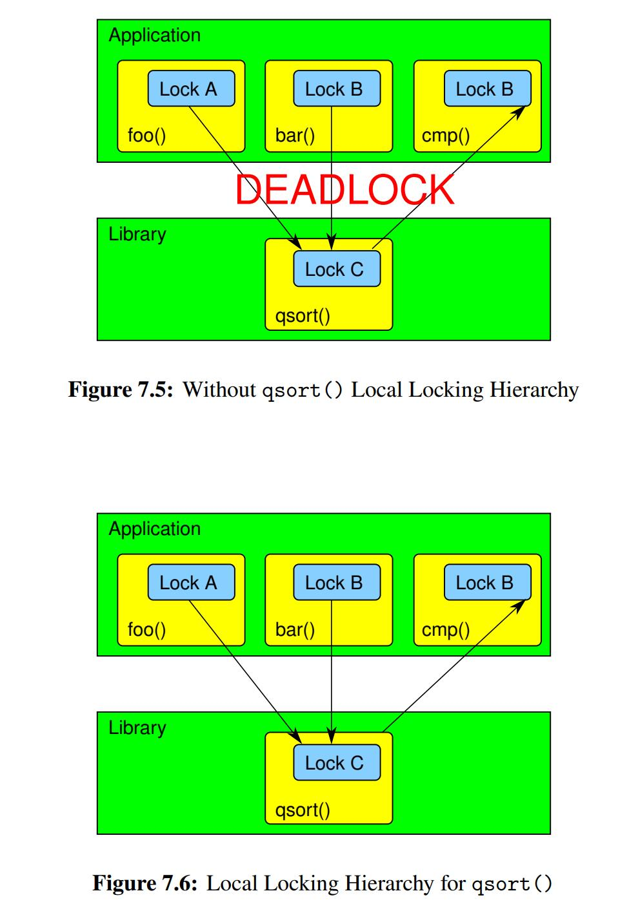
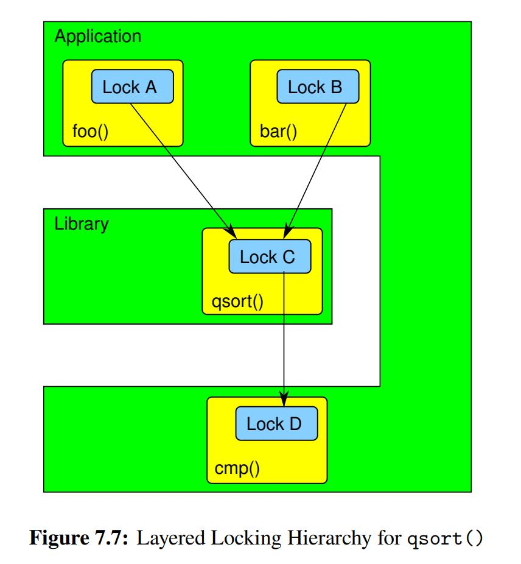

# Locking

## Deadlock

Deadlock occurs when each member of a group of threads is holding at least one lock while at the same time waiting on a lock held by a member of that same group.

This happens even in groups containing a single thread when that thread attempts to acquire a non-recursive lock that it already holds. Deadlock can therefore occur even given but one thread and one lock!

### Locking hierarchies

Locking hierarchies order the locks and prohibit acquiring locks out of order.

```C++
// Using C++
void swap(Counter& a, Counter& b){
    Mutex aLock = a.mutex.aquire();
    Mutex bLock = b.mutex.aquire();
    int tmp = a.getValue();
    a = b;
    b = tmp;
    
}
```

swap(a, b) and swap(b, a) might cause deadlock.


### Local locking hierarchies

However, the global nature of locking hierarchies makes them difficult to apply to library functions. After all, when a program using a given library function has not yet been written, how can the poor library-function implementor possibly follow the yet-to-be-defined locking hierarchy?

Suppose that a library function does invoke the caller’s code. For example, qsort() invokes a caller-provided comparison function

***<u>The golden rule</u>*** in this case is “Release all locks before invoking unknown code.”

<div>			<!--块级封装-->
    <center>	<!--将图片和文字居中-->
    
    <br>		<!--换行-->
    </center>
</div>

Now, if qsort() holds Lock C while calling cmp() in violation of the golden release-all-locks rule above, as shown in Figure 7.5, deadlock can occur.

Now, if qsort() holds Lock C while calling cmp() in violation of the golden release-all-locks rule above, as shown in Figure 7.5, deadlock can occur.

In contrast, if qsort() releases Lock C before invoking the comparison function, which is unknown code from qsort()’s perspective, then deadlock is avoided as shown in Figure 7.6.


Consider the recursive tree iterator in below. The iterator visits every node in the tree, invoking a user’s callback function. The tree lock is released before the invocation and re-acquired after return. This code makes dangerous assumptions: (1) The number of children of the current node has not changed, (2) The ancestors stored on the stack by the recursion are still there, and (3) The visited node itself has not been removed and freed. A few of these hazards can be encountered if one thread calls tree_add() while another thread releases the tree’s lock to run a callback function.

```C
1 struct node {
2 	int data;
3 	int nchildren;
4 	struct node **children;
5 };
6
7 struct tree {
8 	spinlock_t s;
9 	struct node *root;
10 };
11
12 void tree_for_each_rec(struct tree *tr, struct node *nd,
13 		void (*callback)(struct node *))
14 {
15 	struct node **itr;
16
17 	spin_unlock(&tr->s);
18 	callback(nd);
19 	spin_lock(&tr->s);
20
21 	itr = nd->children;
22	 for (int i = 0; i < nd->nchildren; i++) {
23 		tree_for_each_rec(tr, *itr, callback);
24 		itr++;
25 	}
26 }
27
28 void tree_for_each(struct tree *tr,
29 		void (*callback)(struct node *))
30 {
31 	spin_lock(&tr->s);
32 	tree_for_each_rec(tr, tr->root, callback);
33 	spin_unlock(&tr->s);
34 }
35
36 void tree_add(struct tree *tr, struct node *parent,
37 		struct node *new_child)
38 {
39 	spin_lock(&tr->s);
40 	parent->nchildren++;
41 	parent->children = realloc(parent->children,
42 		sizeof(struct node *) *
43 	parent->nchildren);
44 	parent->children[parent->nchildren - 1] = new_child;
45 	spin_unlock(&tr->s);
46 }
```


### Layered locking hierarchies

Unfortunately, it might be infeasible to preserve state on the one hand or to re-initialize it on the other, thus ruling out a local locking hierarchy where all locks are released before invoking unknown code. However, we can instead construct a layered locking hierarchy, as shown in Figure 7.7. Here, the cmp() function uses a new Lock D that is acquired after all of Locks A, B, and C, avoiding deadlock.

<div>			<!--块级封装-->
    <center>	<!--将图片和文字居中-->
    
    <br>		<!--换行-->
    </center>
</div>

### Temporal locking hierarchies

One way to avoid deadlock is to **defer acquisition** of one of the conflicting locks. 

### Pointers to locks

In short, if you find yourself exporting an API with a pointer to a lock as an argument or as the return value, do yourself a favor and carefully reconsider your API design. It might well be the right thing to do, but experience indicates that this is unlikely.


### Conditional locking

But suppose that there is no reasonable locking hierarchy. This can happen in real life, for example, in some types of layered network protocol stacks where packets flow in both directions, for example, in implementations of distributed lock managers. In the networking case, it might be necessary to hold the locks from both layers when passing a packet from one layer to another. Given that packets travel both up and down the protocol stack, this is an excellent recipe for deadlock, as illustrated in Listing 7.4. Here, a packet moving down the stack towards the wire must acquire the next layer’s lock out of order. Given that packets moving up the stack away from the wire are acquiring the locks in order, the lock acquisition in line 4 of the listing can result in deadlock.

One way to avoid deadlocks in this case is to impose a locking hierarchy, but when it is necessary to acquire a lock out of order, acquire it **conditionally**

```C
1 spin_lock(&lock2);
2 layer_2_processing(pkt);
3 nextlayer = layer_1(pkt);
4 spin_lock(&nextlayer->lock1);
5 spin_unlock(&lock2);
6 layer_1_processing(pkt);
7 spin_unlock(&nextlayer->lock1);
```

```C
1 retry:
2 	spin_lock(&lock2);
3 	layer_2_processing(pkt);
4 	nextlayer = layer_1(pkt);
5 	if (!spin_trylock(&nextlayer->lock1)) {
6 		spin_unlock(&lock2);
7 		spin_lock(&nextlayer->lock1);
8 		spin_lock(&lock2);
9 		if (layer_1(pkt) != nextlayer) { // recheck linkage layer protocol
10 			spin_unlock(&nextlayer->lock1);
11 			spin_unlock(&lock2);
12 			goto retry;
13 		}
14 	}
15 	spin_unlock(&lock2);
16 	layer_1_processing(pkt);
17 	spin_unlock(&nextlayer->lock1)1 spin_lock(&lock2);
```

If spin_trylock() was successful, line 16 does the needed layer-1 processing. Otherwise, line 6 releases the lock, and lines 7 and 8 acquire them in the correct order. Unfortunately, there might be multiple networking devices on the system (e.g., Ethernet and WiFi), so that the layer_1() function must make a routing decision. This decision might change at any time, especially if the system is mobile.2 Therefore, line 9 must **recheck the decision**, and if it has changed, must release the locks and start over.

**The idea**: since we've already held a lock, then the reason which cause trylock failure must be deadlock instead of normal contention failure. Because those threads which aquire the 2 locks in the same order are excluded already by the first lock.


### Acquire needed locks first

In an important special case of conditional locking, all needed locks are acquired before any processing is carried out.In an important special case of conditional locking, all needed locks are acquired before any processing is carried out

A related approach, **two-phase locking**, has seen long production use in transactional database systems

### Single lock at a time

In some cases, it is possible to avoid nesting locks, thus avoiding deadlock. For example, if a problem is perfectly partitionable, a single lock may be assigned to each partition. Then a thread working on a given partition need only acquire the one corresponding lock. Because no thread ever holds more than one lock at a time, deadlock is impossible.


### Signal handlers

The trick is to block signals (or disable interrupts, as the case may be) when acquiring any lock that might be acquired within a signal (or an interrupt) handler.

Furthermore, if holding such a lock, it is illegal to attempt to acquire **any** lock that is ever acquired outside of a signal handler without blocking signals

**<u>Pitfall</u>**

Suppose Lock A is never acquired within a signal handler, but Lock B is acquired both from thread context and by signal handlers. Suppose further that Lock A is sometimes acquired with signals unblocked. Why is it illegal to acquire Lock A holding Lock B?

Because this would lead to deadlock. Given that Lock A is sometimes held outside of a signal handler without blocking signals, a signal might be handled while holding this lock. The corresponding signal handler might then acquire Lock B, so that Lock B is acquired while holding Lock A. Therefore, if we also acquire Lock A while holding Lock B, we will have a deadlock cycle. Note that this problem exists even if signals are blocked while holding Lock B.


## Livelock and starvation

In the case of locking, simple exponential backoff can often address livelock and starvation. The idea is to introduce exponentially increasing delays before each retry


### Inefficiency

If the <u>*data protected by the lock is in the same cache line as the lock itself*</u>, then attempts by other CPUs to acquire the lock will result in expensive cache misses on the part of the CPU holding the lock. This is a special case of false sharing, which can also occur if a pair of variables protected by different locks happen to share a cache line. 


## Locking implementation

Please refer to CMU15.418 lecture 16


## Existence guarantees

Left blank on purpose for future look up.


## Locking for libraries

##### Don’t use either callbacks or signals

##### Avoid Locking in Callbacks and Signal Handlers

1. Use simple data structures based on non-blocking synchronization, as will be discussed in Section 14.2.1. 
2. If the data structures are too complex for reasonable use of nonblocking synchronization, create a queue that allows non-blocking enqueue operations. In the signal handler, instead of manipulating the complex data structure, add an element to the queue describing the required change. <u>A separate thread</u> can then remove elements from the queue and carry out the required changes using normal locking. 

##### Explicitly Avoid Callback Deadlocks

The basic rule behind this strategy was discussed in Section 7.1.1.2: “Release all locks before invoking unknown code

##### Explicitly Avoid Signal-Handler Deadlocks

1. If the application invokes the library function from within a signal handler, then that signal must be blocked every time that the library function is invoked from outside of a signal handler. 
2.  If the application invokes the library function while holding a lock acquired within a given signal handler, then that signal must be blocked every time that the library function is called outside of a signal handler.

##### Library Functions Used Between fork() and exec()

If a thread executing a library function is holding a lock at the time that some other thread invokes fork(), the fact that the parent’s memory is copied to create the child means that this lock will be born held in the child’s context. The thread that will release this lock is running in the parent, but not in the child, which means that although the parent’s copy of this lock will be released, the child’s copy never will be. Therefore, any attempt on the part of the child to invoke that same library function (thus acquiring that same lock) will result in deadlock.

A pragmatic and straightforward way of solving this problem is to fork() a child process while the process is still single-threaded, and have this child process remain single-threaded. 

The pthread_atfork() function is provided to help deal with these situations.

