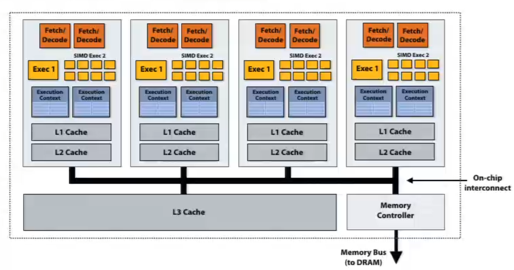
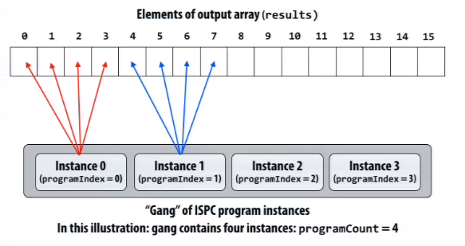
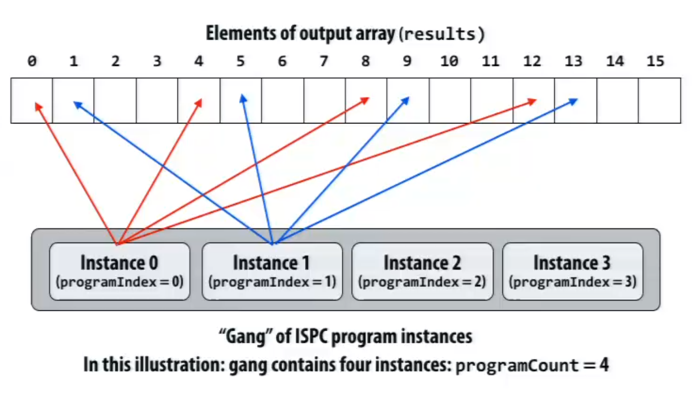
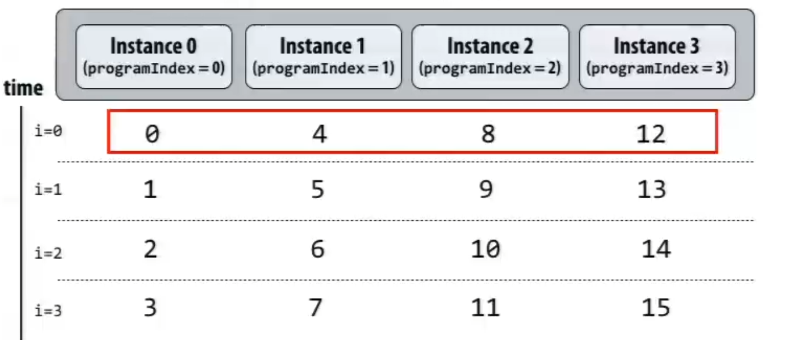
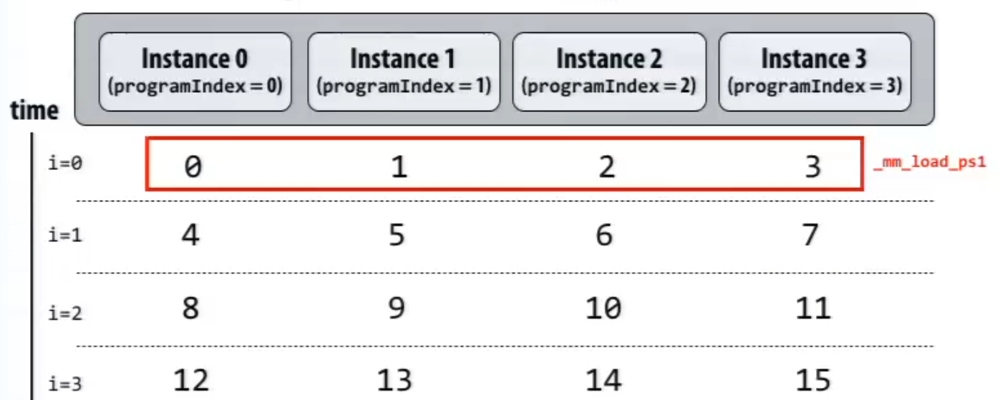
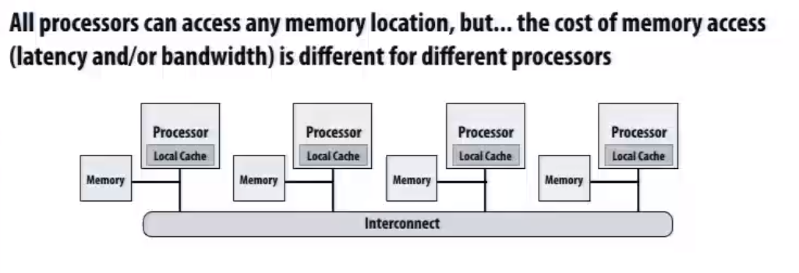
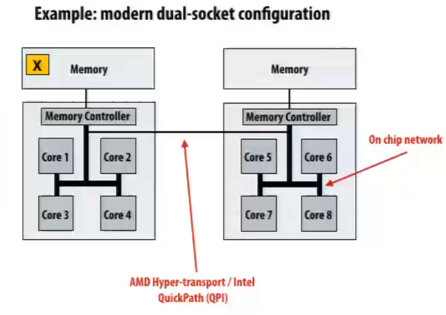
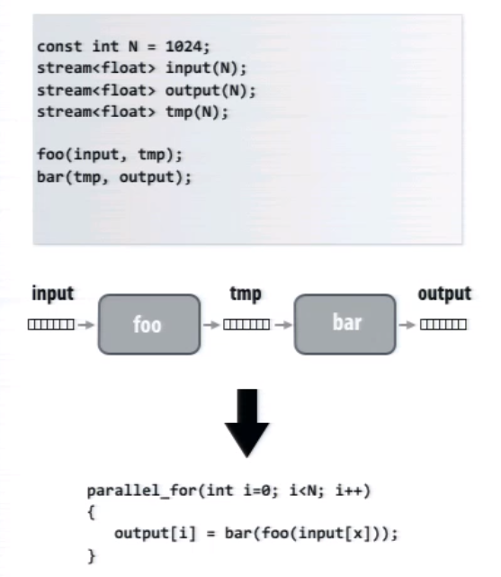
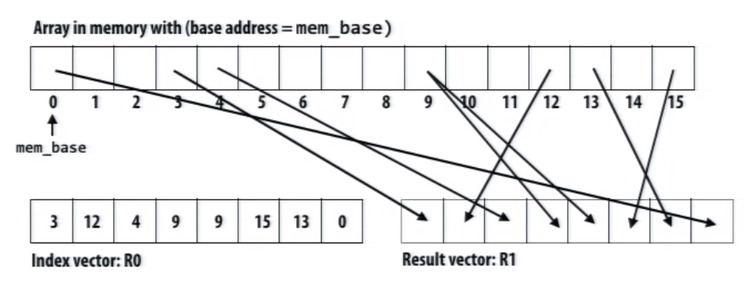

# Parallel Programming Model

           <!--块级封装-->    
    <!--将图片和文字居中-->       

### SIMD

if the program executes many iteration of the same loop body, we can share instruction stream across execution of mutiple iterations. 

**Key point**: SIMD units share the same Program Counter

### Hyper Threading

Hyper Threading can be regarded as an advanced superscalar processing. A core can have 2 execution context, can can decode 4 instruction per cycle. Only one thread may very possible to have less than 4 independent instructions at a time, with hyper threading, it's getting more likely to find 4 independent instructions among multiple threads.

 

## SPMD

**Single Program Multiple Data**

Example language: ISPC

**Features**:

* Calls to ISPC function spawns "gang" of ISPC program instances.

* All instances run ISPC code concurrently
* Upon return, all instances have completed

**Primitives**:

* programCount: number of simultaneously existing instances in the gang
* programIndex: id of the current instance in the gang
* uniform: A type modifier. All instances have the same value for this variable

The ISPC compiller implements the semantics via  SIMD

           <!--块级封装-->    
    
    <!--将图片和文字居中-->   
    </left>
    </right>
    

           <!--块级封装-->    
    
    <!--将图片和文字居中-->   
    </left>
    </right>
    

**Interleaved Partition is better**

## NUMA

**Non-uniform memory access**

           <!--块级封装-->    
    <!--将图片和文字居中-->       

           <!--块级封装-->    
    <!--将图片和文字居中-->       

## Shared Address Space Model

* Threads communicate by reading/writing to shared variables
* Shared variables are like a big bulletin board

## Message Passing Model

* Threads operate within their own private address spaces
* Threads communicate by sending/receiving messages explicitly

* Sending messages is the only way to exchange data between 2 threads

## Data-parallel Model

* Same operation on each element of a collection: array, list, set etc.
* Data-parallel often takes form of SPMD programming
* map(function, collection)
  * function is applied to each element of collection independently
  * map returns when function has been applied to all elements

### Stream Programming

           <!--块级封装-->    
    <!--将图片和文字居中-->       

* Program data flow is known by compiler
* Inputs and outputs of each invocation are known in advance: prefetching can be employed to hide latency
* Producer-consumer locality is know in advance: Implementation can be structured so outputs of first kernel are immediately processed by second kernel(**forwarding**). The values are stored in on-chip buffers never written to memory before return. Saves bandwidth
* There optimization are responsibility of stream program compiler

### Gather/Scatter Instructions

* Increase cache hit rate
* Make programming easier: **stride** can be specified

           <!--块级封装-->    
    <!--将图片和文字居中-->       

* Data-parallel is about imposing rigid program structure to facilitate simple programming and advanced optimizations by compiler
* Basic struction: map a function onto a large collection of data

