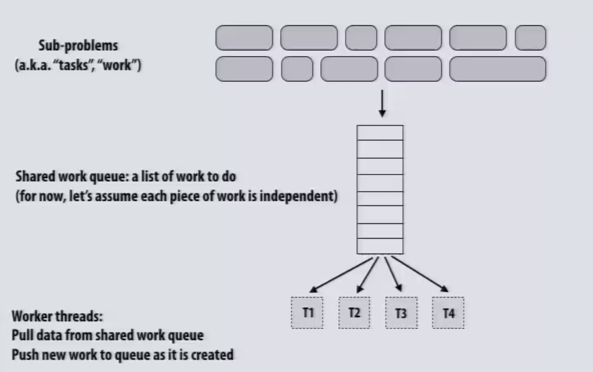
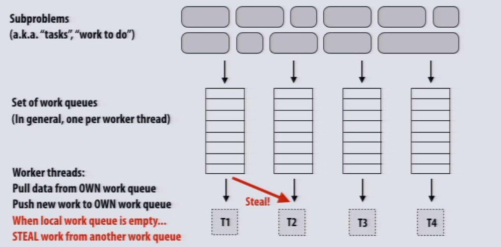
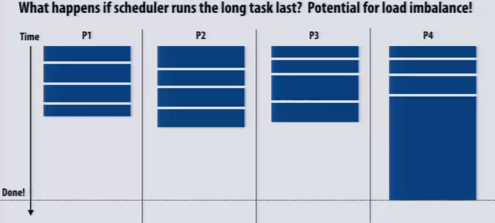
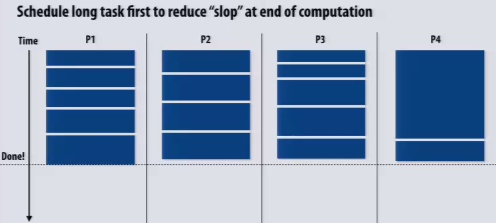
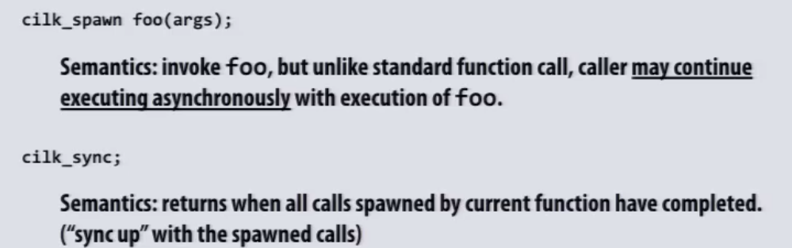
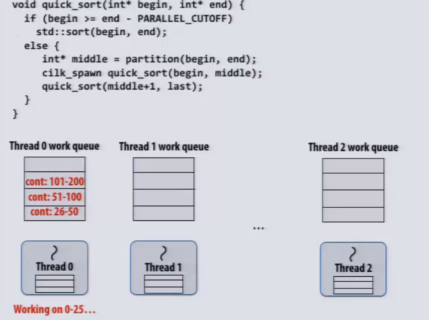
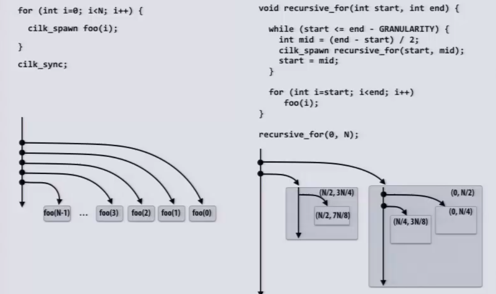
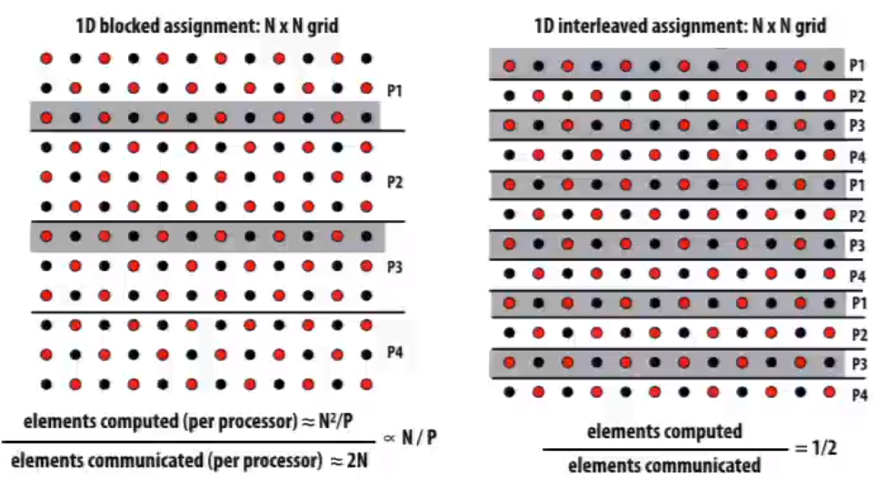
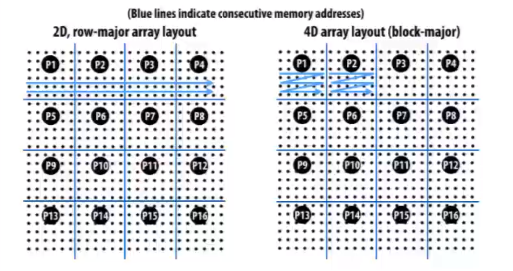

# Performance Optimization

## Keep it simple

Always implement the simplest solution first, then measure performance to determine if you need to do better

If you anticipate only running low-core count machines, it may be unnecessary to implement a complex approach that creates and hundreds or thousands of pieces of independent work.

## Balancing the workload

Ideally: all processors are computing all the time during program execution(they are computing simultaneously, and they finish their portion of work at the same time)

* When the cost of work and amount of work is predictable, static assignment is applicable.
* When execution time of tasks is unpredictable, program determines assignment dynamically at runtime, make it a work queue.

           <!--块级封装-->    
    <!--将图片和文字居中-->       

**When overhead of locking about assigning work queue is large**

* Shuffle the work queue then split the workload equally statically in advance

* Increase task granularity
  * coarse granularity partitioning: 1 task = 10 elements
  * decreased synchronization cost
  * critical section entered 10 times less

* Decrease synchronization overhead using a distributed set of queues (avoid need for all workers to synchronize on single work queue)

           <!--块级封装-->    
    <!--将图片和文字居中-->       

**When costs of tasks are highly un-balanced**

* Chop the long task into smaller ones
* Schedual the long task first

           <!--块级封装-->    
    
    <!--将图片和文字居中-->   
    </left>
    </right>
    

## Fork-join pattern

           <!--块级封装-->    
    <!--将图片和文字居中-->       

**cilk is implemented via a threading pool**

Each thread has a local work queue, and the stealing strategy is always steal the work at the top which is always the biggest work to do because of **recursive-for** (quick sort is a good example) when sliting work.

           <!--块级封装-->    
    <!--将图片和文字居中-->       

           <!--块级封装-->    
    <!--将图片和文字居中-->       

## Message Passing

* Synchronization primitives can be implemented using messages send/recv
* Send and Recv can be asynchronous in stead of blocking

## Pipelining

You can draw inspiration from various concepts in computer architecture

* **Forwarding** can be used to alleviate dependency caused stalls
* **Fine-grain multi-threading** can also be used to increase overall throughput

* **Buffer** can be used to prevent CPU stalls (network message sending buffer)

## Arithmetic Intensity

* Inherent communication: information that fundamentally must be moved between processors to carry out the algorithm given the specified assignment
* Artifactual communication: all other communication results from practical details of system implementation

When assigning workload, try to **reduce inherent communication**, and increase arithmetic intensity.

           <!--块级封装-->    
    <!--将图片和文字居中-->       

Reconsider the order of iterations to fit better in the cacheing scheme.

# Case Studies

* Workload splitted by blocks to increase arithmetic intensity
* Block-major memory layout to exploit cache

           <!--块级封装-->    
    <!--将图片和文字居中-->       

