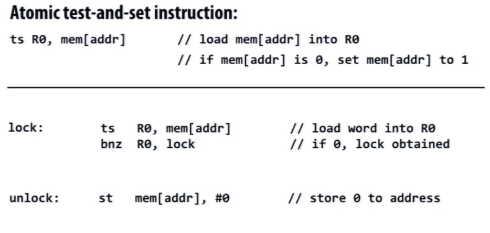
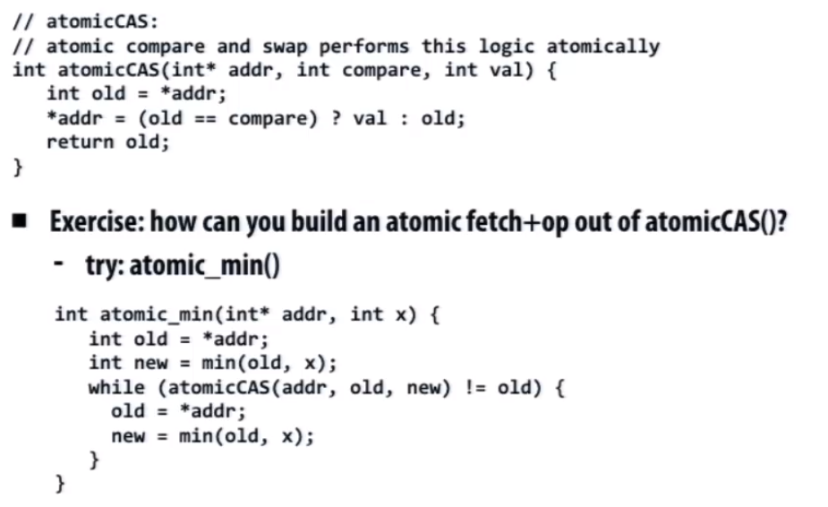
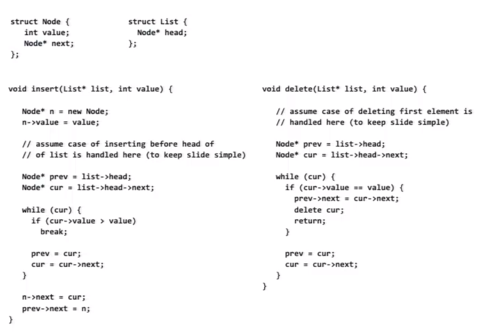
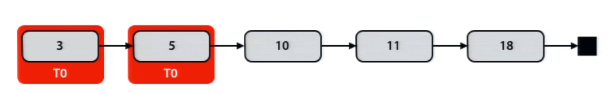
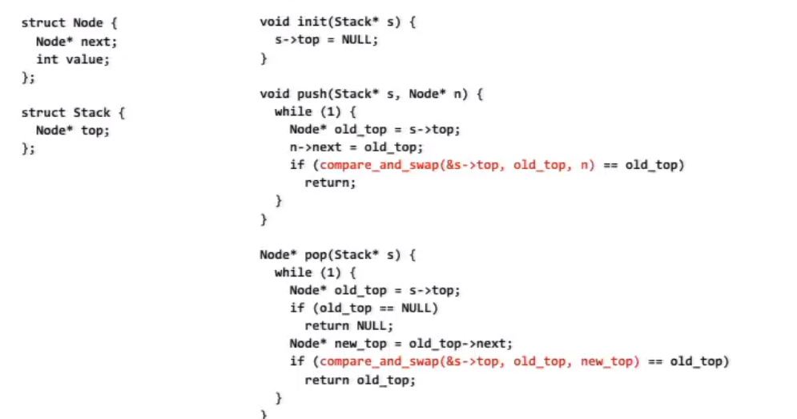
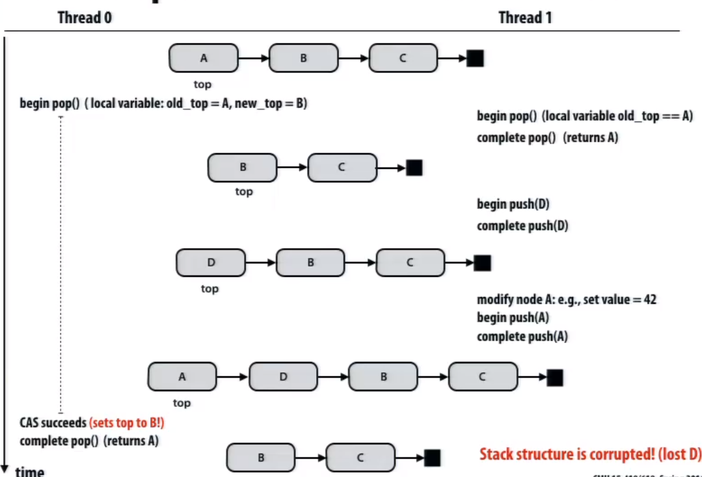

# Synchronization

## Desirable characteristics

* Low latency
  * If lock is free and no other processors are trying to acquire it, a processor should be able to acquire the lock quickly
* Low interconnect traffic
* Scalability
  * Latency should scale reasonably with number of processors
* Fairness
  * Avoid starvation
  * One ideal: all processors should acquire lock in the order they request access to it


## Blocking and Busy-waiting

Idea: if progress cannot be made because a resource cannot be acquired, it is desirable to free up execution resources for another thread (preempt the running thread)

```
if (condition X not true)
	block until true
	// OS schedular de-schedual thread
	// And let another thread use the processor
```

Busy-waiting can be preferable to blocking if:

* Schedualing overhead is larger than expected wait time
* Processor's resources not needed for other tasks
  * This is often the case in a parallel program since we usually don't over subscribe a system when running a performance-critical parallel app


## Atomic test-and-set

Atomic test-and-set based spin-lock

<div>           <!--块级封装-->    <center>    <!--将图片和文字居中-->       </center></div>

**Drawback**:

The cacheline containing the lock would be bouncing around different processor's caches. While the processors are busy waiting, they're bombarding the interconnect.


## X86 cmpxchg

```c
lock cmpxchg dst, src
// lock prefix makes operation atomic
```

```C
if (dst == EAX){
	ZF = 1;
	dst = src;
}else{
	ZF = 0;
	EAX = dst;
}
```


## Test-and-test-and-set

```C
void Lock(int* lock){
	while(1){
		while(*lock != 0);
		if(test_and_set(*lock) == 0)
			return;
	}
}


void Unlock(volatile int* lock){
	*lock = 0;
}
```

**Main idea**:

* While another processor has the lock, don't even try to acquire it

* When the lock is released, try to acquire it.

This technique could reduce the load of interconnect.

## Ticket lock

Main problem with test-and-set style locks:

* Upon release, all waiting processors attempt to acquire lock using test-and-set

```C
struct lock{
	volatile int next_ticket;
	volatile int now_serving;
}

void Lock(lock * l){
	int my_ticket = atomic_increment(&l->next_ticket);
	while(my_ticket != l->now_serving);
}

void unlock(lock * l){
	l->now_serving++;
}
```


## Array-based lock

Each processor spins on a **different memory address**

Utilize atomic operation to assign address on attempt to aquire

```C
struct lock{
	volatile padded_int status[P]; 
	// padded to keep off same cache line size
	// to prevent line bouncing
	volatile int head;
}

int my_element;

void Lock(lock* l){
	my_element = atomic_circ_increment(&l->head) 
	// circular increment
	while(l->status[my_element] == 1);
}

void unlock(lock* l){
	l->status[my_element] = 1;
	l->status[circ_next(my_element)] = 0;
}
```

## Fetch-and-op

CAS(Compare-and-Swap) **seems to be** pretty much almighty when implementing atomic primitives;

<div>           <!--块级封装-->    <center>    <!--将图片和文字居中-->       </center></div>

Main idea: using CAS to detect any changes happend to the target address during operation, if so, do it again.

**Problem is CAS can only detect if the final result** remains the same, it can't detect changes during the timespan. For example, 2 threads, one of which substracted 5, and the other incremented 5 during the operation, then the CAS won't detect the changes.


# Linked list

<div>           <!--块级封装-->    <center>    <!--将图片和文字居中-->       </center></div>

## Solution1

Protect the whole list with a **single lock**

* everything is serialized.
* May limit parallel application performance


## Solution2

**Hand-over-hand** locking

* When traversing the list from head to tail, always aquire locks on the current node the prev node
* Whenever it is, make sure a thread has at least one lock on a node

<div>           <!--块级封装-->    <center>    <!--将图片和文字居中-->       </center></div>

<div>           <!--块级封装-->    <center>    <!--将图片和文字居中-->       </center></div>


# Lock-free programming

An algorithm that uses lock is blocking regardless of wether the lock implementation uses spinning or pre-emption.

## Stack

**First try**

<div>           <!--块级封装-->    <center>    <!--将图片和文字居中-->       </center></div>

Main idea: as long as no other thread has modified the stack, a thread's modification can proceed.

### ABA problem

<div>           <!--块级封装-->    <center>    <!--将图片和文字居中-->       </center></div>