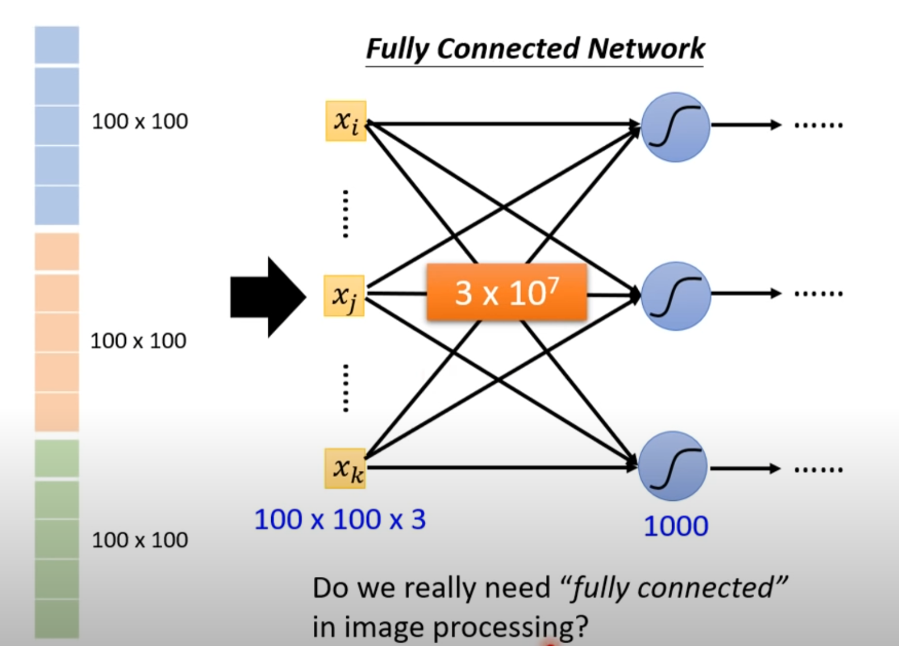
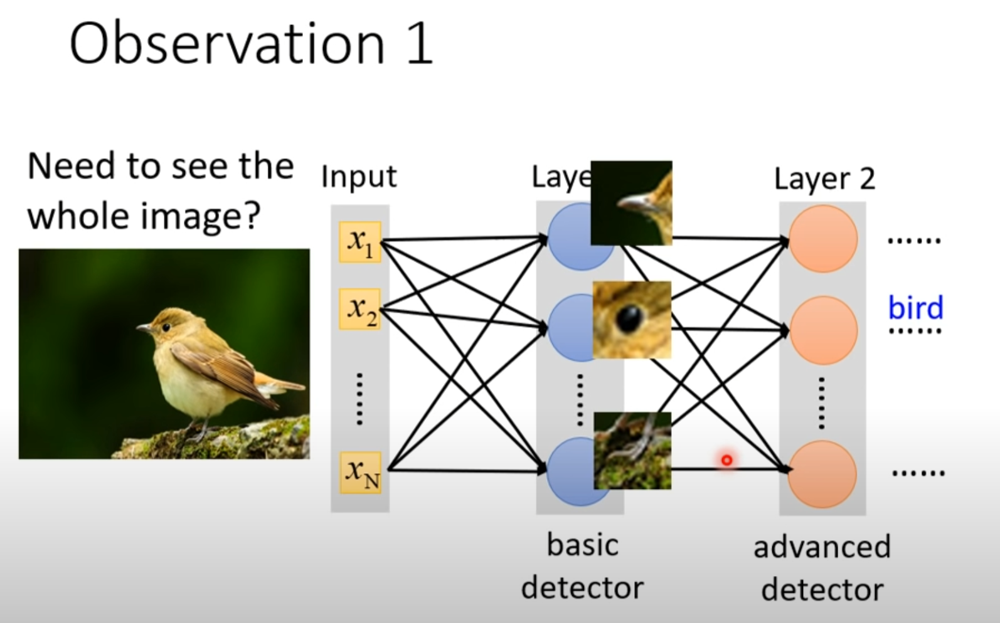
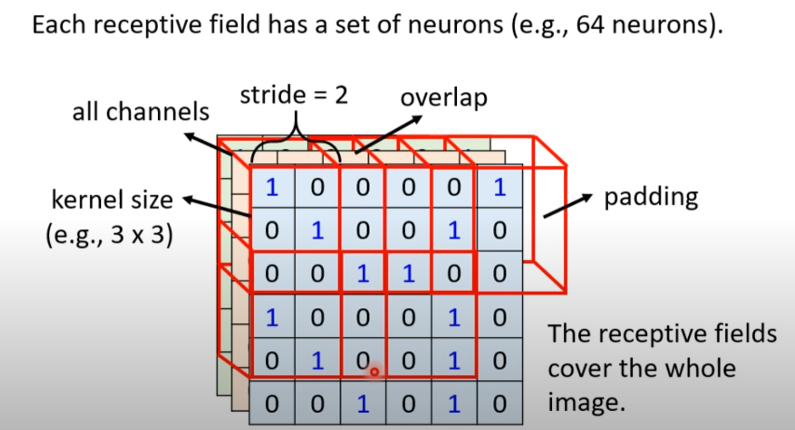
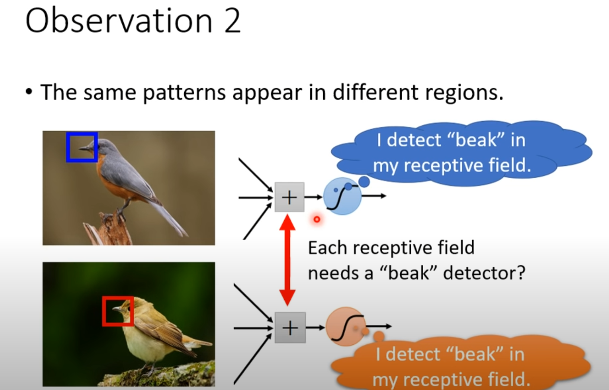
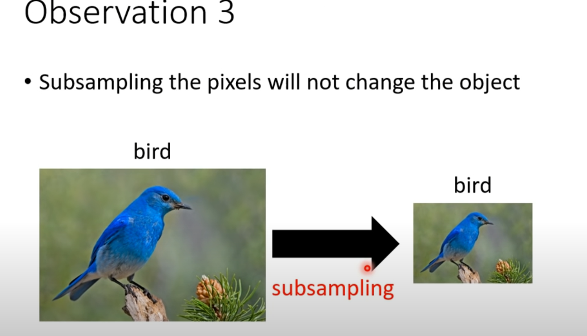
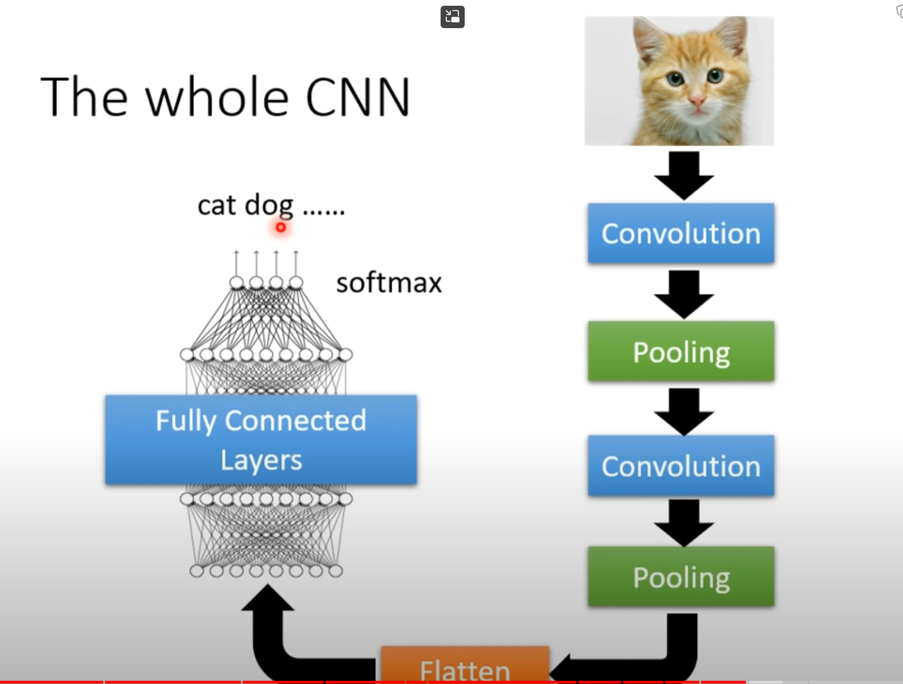

# CNN

When doing image process task, we can flatten the 3-channel image matrix into a vector, then we input the whole vector into a network, this network is called **Fully Connected Network**.

## Observation

Intuitively, we only need to focus on some pattern or feature of few parts of the whole image, not to need to see the whole image.

So we can take a small receiptive field as a unit instead of each pixel as a unit when making input layer.

This could reduce the input layer scale, and let the network focus on patterns

**Kernels can overlap**

As the slide below indicates, we can do **parameter sharing** among multiple receiptive field

A set of shared parameters is called a **filter**

**Pooling**: discard some information to reduce the training scale

