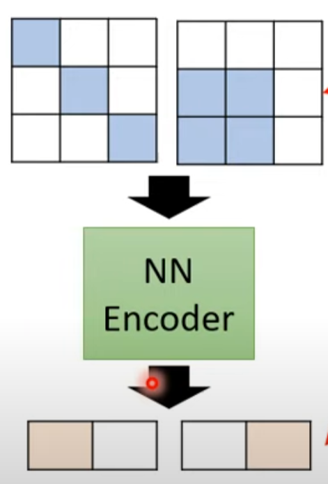
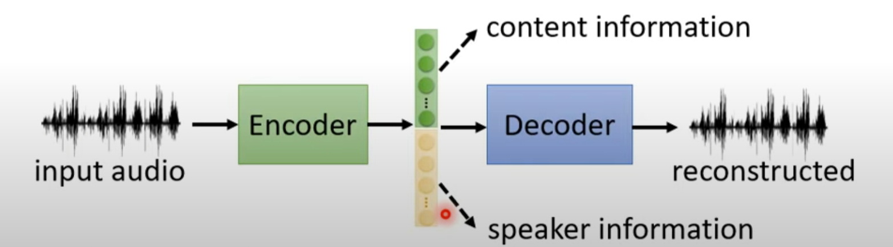

# Auto-encoder

Auto-encoder can be consider as a specific way of self-supervised.

Auto-encoder can be used to do reconstruction, it is trying to make its output as similar as possible to the original input. The goal is to decrease the dimension of the input matrix and turn it into a vector or so-called embedding (**Dimension Reduction**).

## Why

Reducing complicity

## Feature Disentangle

