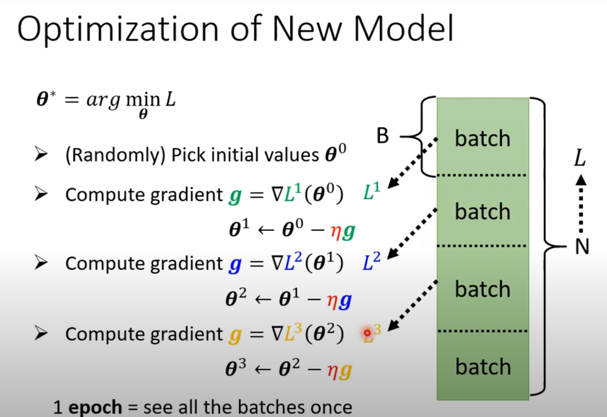

# Fundamentals

## Essence

In one word, **machine learning is looking for functions**.

### Types of functions

* Regression: the function output is a scalar
* Classification: given options, the function output is the right choice
* Structured Learning: create something with structure(image, document)

### Process

#### Function with Unknown Parameters

​	***y = b+wx*** (b is bias, w is weight, x is feature)

#### Define Loss from Training Data

​	**Loss** is a function of parameters: ***L(b,w)***， loss indicates how good a set of value is

​	**label** is the training data value corresponding to feature

#### Optimization

Find a a set of parameters to get the minimum Loss

Method: **Gradient Descent**

**η: Learning Rate (Increament in each round of update)**

**batch:** split the whole data set into batches, and compute gradient and loss on each single batch other than the whole data set.

**epoch**: see all the batches once, iterate all batches, that is an epoch

## Sophisticated Models

linear models have severe limitation, they are too simple

 Sigmoid is equal to sum of 2 ReLU function

Sigmoid and ReLU are called **Activation function**

We can make this recursive, apply multiple layers of activation functions, these layers are called **hidden layers**.

Simple understanding of **Deep Learning**

Activation functions works as neuron, and many layers means deep, these layers together are called **Neural Network**.