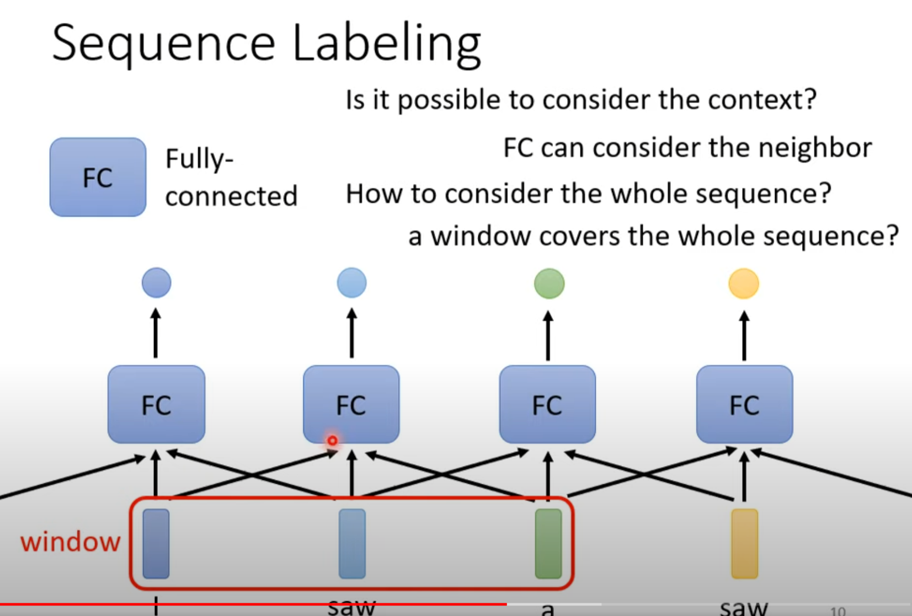
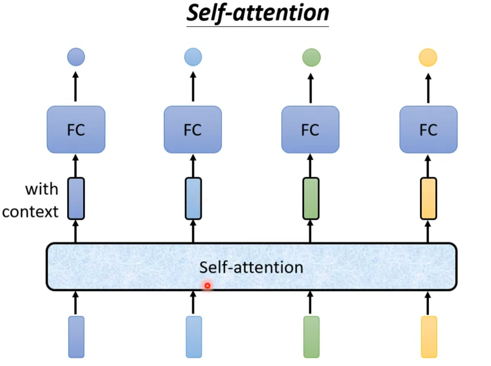
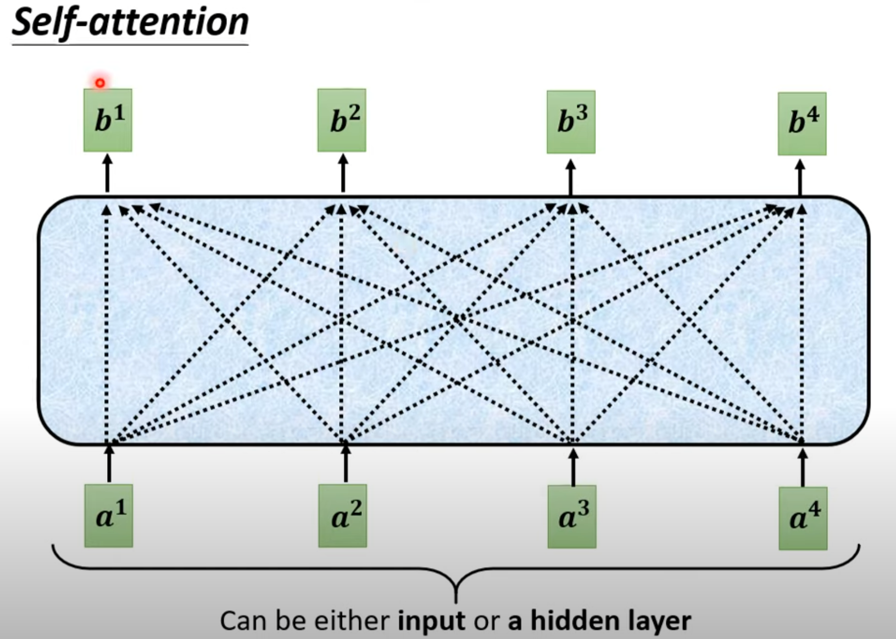

# Self-attention

## Background

When the input is a set of vectors instead of just one single vector, how to let the model consider the context?

Some thoughts about this:

* If we can make the window big enough to cover the whole context? No, cause the length of sequence is not fixed as for each input

Self-attention is a layer of network, after which the vector will be filled with context

