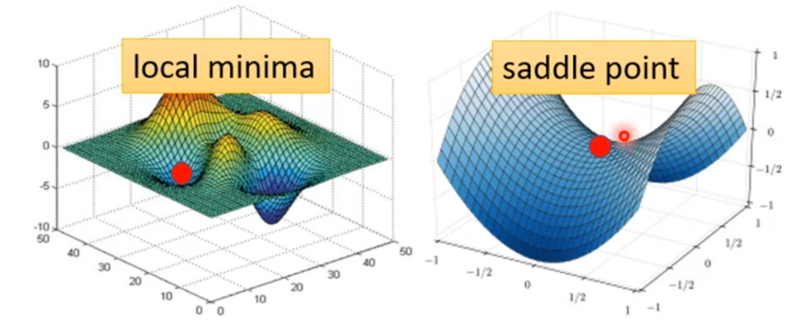
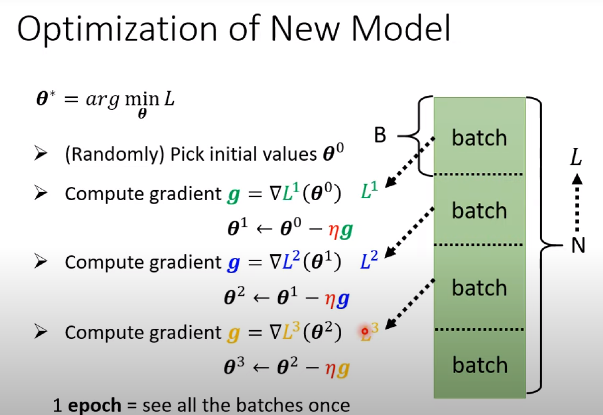
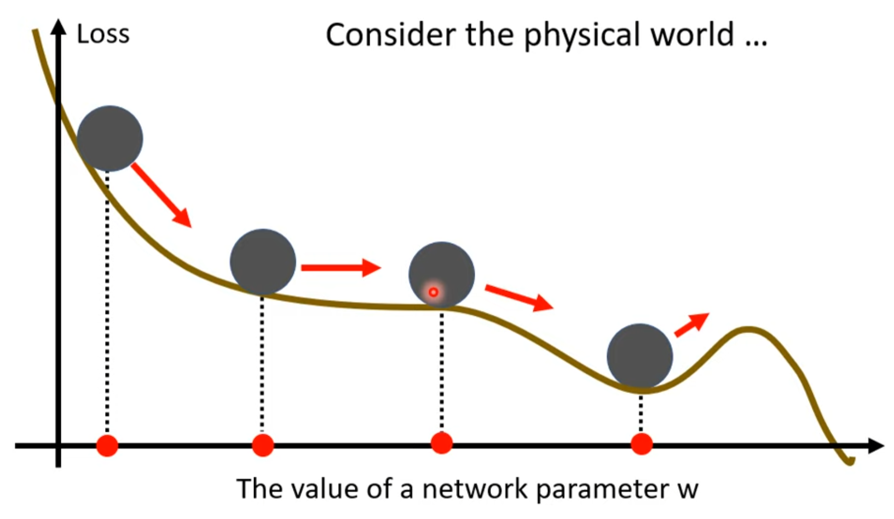
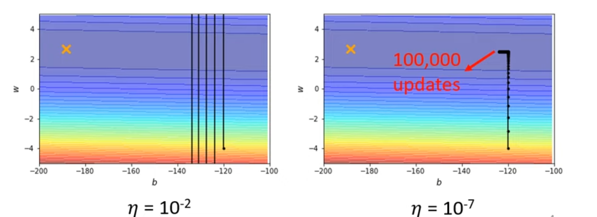
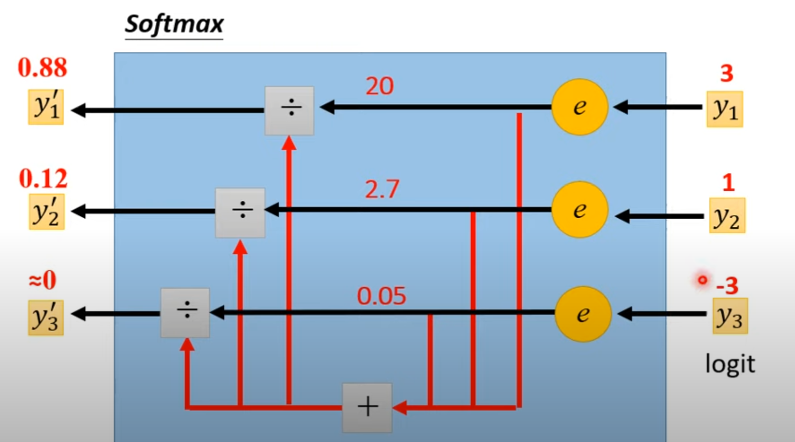
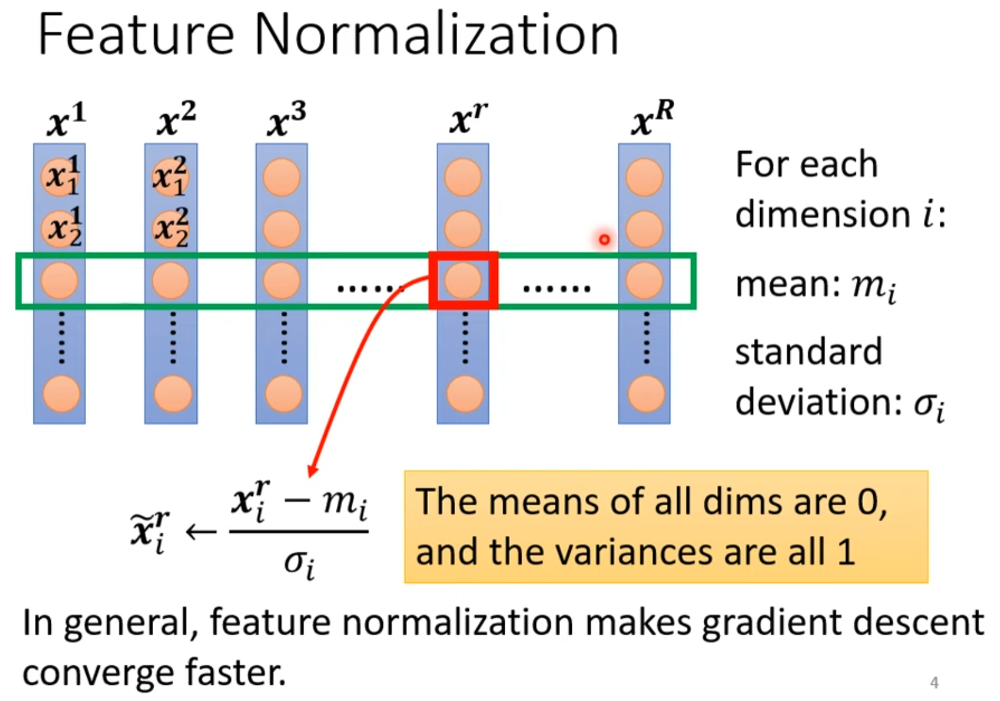

# Optimization Tricks

## Critical points

Optimization fails because of

* Local minima: no way out
* Saddle point: there is way out

When you have lots of parameters, perhaps local minima is rare bacause of multiple dimensions

## Batch

After each epoch, there will be **shuffle**, which makes data in each batch is different from epoch to epoch.

Gradient will be computed only on one batch in each update.

|                      | Small Batch     | Large Batch    |
| -------------------- | --------------- | -------------- |
| **Each update**      | Powerful        | Noisy          |
| **Each update time** | Usually shorter | Usually longer |
| **Performance**      | Usually better  | Usually worse  |

## Momentum

Analogy to real world physics, inertia of a moving object can enable it to get across a small hill

* Movement not just based on gradient, but previous movement

## Adaptive learning rate

* People believe training stuck because the parameters are around critical point, critical points are actually rare, training can be difficult even without critical points

**Convex error sufface**: at the beginning, vertical gradient is relatively large which drives us all the way down hill. But when it comes to horizontal movement to our destination, the gradient gets very small and at this moment our learning rate/step is also too small/short which leads to bare movement.

**Different parameters needs different learning rate**

#### **Learning Rate Schedualing**

**Learning Rate Decay**: as the training goes, we are closer to the destination, so we reduce the learning rate

**Warm Up**: Increase then decrease

## Classification in short

**softmax**: normalize a vector and amplify the difference between big element and small element

**cross-entropy**: is a Loss function

***Pytorch***: cross-entropy and softmax are bound together, if you call cross-entropy pytorch will automatically add a layer of softmax at the end of your network

## Batch Normalization

Batch Normalization is used to change the error surface to make it easier to navigate

**In deep learning**, it is often suggested doing Batch Normalization followed by each layer

